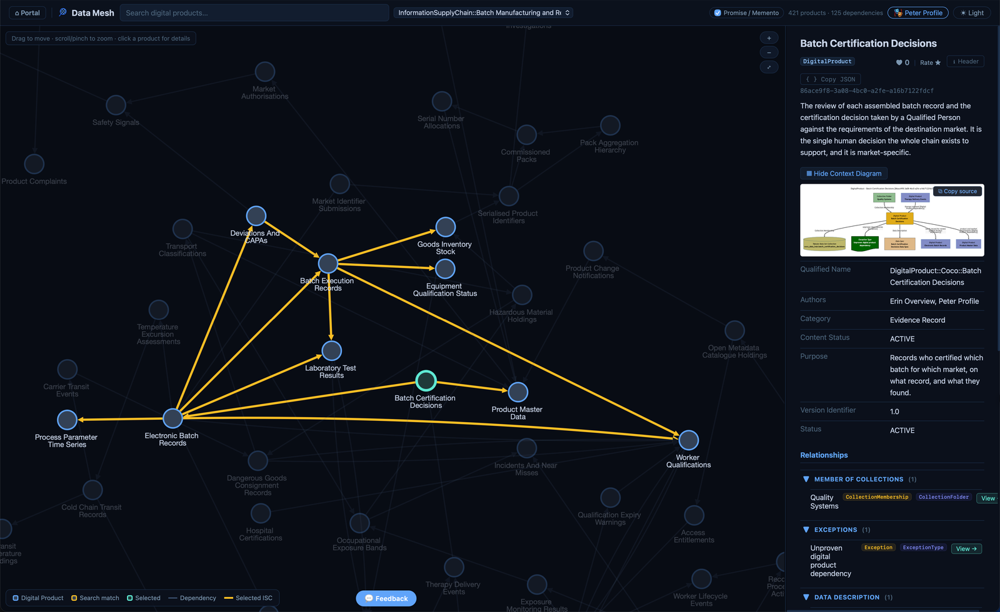
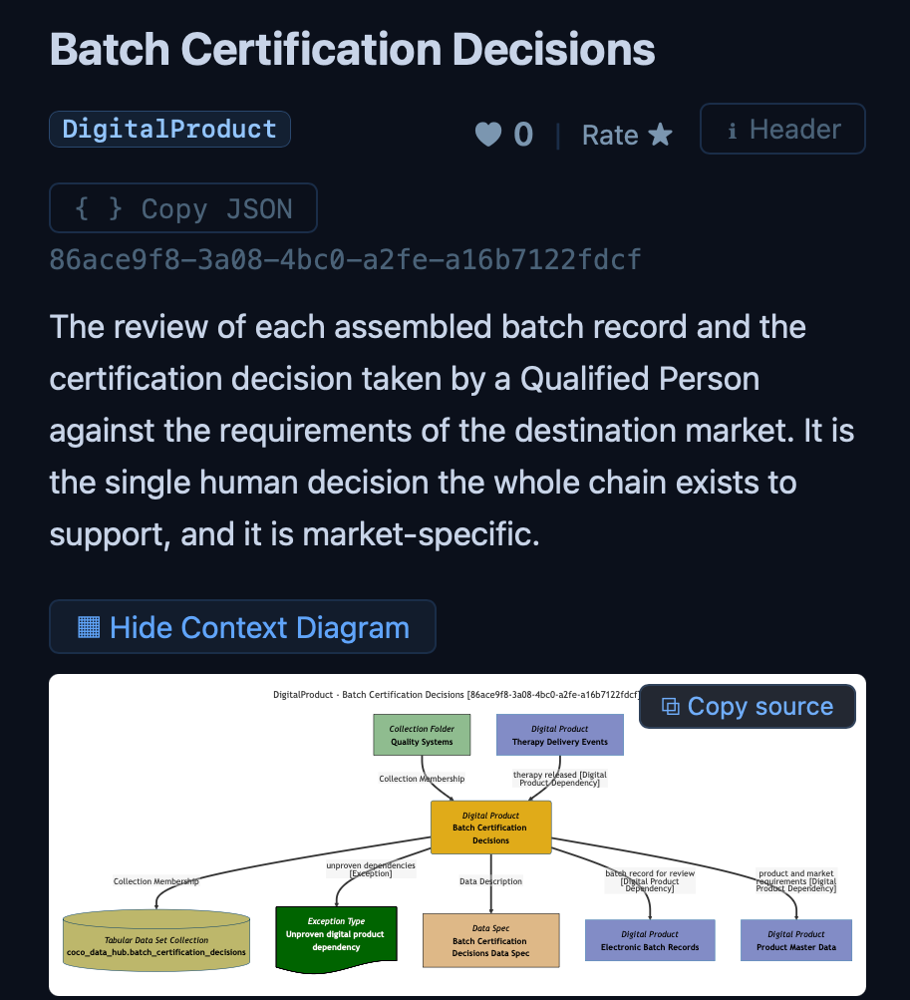
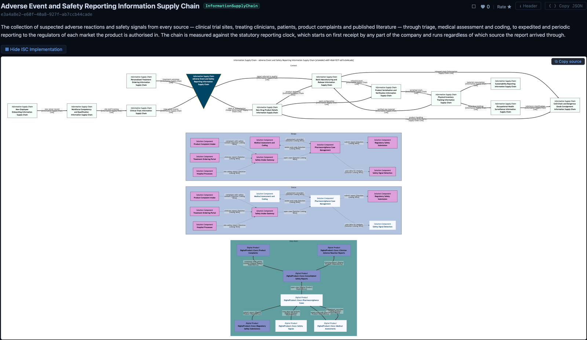
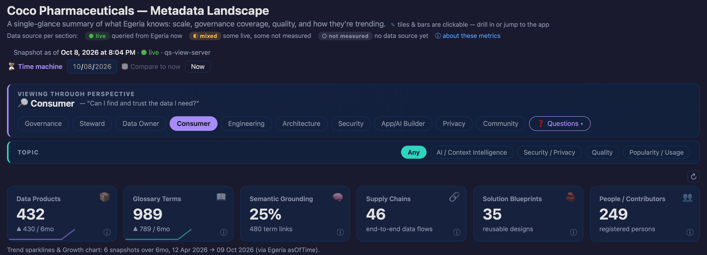
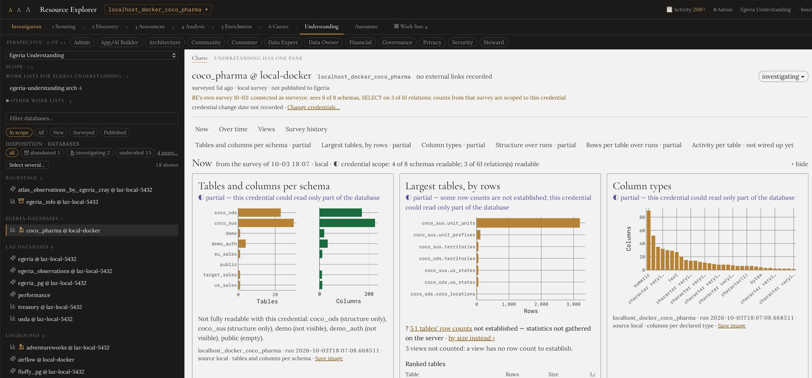
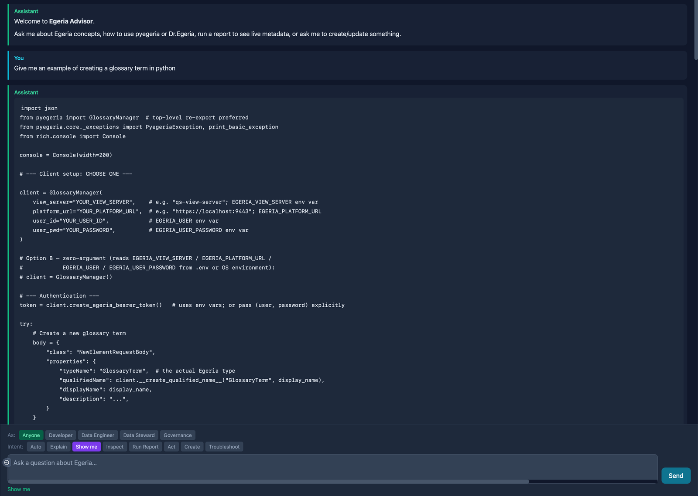

<!-- SPDX-License-Identifier: CC-BY-4.0 -->
<!-- Copyright Contributors to the Egeria project. -->

# October 2026

Welcome to the Egeria community's October 2026 newsletter. Since our [last newsletter](https://egeria-project.org/release-notes/april-2026/), we have released Egeria 6.1 and now Egeria 6.2.

AI agents and applications are only as trustworthy as the context they work from. They need to know what data exists, what it means, where it came from, and what has been promised about it. That knowledge also has to stay accurate as systems change. Egeria 6.2 makes Egeria much better at producing that kind of context, using the open standards data teams already work with.

*The new Data Mesh view in Egeria Workspaces, highlighting the products in one information supply chain and the dependencies between them.*

## What's new

### Data contracts and data products on open standards

Egeria now supports the Bitol Open Data Contract Standard (ODCS v3.2.0) and Open Data Product Standard (ODPS v1.1.0). Teams that keep contracts and product descriptions in git can have Egeria read them from a directory or a Kafka topic, catalog them as data sharing agreements and digital products, and generate them back out from open metadata, ready to commit. The support includes the ODCS AI context block and semantic types for measures and dimensions, which give an AI agent what it needs to interpret data correctly.

[Learn more about the Bitol content pack](https://egeria-project.org/content-packs/bitol-content-pack/overview/)

### Lineage that fits your catalog

Our OpenLineage support has moved to specification 2-0-2. Incoming lineage events are now matched to resources that are already catalogued, rather than creating parallel copies, and ambiguous matches are flagged for a steward to review. Custom facets are kept, and data quality and statistics events are captured as survey reports. For anyone building AI on enterprise data, this lineage is provenance: the basis for explaining and auditing an answer.

[Learn more about Egeria and OpenLineage](https://egeria-project.org/egeria-solutions/leveraging-open-lineage/overview/)

### Metadata that maintains itself, with people in the loop

Two new connectors take on work that usually falls to busy data stewards. **Darwin** keeps the data mesh consistent with the lineage beneath it, rolling column-level lineage up to the dependencies between digital products. It never removes a relationship a person declared; if a declared dependency has no lineage to support it, Darwin raises an exception for a steward. **Mendel** resolves duplicate metadata, consolidating duplicates once a steward has validated them. Duplicate metadata produces contradictory context, so this matters for any AI that retrieves from the catalog.

{ width="460" }

*Darwin found no lineage behind one of this product's declared dependencies, so it raised an exception (the green box) for a steward to resolve.*

Learn more about [rolling up lineage](https://egeria-project.org/features/lineage-management/overview/#rolling-up-the-lineage) and [duplicate management](https://egeria-project.org/features/duplicate-management/overview/).

### Data products that deliver, and designing ahead

The Open Metadata Digital Product Catalog now delivers data to subscribers end to end, recording the lineage of every delivery, and product families can be subscribed to as a single product. Starting the sample catalog now takes about a minute and a half instead of sixteen minutes.

A new **Promise** classification lets you design lineage before the resources it describes exist. Promised elements stay out of everyday catalog searches but appear in lineage, so a solution can be planned first and then tracked as it is built. Information supply chain diagrams now include a **Status** layer that shows how far each solution component has progressed, with promised components shown in white.

*One information supply chain seen at four levels: the supply chains it connects to, the solution components that implement it, how far each component has been deployed, and the digital products that make up its part of the data mesh. The white boxes are promised but not yet delivered.*

Learn more about [digital product management](https://egeria-project.org/features/digital-product-management/overview/) and the [Promise classification](https://egeria-project.org/concepts/promise/).

### Built to be relied on

Eighteen functional verification test suites now exercise the platform, its connectors, and its content packs. We also fixed several cases where searches could return incomplete results without any warning. An AI working from partial answers it believes are complete is a real risk, so we treated these fixes as a priority.

## Egeria Workspaces

Egeria Workspaces, our ready-to-run environment, has been updated alongside the core release, with all the new 6.2 connectors switched on. Along with the Data Mesh view, a portal-wide toggle reveals promised and retired elements, and the Egeria Overview dashboard now runs entirely on live data, including survey coverage, quality, schemas and engine health. There is also a new My Profile app, a shared app bar across the portal, and new Dr.Egeria templates for data contracts, data products, and lineage.

*Egeria Overview, viewed through the Consumer perspective. Every figure comes from live metadata, with trends drawn from Egeria's own history.*

You can [try the live demo](https://egeria.pdr-associates.com){target=blank} without installing anything (signing up takes a minute), or run [Egeria Workspaces](https://egeria-project.org/egeria-workspaces/) locally with Docker or Podman.

## Early preview: Resource Explorer and Egeria Advisor

We are also sharing early versions of two AI-enhanced applications built on Egeria, part of our [Trellis](https://egeria-project.org/concepts/trellis/) work. They run alongside Egeria Workspaces as an optional add-on.

**Resource Explorer** surveys resources that are not yet in the catalog, such as Git repositories, PostgreSQL databases, and file systems. Its findings are evidence for people to judge: you review what it found and decide what gets catalogued into Egeria.

*Resource Explorer reports what its survey found and says plainly when a chart is partial because the credential could only read part of the database.*

**Egeria Advisor** is a conversational assistant for Egeria and pyegeria. It answers questions, tailors its responses to your role, and can turn requests into Dr.Egeria commands and reports that run as the signed-in user.

*Egeria Advisor answers with pyegeria code. The selectors at the bottom set who you are and what you want: explain, show me, run a report, or create something.*

Both applications are early and changing quickly. We are sharing them now because we would rather shape them with the people who will use them. Please try them, tell us what works and what doesn't, and if you are interested in going further, work with us on them.

## Full release notes for V6.2

The full release notes for version 6.2 are on [Egeria's website](https://egeria-project.org/release-notes/latest/). Egeria 6.2 moves to Java 21, Gradle 9, and Spring Boot 3.5, so please read the [upgrade notes](https://egeria-project.org/release-notes/latest/#upgrade-notes) before upgrading.

## Future plans

Plans for the [next release](https://egeria-project.org/release-notes/next/) are open, and we welcome suggestions.

## Connecting with the project

Egeria is an open source project under LF AI & Data, and it grows through the people who use it and shape it. With our focus on AI and on supporting data practitioners directly, we are looking for new users and contributors. Whether you want to try Egeria on your own metadata, contribute code or content, or bring a hard problem to the discussion, we would be glad to hear from you.

- Talk with the team and other users on [Slack](https://slack.lfaidata.foundation){target=blank}.
- Watch demos and walkthroughs on [YouTube](https://www.youtube.com/@egeria-project){target=blank}.
- Follow the project on [LinkedIn](https://www.linkedin.com/company/egeria-project/){target=blank}.
- Read our blogs and articles on [Pragmatic Data Research, LTD](https://pdr-associates.com)

!!! info "Connecting with the community"
    Go to our [community guide](https://egeria-project.org/guides/community){target=blank} to find out more about the activities of the Egeria project and how to get involved.

--8<-- "snippets/abbr.md"
