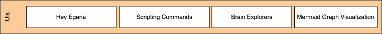
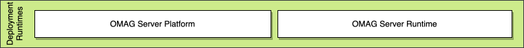

<!-- SPDX-License-Identifier: CC-BY-4.0 -->
<!-- Copyright Contributors to the Egeria project 2020. -->

# Roadmap

Egeria is a large project with many activities adding content to the project. This page provides an overview of the aims of the project and a reflection of where we are today.

## Capability layers

Egeria aims to deliver against 7 capability layers:

### Governance solutions

The governance solutions aim to support an organization's governance efforts by providing pre-built capability not typically found in commercial tools.

The implementation of a governance solution is focused mainly on the extension of the [Egeria User Interfaces](/user-interfaces) and associated reference data to support additional roles and functions. They make use of the services provided by the [developer platform](#developer-platform) and may exploit additional content, utilities and connector implementations from the integration platform.

### Education

Provides educational resources for different personas and starting points.

Egeria's education aims to broaden the knowledge of people who need to work with digital resources about metadata, governance practices and the use of Egeria.  It is based around the [Coco Pharmaceuticals](/practices/coco-pharmaceuticals/) scenario and are organized by persona, so you can target your learning to your interests.

- The [Egeria workbooks](https://github.com/odpi/egeria-workspaces/blob/main/workspaces/egeria-workbooks.ipynb) are part of the [Egeria Workspaces](https://github.com/odpi/egeria-workspaces/tree/main) deployment environments.  They provide guidance and examples on how to use Egeria and how to adapt it to support your use cases.  This is an excellent starting point to get hands-on experience with Egeria.
- The [open-metadata-samples](https://github.com/odpi/egeria/tree/main/open-metadata-resources/open-metadata-samples) module in the main git repository for the Egeria code - *egeria.git* - includes many coding samples showing how to use the Egeria interfaces. There are also many sample clients, server configurations and sample data included in the *[open-metadata-deployment](https://github.com/odpi/egeria/tree/main/open-metadata-resources/open-metadata-deployment)* module.  They are accompanied by `README.md` files to explain how to use them.
- The [Open Metadata Labs](/education/open-metadata-labs/overview) are also part of the [Egeria Workspaces](https://github.com/odpi/egeria-workspaces/tree/main) and build out an operational open metadata ecosystem to show how different governance use cases can be implemented. 
- This website ([https://egeria-project.org/](https://egeria-project.org/)) contains comprehensive documentation on Egeria's features.
- The [Governance practices](/practices) provides governance best practices. They aim to guide a team that is setting up or revising their governance program through common governance tasks.

### User Interaction

Most users will experience the open metadata ecosystem via their own tools.  However Egeria does have some simple user interfaces to cover its unique capabilities.

- *[Hey Egeria](/user-interfaces/hey-egeria/overview)* provide command line controlled commands and visualizations for a running Egeria system.  They are designed for technical and data professional working in the open metadata ecosystem and operating Egeria infrastructure.
- *Dr.Egeria* provides markdown based editing of open metadata either through markdown documents or Jupyter Notebooks.
- *My Egeria* provides form-based based editing of open metadata.
- *[Monitoring Widgets](/user-interfaces/hey-egeria/overview/)* provide an ongoing display of the status of the Egeria infrastructure and its connectors.
- *[Scripting commands](/guides/developer/scripting-commands/overview)* allow calls to Egeria's services from scripting languages to aid automation of governance.
- *[Brain Explorers](/user-interfaces/brain-explorers/overview/)* are cloud based websites allowing you to interact with a graph interface to visualized open metadata content.
- *[Mermaid graph visualization](/user-interfaces/mermaid/overview)* for visualizing collections of related open metadata elements.
- *SuperSet Dashboards* provide an overview on the operation of the open metadata ecosystem.

### Integration platform

Supports the integration of popular technologies into the open metadata ecosystem with pre-built connectors that are installed in the standard runtime and automatically configured and started when the appropriate content pack is loaded. Minimal coding (using the developer platform) is still required around unusual and home-grown tools and technologies.

- The *[Connector Catalog](/connectors)* provides connectors to popular third party technologies such as metadata repositories, databases, data formats and platforms; data movement engines, data virtualization engines, dev ops tools, analytics/AI tools, data catalogs, MDM and user directories, CMDBs, SDLC tools, ...
- The *[Content Packs](/content-packs)* provide metadata, reference data and connector configurations to help get you up-and running with the supplied capability of Egeria.  They are formatted as [Open Metadata Archives](/concepts/open-metadata-arachive) and can be configured to load at server startup using the [Administration Services](/guides/admin/servers) or while the server is running using the [Runtime Manager OMVS](/services/omvs/runtime-manager/overview).

### Developer platform

Provides frameworks, APIs, and hosting platforms for building an integrated metadata and distributed governance solutions.

The developer platform contains the core Egeria implementation and provides support for integrating third party technology into the open metadata ecosystem and extending Egeria to run in different environments or to use different infrastructure services.

Its use is described in the [developer's guide](/guides/developer).

- There are clients written in both *[Java](/guides/developer/java-clients/overview)* and *[Python](/guides/developer/python-clients/overview)* to aid programmers calling the Egeria services.
- The *[utilities](https://github.com/odpi/egeria/tree/main/open-metadata-resources/open-metadata-dev-utilities)* and *[reports](https://github.com/odpi/egeria/tree/main/open-metadata-resources/open-metadata-reports)* support common tasks that retrieve and update metadata.
- The *[Unit Test Utilities](https://github.com/odpi/egeria/tree/main/open-metadata-test/open-metadata-ut)* help to unit test Egeria specific components. They work with standard test harnesses.
- The *[Function Verification Tests](https://github.com/odpi/egeria/tree/main/open-metadata-test/open-metadata-fvt)* are used to test Egeria's runtime.  However they illustrate how to automate tests for your components that work with the Egeria runtime. 
- The *[Conformance Test Suite (CTS)](/guides/cts/overview)* supports the testing of third party connectors. Each type of connector or service is supported by its own test workbench.

- Open Metadata and Governance (OMAG) registered services are dynamically loaded in the OMAG Server Platform. This means they can be added and removed as needed to create a customized platform. This may include registered services written by the Egeria community and supplied by third parties.

    - [Access services](/services/omas) provide specialist APIs / events for different types of tools. They work with the pre-defined [open metadata types](/types) and use the [repository services](/services/omrs) to access metadata.
    - [Engine services](/services/omes) provide the services that host a specific type of governance engine. The governance engines collectively provide active governance to the assets and their associated metadata.
    - [Integration services](/services/omis) each provide a specialized API to integration connectors. These are hosted in an [integration daemon](/concepts/integration-daemon). The purpose of the integration services is to simplify the implementation and management of connectors that integrate metadata exchange with third party technologies.
    - [View services](/services/omvs) provide the services used by UIs. They are typically fine-grained services and they run in the [view server](/concepts/view-server). The use of the separate server (and server platform) enables an extra firewall to be erected between the view servers and the metadata servers and governance servers, hiding the internal systems from end users.
  
- The [Open Metadata Types](/types) provide definitions for the different types of metadata needed by an organization. The open metadata type system is extendable; however, by providing a comprehensive starter set, and encouraging tools to use them, Egeria ensures metadata can be seamlessly shared amongst them.
- The [Framework Services](/services/framework-services) provide Egeria clients to support metadata retrieval for connectors defined by the [frameworks](/frameworks).

    - [Connected Asset](/services/ocf-metadata-management) supports the creation of connectors and the retrieval of metadata about the attached asset.
    - [Open Metadata Store](/services/gaf-metadata-management) supports the retrieval and maintenance of any type of open metadata.
    - [Open Integration Service](/services/oif-metadata-management) provides the runtime services for integration connectors.
    - [Open Governance Service](/service/gaf-metadata-management) supports the execution of [engine actions](/concepts/engine-action) and [governance action processes](/concepts/governance-action-process).
  
- The [OMAG Server Platform](/concepts/omag-server-platform) provides a multi-tenant runtime platform for [OMAG Servers](/concepts/omag-server). Each OMAG Server hosts the connectors along with the Egeria services to integrate third party technology.

    - The [platform chassis](/services/platform-chassis) uses Spring Boot to provide the web server and REST API support for the platform.
    - The [server chassis](/services/server-chassis) uses Spring Boot to provide the web server and REST API support for a single OMAG Server.
    - The [administration services](/services/admin-services/overview) supports configuring the OMAG Platform and Servers. Details of how to use the admin services are provided in the [administration guide](/guides/admin/guide)
    - The [server operations](/services/server-operations) and [platform services](/services/platform-services/overview) provide the means to start, stop and query the OMAG Servers and services running on an OMAG Server Platform.
    - The [multi-tenancy management](/services/multi-tenant) module supports multiple OMAG Servers running on an OMAG Server Platform.
    - The [repository services](/services/omrs) provide the basic ability to share metadata between metadata repositories. The metadata repositories are organized
      into [open metadata repository cohorts](/concepts/cohort-member). These cohorts define the scope of the metadata sharing and ensure metadata is available to all consumers within the cohort.
    - The [metadata security](/services/metadata-security) module provides customizable authorization checks for calls to the OMAG Server Platform, OMAG Server and the open metadata instances themselves.
    - A governance server makes use of open metadata to actively manage an aspect of the digital landscape. The [governance server services :material-dock-window:](https://github.com/odpi/egeria/tree/main/open-metadata-implementation/governance-servers){ terget=gh } each provide the principle subsystem of a [type of governance server](/concepts/governance-server).
    - The [generic handlers](/services/generic-handlers) provide support for the type specific maintenance and retrieval of metadata that follows the [open metadata types](/types). This includes managing visibility of metadata through the [Governance Zones](/concepts/governance-zone/), calls to [Open Metadata Security](/features/metadata-security/overview/) and [metadata management using templates](/features/templated-cataloguing/overview/).

- The [open metadata frameworks](/frameworks) define the interfaces implemented by components that "plug-in" to Egeria, either to integrate calls to third party technology or extend the function of Egeria. The frameworks are as follows:

    - [Audit Log Framework (ALF)](/frameworks/alf/overview) - extensions for all types of connectors to enable natural language diagnostics such as exceptions and audit log messages.
    - [Open Metadata Framework (OMF)](/frameworks/ocf/overview) - base framework for open metadata definitions.
    - [Open Connector Framework (OCF)](/frameworks/ocf/overview) - base framework for all types of plug-in components called connectors.
    - [Open Integration Framework (OIF)](/frameworks/oif/overview) - specialized connectors for metadata exchange and synchronization with third party technologies.
    - [Survey Action Framework (SAF)](/frameworks/osf/overview) - specialized connectors called survey action services that support automated metadata discovery.
    - [Open Governance Framework (OGF)](/frameworks/ogf/overview) - specialized connectors for the triage and remediation of issues found in the digital landscape.

### Deployment runtimes

The runtimes package up the services to simplify the process of deploying Egeria's capability.

The [OMAG Server Platform](/concepts/omag-server-platform) provides support for dynamically configuring and running multiple [OMAG Servers](/concepts/omag-server).

### Deployment resources

Aim to simplify the process of deploying the OMAG Server Platform and its connectors into an operational environment.

* The [Egeria docker image :material-dock-window:](https://quay.io/search?q=egeria){ target=docker } is built daily and pushed to Quay.io and DockerHub. It contains an OMAG Server Platform. You can download it and use it in your own container environments.  It is used by the helm charts.
* The [Egeria Workspaces](https://github.com/odpi/egeria-workspaces) provide docker compose scripts for standard Egeria deployments plus associated runtimes (including Apache Kafka, Unity Catalog, Apache Airflow, Marquez, Apache SuperSet, OpenLineage Proxy and PostgreSQL.)

## Understanding the roadmap

### Current status

Following is an overview of the [content status](/release-notes/content-status) of the functions in Egeria's latest release (5.3). 

As you can see, some progress has been made on all layers. However, since they do build on one another, most of the early work has been focused on establishing the frameworks, connector APIs and other services to provide the developer platform. The developer platform provides the libraries and interfaces to build connectors to integrate third party tools along with the runtime to host these connectors and manage the metadata exchange.

Today we have a robust [OMAG Server Platform](/concepts/omag-server-platform) and the ability to configure [OMAG Servers](/concepts/omag-server) that host specific types of connectors to third party tools.   The continual development of the registered services is broadening the types of metadata, and tools, that can integrate with Egeria through the federated query mechanism, supported by the repository services.  With this expansion, more solutions are envisaged, along with a runtime environment that can be downloaded and used immediately.  Many features are available through Egeria's command line interface, or through simple python scripting.  Thus, a team can be up and running quickly.  The dynamic configuration and Java frameworks that support new connectors and services development are still there and can be used to further expand Egeria's capabilities.   

### History

The initial implementation of Egeria focused on the [Open Metadata Repository Services (OMRS)](/services/omrs) to support different types of metadata repositories exchanging metadata via an [open metadata repository cohort](/concepts/cohort-member).  This also involved the build out of the [OMAG Server Platform](/concepts/omag-server-platform) to host this code.
The aim was to demonstrate how third party metadata servers could exchange metadata. This capability was delivered along with two repository connectors for the following third party connectors along with the [Conformance Test Suite](guides/cts/overview).

- [IBM Information Governance Catalog (IGC) :material-dock-window:](https://github.com/odpi/egeria-connector-ibm-information-server){ target=gh }
- [Apache Atlas :material-dock-window:](https://github.com/odpi/egeria-connector-hadoop-ecosystem){ target=gh }

Through 2020, our focus shifted to the integration platform as we added [connector implementations](/guides/developer/guide/#what-is-a-connector) for popular third party technologies (see the [connector catalog](/connectors/#catalog)) and built out the [ecosystem user interface (UI) :material-dock-window:](https://github.com/odpi/egeria-react-ui){ target=gh } that enables an organization to:

- configure OMAG Servers on OMAG Server Platforms
- visualize the open metadata types through the type explorer (TEX)
- visualize open metadata instances in a single repository or across the open metadata repository cohorts that a server is connected to.
- visualize to cohort and query the operational status of the OMAG Servers and services operating in the open metadata ecosystem
- configure OMAG Servers and deploy them to OMAG Server Platforms

The ecosystem UI makes calls to specialized REST services supported by a type of OMAG Server called the [view server](/concepts/view-server). The view server is new for 2020 and enables the REST APIs to the UIs to be deployed in a DMZ and the metadata servers to be behind an additional firewall. It also takes much of the load for supporting end users off of the metadata servers.

In 2020 support for a new type of OMAG Server called the [integration daemon](/concepts/integration-daemon) was also added. This server supports integration services that can host integration connectors dedicated to exchanging metadata with specific third party technologies.

2021 had a focus on governing metadata. There is a new OMAG Server called the [engine host](/concepts/engine-host) that runs [governance engines](/concepts/governance-engine). These are supported by new access services for governance.

This new website was added to the project in 2021, and it has resulted in more interest in consuming Egeria.

2022 continued the focus on metadata governance.  The following OMASs were refactored to call the generic handlers rather than direct calls to the repository handler.

* Data Engine OMAS
* Asset Catalog OMAS
* Asset Lineage OMAS

There was investment in both the function and performance of the generic handlers, which provide many of the metadata governance functions supported by all OMASs, such as metadata security, provenance validation, anchor management, LatestChange classifications, effectivity dating, memento management and de-duplicating query results.

Integration with third party technologies made good progress with the addition of OpenLineage support, the new JDBC, Hive Metastore, schema registry, OpenAPI Specification and Apache Kafka connectors.

2023 and 2024 saw a dramatic change in the project's direction as it shifted its primary focus from providing libraries for tools vendors to supporting organizations that are looking to create an open metadata ecosystem.  This resulted in more samples, view services, content packs and a new range of UIs.  The OMAG Server Platform has had some internal restructure and clean up of deprecated code.  The result is a simpler coding experience for new community members.

### Future Plans

After the release of version 5.0, the team continues to focus on usability, simplification and publicity around the new platform and its advanced capability.  There will also be more connectors, increasing Egeria's reach across the IT landscape.  Functionally, you will see the completion of the Context Event Framework (CEF) and its supporting services, plus more view services will emerge as the governance solutions mature.  The speed of this rollout depends on our ability to rebuild the community.

> How Egeria has evolved over the years.  This reflects that the scope has grown from a desire to provide embeddable integration libraries for use in data tools and platforms, to today's desire to directly support teams in their governance, data and AI projects.  The libraries and frameworks are still there.  However, most users will experience as a running services, preloaded with metadata to accelerate their adoption.

--8<-- "snippets/abbr.md"
