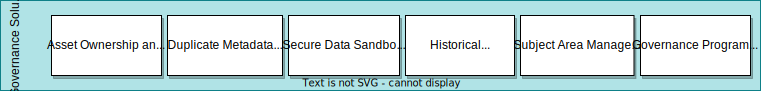
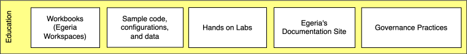

<!-- SPDX-License-Identifier: CC-BY-4.0 -->
<!-- Copyright Contributors to the Egeria project 2020. -->

# Roadmap

Egeria is a large project with many different activities adding content to the project. This page provides an overview of the aims of the project and a reflection of where we are today.

## Capability layers

Egeria aims to deliver against 5 capability layers:

### Governance solutions

Support the leadership team for a governance program providing the ability to create common definitions and monitor the success of the governance efforts across the enterprise.

The implementation of a governance solution is focused mainly on the extension of the Egeria UI to support additional roles and functions. They make use of the services provided by the [developer platform](#developer-platform) and may exploit additional content, utilities and connector implementations from the integration platform.

### Education

Provides educational resources for different personas and starting points.

Egeria's education aims to broaden the knowledge of people who need to work with digital resources about metadata, governance practices and the use of Egeria. Since there are many types of professionals involved with different skill levels, there are different choices:

- The [Egeria dojo](/getting-started/dojo/introduction) is a deep dive into the Egeria code and community. It is aimed at individuals who wish to become contributors.
- The [hands-on labs](/education/open-metadata-labs/) provide practical experiences in running the Egeria code and using the different services. It is based around the [Coco Pharmaceuticals :material-dock-window:](https://opengovernance.odpi.org/coco-pharmaceuticals/){ target=gov } use case and is organized by persona so you can target your learning to your interests.
- The [guidance on governance :material-dock-window:](https://opengovernance.odpi.org){ target=gov } provides governance best practices and training using the same Coco Pharmaceuticals use cases as the hands-on labs. They aim to guide a team that is setting up or revising their governance program through common governance tasks. They link to the [Egeria code samples :material-dock-window:](https://github.com/odpi/egeria/tree/master/open-metadata-resources/open-metadata-samples){ target=gh } and hands-on labs to show how these best practices could be implemented using Egeria.
- The **edX courses** are a new idea to provide a full curriculum and certification for governance professionals and architects. It is in the early phases of design.

### Integration platform

Supports integration of popular technologies by installing and configuring Egeria. Minimal coding is still required around unusual and home-grown tools and technologies.

- Ecosystem UIs: server and platform configuration, ecosystem monitoring, type explorer and repository explorer.
- Utilities and converters: support for different standard formats to load industry standard definitions, models, glossaries, and other content packs built on industry standard definitions, models, glossaries and other content packs. Examples include JSON-LD, OWL/RDF, XML, ...
- [Pre-canned connectors to third party technologies](/connectors): popular metadata repositories, databases, data formats and platforms; data movement engines, data virtualization engines, dev ops tools, analytics/AI tools, data catalogs, MDM and user directories, CMDBs, SDLC tools, ...
- [Conformance test suite](/guides/cts/overview): Supports the testing of third party connectors. Each type of connector or service is supported by its own test workbench.

### Developer platform

Provides frameworks, APIs, and hosting platforms for building an integrated metadata and distributed governance solutions.

The developer platform contains the core Egeria implementation and provides support for integrating third party technology into the open metadata ecosystem and extending Egeria to run in different environments or to use different infrastructure services.

Its use is described in the [developer's guide](/guides/developer/guide).

- Open Metadata and Governance (OMAG) registered services are dynamically loaded in the OMAG Server Platform. This means they can be added and removed as needed to create a customized platform. This may include registered services written by the Egeria community and supplied by third parties.
    - The [access services](/services/omas) provide provide specialist APIs / events for different types of tools. They work with the pre-defined [open metadata types](/types) and use the [repository services](/services/omrs) to access metadata.
    - [Engine services](/services/omes) provide the services that host a specific type of governance engine. The governance engines collectively provide active governance to the assets and their associated metadata.
    - [Integration services](/services/omis) each provide a specialized API to integration connectors. These are hosted in an [integration daemon](/concepts/integration-daemon). The purpose of the integration services is to simplify the implementation and management of connectors that integrate metadata exchange with third party technologies.
    - [View services](/services/omvs) provide the services used by UIs. They are typically fine-grained services and they run in the [view server](/concepts/view-server). The use of the separate server (and server platform) enables an extra firewall to be erected between the view servers and the metadata servers and governance servers, hiding the internal systems from end users.
- The [open metadata types](/types) provide common definitions for the different types of metadata needed by an organization. The open metadata type system is extendable; however, by providing a comprehensive starter set, and encouraging tools to use them, Egeria ensures metadata can be seamlessly shared amongst them.
- The [OMAG Server Platform](/concepts/omag-server-platform) provides a multi-tenant runtime platform for [OMAG Servers](/concepts/omag-server). Each OMAG Server hosts the connectors along with the Egeria services to integrate third party technology.
    - The [server chassis](/services/server-chassis) uses Spring Boot to provide the web server and REST API support for the platform.
    - The [administration services](/services/admin-services) supports configuring and operating the OMAG Platform and Servers. Details of how to use the admin services are provided in the [administration guide](/guides/admin/guide)
    - The [platform services](/services/platform-services) provide the means to query the OMAG Servers and services running on an OMAG Server Platform.
    - The [multi-tenancy management](/services/multi-tenant) module supports multiple OMAG Servers running on an OMAG Server Platform.
    - The [repository services](/services/omrs) provide the basic ability to share metadata between metadata repositories. The metadata repositories are organized
      into [open metadata repository cohorts](/concepts/cohort-member). These cohorts define the scope of the metadata sharing and ensure metadata is available to all consumers within the cohort.
    - The [metadata security](/services/metadata-security) module provides customizable authorization checks for calls to the OMAG Server Platform, OMAG Server and the open metadata instances themselves.
    - A governance server makes use of open metadata to actively manage an aspect of the digital landscape. The [governance server services :material-dock-window:](https://github.com/odpi/egeria/tree/master/open-metadata-implementation/governance-servers){ terget=gh } each provide the principle subsystem of a [type of governance server](/concepts/governance-server).
    - The [generic handlers](/services/generic-handlers) provide support for the type specific maintenance and retrieval of metadata that follows the [open metadata types](/types). This includes managing visibility of metadata through the [Governance Zones](/concepts/governance-zone/), calls to [Open Metadata Security](/features/metadata-security/overview/) and [metadata management using templates](/features/templated-cataloguing/overview/).
- The [open metadata frameworks](/frameworks) define the interfaces implemented by components that "plug-in" to Egeria, either to integrate calls to third party technology or extend the function of Egeria. The frameworks are as follows:
    - [Open Connector Framework (OCF)](/frameworks/ocf/overview) - base framework for all types of plug-in components called connectors.
    - [Open Discovery Framework (ODF)](/frameworks/odf/overview) - specialized connectors called discovery services that support automated metadata discovery,
    - [Governance Action Framework (GAF)](/frameworks/gaf/overview) - specialized connectors for the triage and remediation of issues found in the digital landscape.
    - [Audit Log Framework (ALF)](/frameworks/alf/overview) - extensions for all types of connectors to enable natural language diagnostics such as exceptions and audit log messages.

### Deployment resources

Aim to simplify the process of deploying the OMAG Server Platform and its connectors into an operational environment.

- The [Egeria docker image :material-dock-window:](https://hub.docker.com/r/odpi/egeria){ target=docker } is built daily and pushed to DockerHub. It contains an OMAG Server Platform. You can download it and use it in your own container environments.
- The [Kubernetes Helm charts :material-dock-window:](https://github.com/odpi/egeria-charts){ target=gh } make use of the docker image to create a rich Egeria deployment used in the [open metadata labs](/education/open-metadata-labs).
- The [Kubernetes operators :material-dock-window:](https://github.com/odpi/egeria-k8s-operator){ target=gh } are in development. They will provide an easy way to control an Egeria deployment running on Kubernetes.

## Understanding the roadmap

### Current status

Following is an overview of the current status of the functions in Egeria today:

- Green means that there is function that is either [released or in technical preview](content-status).
- Orange means there is work in progress.
- Red means it is planned but not started.

This chart is being updated with each release.

As you can see, some progress has been made on all layers. However, since they do build on one another, most of the early work has been focused on establishing the frameworks, connector APIs and other services to provide the developer platform. The developer platform provides the libraries and interfaces to build connectors to integrate third party tools along with the runtime to host these connectors and manage the metadata exchange.

Today we have a robust [OMAG Server Platform](/concepts/omag-server-platform) and the ability to configure [OMAG Servers](/concepts/omag-server) that host specific types of connectors to third party tools. The initial focus was to enable third party metadata servers to connect together in the peer-to-peer open metadata repository cohort. This capability is delivered along with two repository connectors for the following third party connectors:

- [IBM Information Governance Catalog (IGC) :material-dock-window:](https://github.com/odpi/egeria-connector-ibm-information-server){ target=gh }
- [Apache Atlas :material-dock-window:](https://github.com/odpi/egeria-connector-hadoop-ecosystem){ target=gh }

### History

Through 2020, our focus shifted to the integration platform as we added [connector implementations](/guides/developer/guide/#what-is-a-connector) for popular third party technologies and standards (see [connector catalog](/connectors/#catalog)) and built out the [ecosystem user interface (UI) :material-dock-window:](https://github.com/odpi/egeria-react-ui){ target=gh } that enables an organization to:

- configure OMAG Servers on OMAG Server Platforms
- visualize the open metadata types through the type explorer (TEX)
- visualize open metadata instances in a single repository or across the open metadata repository cohorts that a server is connected to.
- visualize to cohort and query the operational status of the OMAG Servers and services operating in the open metadata ecosystem
- configure OMAG Servers and deploy them to OMAG Server Platforms

The ecosystem UI makes calls to specialized REST services supported by a type of OMAG Server called the [view server](/concepts/view-server). The view server is new for 2020 and enables the REST APIs to the UIs to be deployed in a DMZ and the metadata servers to be behind an additional firewall. It also takes much of the load for supporting end users off of the metadata servers.

In 2020 support for a new type of OMAG Server called the [integration daemon](/concepts/integration-daemon) was also added. This server supports integration services that can host integration connectors dedicated to exchanging metadata with specific third party technologies.

### Plans

2021 has a focus on governing metadata. There is a new OMAG Server called the [engine host](/concepts/engine-host) that runs metadata discovery engines and governance engines. These are supported by new [access services](/services/omas) for governance.

Support for the governance solutions naturally follows along, building on the two lower levels. The governance solutions themselves complement specific metadata and governance solutions available in the market today. Egeria is focused on filling in the gaps to support individuals that are setting up and running an open metadata ecosystem and wish to take advantage of the enterprise perspective it brings.

The first solution is *Historical Lineage Exploration*. This was made available as a tech preview in late 2020. This provides a user interface for finding assets and viewing their lineage along with a dedicated governance server called the [open lineage server](/concepts/open-lineage-server).

Next will be the Subject Area Management solution closely followed by the others in 2021 and beyond.

--8<-- "snippets/abbr.md"
