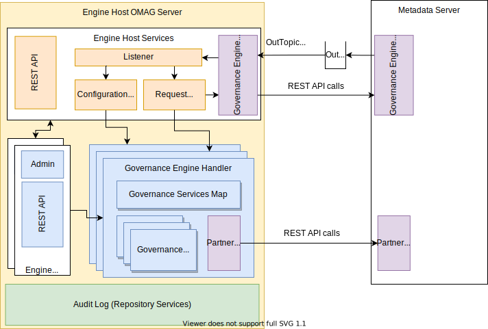

---
hide:
- toc
---

<!-- SPDX-License-Identifier: CC-BY-4.0 -->
<!-- Copyright Contributors to the ODPi Egeria project 2020. -->

--8<-- "snippets/content-status/tech-preview.md"

# Engine host services

The engine host services support the behavior of the [engine host](/egeria-docs/concepts/engine-host).  They manage the start up and shutdown of the configured [Open Metadata Engine Services (OMES)](/egeria-docs/services/omes) as well as retrieve the configuration of their governance engines
and governance services through the 
[Governance Engine OMAS](/egeria-docs/services/omas/governance-engine/overview)
running in a [Metadata Access Server](/egeria-docs/concepts/metadata-access-server).

The engine host services also provide a REST API to query the status of the governance engines running in the server.

The internals of the Engine Host OMAG Server are shown in Figure 1:

> **Figure 1:** Inside the Engine Host OMAG Server

## Further information

There is more of an overview of open governance in the [Governance Action Framework (GAF)](/egeria-docs/frameworks/gaf/overview).

Instructions for [configuring an Engine Host OMAG Server](/egeria-docs/guides/admin/server/configuring-an-engine-host) are found in the [Administration Guide](/egeria-docs/guides/admin).

Instructions for defining Governance Engines and Governance Services are located under the [Discovery and Stewardship](/egeria-docs/features/discovery-and-stewardship) feature.

--8<-- "snippets/abbr.md"