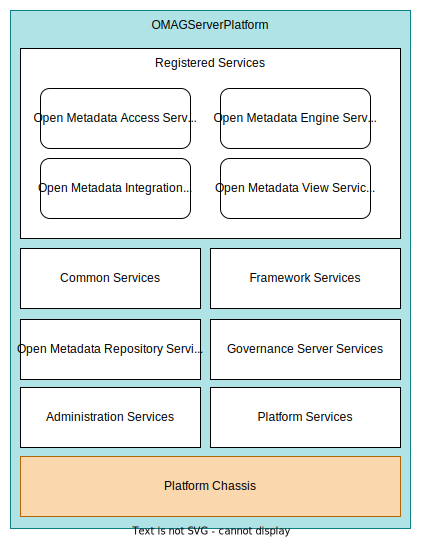

<!-- SPDX-License-Identifier: CC-BY-4.0 -->
<!-- Copyright Contributors to the ODPi Egeria project 2020. -->

# Egeria Services

The Egeria services provide the support for the OMAG Server Platform and its Open Metadata and Governance services.

## Base Platform Support Services

* [Administration Services](/services/admin-services/overview) - for configuring [OMAG Servers](/concepts/omag-server)
* [Platform Services](/services/platform-services/overview) - for starting/stopping and managing the OMAG Servers when they are running.
* [Platform Chassis](/services/platform-chassis) - provides the "main" function for the OMAG Server Platform.
* [Open Metadata Repository Services (OMRS)](/services/omrs) - for managing the repositories used to support the OMAG Server Platform.

## Registered Services

The registered services are pluggable in the OMAG Server Platform and provide specialized services for different types of technologies.

* [Open Metadata Access Services (OMASs)](/services/omas) - Specialized metadata management interfaces.
* [Open Metadata Engine Services (OMESs)](/services/omes) - Specialized support for [governance services](/concepts/governance-service).
* [Open Metadata Integration Services (OMISs)](/services/omis) - Specialized services for [integration connectors](/concepts/integration-connector).
* [Open Metadata View Services (OMVSs)](/services/omvs) - Specialized services for user interfaces.

## Common Services

The common services support clients and the registered services that run in the [OMAG Server Platform](/concepts/omag-server-platform).

* [First-Failure Data Capture (FFDC) Services](/services/ffdc-services) - supports common exceptions and error handling.  It can but used by clients and server-side services.

* [Multi-Tenant Services](/services/multi-tenant) - supports the management of [Open Metadata and Governance (OMAG) Server](/concepts/omag-server) instances running in an [OMAG Server Platform](/concepts/omag-server-platform).

* [Metadata Security](/services/metadata-security-services) - supports authorization of access to OMAG Services and specific metadata instances.

* [Generic Handlers](/services/generic-handlers) - supports the management of specific types of open metadata elements.  The generic handlers provide services to translate OMAS requests built around that service's private beans into calls to the repository services (through the repository handler).

* [Repository Handler](/services/repository-handler) - supports access to multiple related metadata instances from the
[Open Metadata Repository Services (OMRS)](/services/omrs/overview). It manages the provenance checking, deduplication and translates OMRS exceptions into [Open Connector Framework (OCF)](/frameworks/ocf/overview) exceptions that are
used extensively across the [Open Metadata Access Services (OMASs)](/services/omas).

## Governance Server Services

The governance server services provide the implementation of each type of [governance server](/concepts/governance-server).

* [Engine Host Services](/services/engine-host-services) for the [Engine Host](/concepts/engine-host).
* [Integration Daemon Services](/services/integration-daemon-services) for the [Integration Daemon](/concepts/integration-daemon).

--8<-- "snippets/abbr.md"

