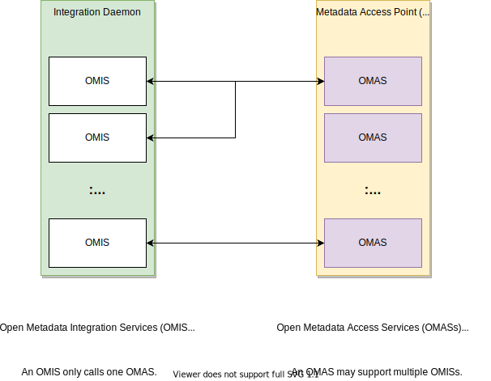
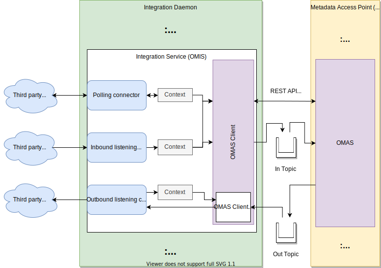

---
hide:
- toc
---

<!-- SPDX-License-Identifier: CC-BY-4.0 -->
<!-- Copyright Contributors to the ODPi Egeria project 2020. -->

--8<-- "snippets/content-status/tech-preview.md"

# Integration Daemon Services

The *integration daemon services* provide the implementation of the [Integration Daemon](/concepts/integration-daemon) OMAG Server which is responsible for operating the [Open Metadata Integration Services (OMISs)](/services/omis).  The integration services are responsible for running connectors that exchange metadata with third party technology.

> **Figure 1:** Integration daemon exchanging metadata with many types of third party technologies

Each type of integration service supports a particular type of connector interface that is designed to exchange metadata with a specific [Open Metadata Access Services (OMASs)](/services/omas). For example, the [Database Integrator OMIS](/services/omis/database-integrator/overview) calls the [Data Manager OMAS](/omas/data-manager/overview).  

> **Figure 2:** The pairing of the integration services with the access services

Inside the Integration Daemon, the integration services host the [integration connectors](/concepts/integration-connector) that manage the exchange of metadata with third party technology. 

> **Figure 3:** Inside the integration daemon showing the context object that provides the specialist API to the integration connectors

## Further information

* [Trouble shooting issues](/guides/diagnostic/integration-daemon-diagnostic-guide) with the integration daemon
* [Configuring](/concepts/integration-daemon) the integration daemon
* Learning more about [integration connectors](/concepts/integration-connector)
* [Solutions](/solutions/data-manager-integration) using the integration daemon

--8<-- "snippets/abbr.md"