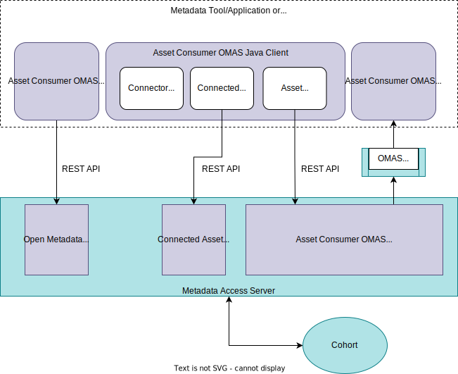

<!-- SPDX-License-Identifier: CC-BY-4.0 -->
<!-- Copyright Contributors to the Egeria project. -->

--8<-- "snippets/content-status/stable.md"

# Asset Consumer Open Metadata Access Service (OMAS)

| Description              | Value                                                                                                                                                                                              |
|--------------------------|----------------------------------------------------------------------------------------------------------------------------------------------------------------------------------------------------|
| Link to Implementation   | [open-metadata-implementation/access-services/asset-consumer :material-github:](https://github.com/odpi/egeria/tree/main/open-metadata-implementation/access-services/asset-consumer){ target=gh } |
| Audit Log Component Id   | 201                                                                                                                                                                                                |
| Audit Log Message Prefix | OMAS-ASSET-CONSUMER                                                                                                                                                                                |
| URL Marker               | asset-consumer                                                                                                                                                                                     |

## Overview

The Asset Consumer OMAS provides services to an individual who wants to work
with [digital resources](/concepts/resource) such as:

* data stores, data sets and data feeds
* reports
* APIs
* functions such as analytical services

These resources are represented in open metadata as [assets](/concepts/asset).

Asset Consumer OMAS supports:

* the retrieval of [connection](/concepts/connection) objects from the open metadata repositories.  A connection object is used to create a connector to an asset.
* the creation of a [connector](/concepts/connector) based on the properties in a connection object.
* the retrieval of properties about an asset.  These properties are called the [connected asset properties](/concepts/connected-asset-properties).
* the adding of feedback (comments, ratings and likes) to an asset.
* the maintenance of [informal tags](/concepts/informal-tag) and the attachment of them to an asset.
* the adding of an audit log record for an asset.
* the publishing of notifications about assets on Asset Consumer OMAS's [out topic](/concepts/out-topic).
* the use of the [open metadata store](/services/gaf-metadata-management) interface.

Adding feedback through the Asset Consumer OMAS results in [Karma Points](/concepts/karma-point) being awarded to the individual.  These are maintained in the individual's profile.  A karma point is awarded for each contribution of feedback through the API. (The awarding of Karma points is managed by the [Community Profile OMAS](/services/omas/community-profile/overview).)

The connectors returned by the Asset Consumer OMAS are [Open Connector Framework (OCF)](/frameworks/ocf/overview) connectors.  The caller can use the connector to access the contents of the asset itself and the properties about the asset it is accessing.   This service is provided by the [OCF Metadata Management Common Service](/services/ocf-metadata-management).

## User Guide

The Asset Consumer OMAS is designed for use by an application that is accessing data sources and services through [connectors](/concepts/connector). These data sources and services are called [digital resources](/concepts/resource).  Digital resources are represented in open metadata as [Assets](/concepts/asset), hence the name of this OMAS is **Asset Consumer**.

Typically, the first action to take is to [create the connector](#creating-a-connector-for-application-use) to get [access to the asset content and its properties](#working-with-connectors). Connectors are created from
[Connection](/concepts/connection) objects. Connection objects can be created by the calling application, or stored in one of the open metadata repositories that are accessible to the Asset Consumer OMAS.

Alternatively, if the consumer only needs access to the asset's properties, they can use the Asset Consumer OMAS to [locate the identifier of the asset](#locating-the-connected-asset) and then [retrieve the asset properties](#retrieving-asset-properties).

Within the asset properties are links to glossary terms. It is possible to [look up the full description of a term](#looking-up-the-meanings-of-terms) to further understand the asset.

There are also capabilities to 
[log messages about the asset](#logging-messages-about-an-asset),
[add feedback to the asset](#adding-feedback-to-an-asset)
in terms of likes, star ratings, reviews and comments,
and [add tags to the asset](#tagging-an-asset).

## Interface choices

The Asset Consumer OMAS offers the following types of interface:

* [Java client](https://odpi.github.io/egeria/org/odpi/openmetadata/accessservices/assetconsumer/client/package-summary.html).
* [Out Topic Events](https://odpi.github.io/egeria/org/odpi/openmetadata/accessservices/assetconsumer/events/package-summary.html) for receiving events about assets.
* [REST API](https://odpi.github.io/egeria/org/odpi/openmetadata/accessservices/assetconsumer/server/spring/package-summary.html).

Connectors are only available through the Java client.

## Configuration

Details of how to configure the Asset Consumer OMAS can be found [in the admin guide](/guides/admin/services/configuring-the-access-services)

## Scenarios

This is the list of documented scenarios:

* [Working with Connectors (overview)](#working-with-connectors)
* [Creating a connector](#creating-a-connector-for-application-use)
* [Locating the connected asset](#locating-the-connected-asset)
* [Retrieving asset properties](#retrieving-asset-properties)
* [Logging audit messages about an event](#logging-messages-about-an-asset)
* [Adding Feedback to an Asset](#adding-feedback-to-an-asset)
* [Looking up the meanings of terms assigned to an asset](#looking-up-the-meanings-of-terms)
* [Adding descriptive tags to an asset](#tagging-an-asset)

--8<-- "docs/services/omas/asset-consumer/working-with-connectors.md"
--8<-- "docs/services/omas/asset-consumer/creating-a-connector.md"
--8<-- "docs/services/omas/asset-consumer/locating-the-connected-asset.md"
--8<-- "docs/services/omas/asset-consumer/retrieving-asset-properties.md"
--8<-- "docs/services/omas/asset-consumer/logging-messages-about-an-asset.md"
--8<-- "docs/services/omas/asset-consumer/adding-feedback-to-an-asset.md"
--8<-- "docs/services/omas/asset-consumer/looking-up-meanings-of-terms.md"
--8<-- "docs/services/omas/asset-consumer/tagging-an-asset.md"

--8<-- "snippets/abbr.md"
