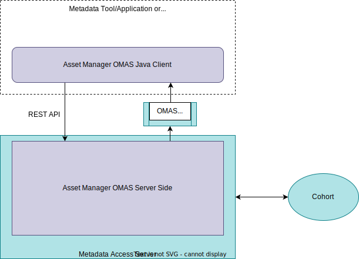
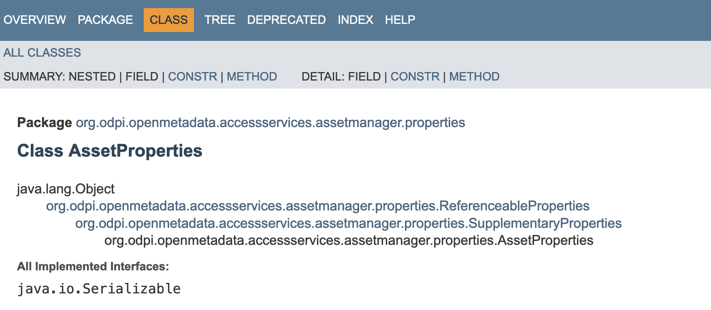

<!-- SPDX-License-Identifier: CC-BY-4.0 -->
<!-- Copyright Contributors to the Egeria project 2020. -->

--8<-- "snippets/content-status/in-development.md"

???+ warn "Development work in progress"
    See issue [3562](https://github.com/odpi/egeria/issues/3562) for the latest development status.

# Asset Manager Open Metadata Access Service (OMAS)

*Data Catalogs* and *Configuration Management Databases (CMDBs)* are examples of asset managers.  They maintain a catalog of [resources](/concepts/resource) for their users as [assets](/concepts/asset) along with catalog search and governance functions to support the maintenance and use of these resources.  Such technologies might integrate with the open metadata ecosystem to receive additional information about their resources, or to distribute the information they have to other tools.


The Asset Manager OMAS provides APIs and outbound events to support the exchange of metadata between a third party *asset manager* and the open metadata ecosystem.

## Types of metadata supported by the Asset Manager OMAS

Asset Manager OMAS provides search and query APIs for these types of metadata elements along with the APIs to maintain their values.

* Data assets and schema
* Connections, connector types and endpoints
* IT Infrastructure (hosts, platforms, servers, storage, capabilities)
* Processes and Lineage
* Collaboration (comments, tags other forms of feedback)
* Stewardship actions
* Reference data (valid values)
* Glossaries and external references
* Governance definitions such as quality rules

The Asset Manager OMAS OutTopic provides a notification service for any changes to these types of elements.



## Integration

Asset managers often have their own integration mechanisms for both the collection of metadata and its distribution.  Therefore, it may be possible to integrate calls to the Asset Manager OMAS directly into the asset manager's runtime, either via the Java client or by calls to the REST API/OutTopic.  This is shown on the left of the diagram below.  The alternative is to create an [integration connector](/concepts/integration-connector) that uses the [Catalog Integrator OMIS](/services/omis/catalog-integrator/overview) or [Lineage Integrator OMIS](/services/omis/lineage-integrator/overview) running in an [Integration Daemon](/concepts/integration-daemon).


## API Features

### Unique name (qualifiedName)

--8<-- "docs/parameters/qualified-name.md"

### External Identifiers

A major challenge when exchanging metadata with third party asset managers is that there is often a mismatch between the structure of the metadata in a third party asset manager and the structure of the [open metadata types](/types) used by the Asset Manager OMAS.

For this reason, the Asset Manager OMAS supports the ability to [associate one or more external identifiers with an open metadata instance](/features/external-identifiers/overview).  These external identifiers are scoped to a particular third party asset manager so that there is no confusion if two third party asset managers happen to use the same unique identifier within their repositories. Each of these external identifiers can be mapped to the appropriate open metadata instances without confusion.

There are also API calls for querying open metadata instances using external identifiers and the identifier of the third party asset manager.

### Identifying your asset manager

The Asset Manager OMAS provides an API for managing an element that represents your asset manager.  This is a [software capability](/concepts/software-capability) of type *Catalog* with the *AssetManager* classification attached. This element can then be linked to the assets and their properties contributed from your asset manager to show where the metadata came from and the scope of any identifiers that are mapped to these elements.

### Defining an external identifier

The code snippet below shows the Asset Manager OMAS method to create a glossary term in open metadata.  It includes a parameter called `externalIdentifierProperties` that are used to define the external identifier for the new element.  In addition, the `assetManagerGUID` and `assetManagerName` properties are used to tie the external identifier to software capability.

```java
    /**
     * Create a new metadata element to represent a glossary term.
     *
     * @param userId calling user
     * @param assetManagerGUID unique identifier of software capability representing the caller
     * @param assetManagerName unique name of software capability representing the caller
     * @param glossaryGUID unique identifier of the glossary where the term is located
     * @param externalIdentifierProperties optional properties used to define an external identifier
     * @param glossaryTermProperties properties for the glossary term
     *
     * @return unique identifier of the new metadata element for the glossary term
     *
     * @throws InvalidParameterException  one of the parameters is invalid
     * @throws UserNotAuthorizedException the user is not authorized to issue this request
     * @throws PropertyServerException    there is a problem reported in the open metadata server(s)
     */
    String createGlossaryTerm(String                       userId,
                              String                       assetManagerGUID,
                              String                       assetManagerName,
                              String                       glossaryGUID,
                              ExternalIdentifierProperties externalIdentifierProperties,
                              GlossaryTermProperties       glossaryTermProperties) throws InvalidParameterException,
                                                                                          UserNotAuthorizedException,
                                                                                          PropertyServerException;
```

Within `externalIdentifierProperties`:

* *externalIdentifier* contains the value of the identifier. The other properties provide additional context information:
* *externalIdentifierName* is the name of the property where the identifier is stored in the third party asset manager.
* *externalIdentifierUsage* describes how the external identifier is used
* *externalIdentifierSource* describes the process that created the extern identifier
* *externalIdentifierKeyPattern* describes the pattern used for the identifier (how it is generated and managed). These are the values it can take, with the default (and most used) being `LOCAL_KEY`:

| Enumeration   | Value | Name             | Description                                                                                                   |
|---------------|-------|------------------|---------------------------------------------------------------------------------------------------------------|
| LOCAL_KEY     | 0     | "Local Key"      | Unique key allocated and used within the scope of a single system.                                            |
| RECYCLED_KEY  | 1     | "Recycled Key"   | Key allocated and used within the scope of a single system that is periodically reused for different records. |
| NATURAL_KEY   | 2     | "Natural Key"    | Key derived from an attribute of the entity, such as email address, passport number.                          |
| MIRROR_KEY    | 3     | "Mirror Key"     | Key value copied from another system.                                                                         |
| AGGREGATE_KEY | 4     | "Aggregate Key"  | Key formed by combining keys from multiple systems.                                                           |
| CALLERS_KEY   | 5     | "Caller's Key"   | Key from another system can bey used if system name provided.                                                 |
| STABLE_KEY    | 6     | "Stable Key"     | Key value will remain active even if records are merged.                                                      |
| OTHER         | 99    | "Other"          | Another key pattern.                                                                                          |

* *mappingProperties* are used to provide additional values used to guide the mapping process between the open metadata elements and the elements in the third party asset manager.

### Supplementary Properties

It is common for external asset managers to include extensive descriptive properties for assets, endpoints, and software capabilities that include both a technical name and description, as well as a common or business name and description.  The technical name is often extracted from the technology when it is initially catalogued and the common or business name is the name that its users know and the value they are likely to search for.

The Asset Manager OMAS supports this distinction and stores the technical name and description in the base metadata instance ([*Asset*](/types/0/0010-Base-Model), [*Endpoint*](/types/0/0026-Endpoints) and [*SoftwareCapability*](0042-Software-Capabilities)  and the common/business name and description in a [*GlossaryTerm*](/types/3/0330-Terms) metadata instance that is linked to the asset using a [*SupplementaryProperties*](/types/3/0395-Supplementary-Properties) relationship. The properties that are stored in the glossary term are referred to as *supplementary properties*.

This approach means that Asset Manager OMAS works seamlessly with other APIs that are cataloguing directly with the technology (such as [Data Manager OMAS](/services/omas/data-manager/overview) and [Data Engine OMAS](/services/omas/data-engine/overview)) and consequently only maintain the base metadata elements.

You can see this distinction in the structure of the property beans.  For example, look at the [AssetProperties](https://odpi.github.io/egeria/org/odpi/openmetadata/accessservices/assetmanager/properties/AssetProperties.html) definition.  It inherits from [SupplementaryProperties](https://odpi.github.io/egeria/org/odpi/openmetadata/accessservices/assetmanager/properties/SupplementaryProperties.html).  The properties defined in *AssetProperties* are stored in the Asset entity and  *SupplementaryProperties* are stored in the GlossaryTerm entity.



### Enumerations

#### DataItemSortOrder

*DataItemSortOrder* provides the valid values for the *sortOrder* property of SchemaAttribute.  It indicates whether the rows/instances of the data stored in this schema appear in any particular order or not.

| Enumeration | Value | Name           | Description                                                                       |
|-------------|-------|----------------|----------------------------------------------------------------|
| UNKNOWN     | 0     | "<Unknown>"    | "The sort order is not specified. |
| ASCENDING   | 1     | "Ascending"    | "The attribute instances are organized so that the smallest/lowest value is first and the rest of the instances follow in ascending order. |
| DESCENDING  | 2     | "Descending"   | The attribute instances are organized so that the largest/highest value is first and the rest of the instances follow in descending order. |
| UNSORTED    | 3     | "Unsorted"     | "The instances of the schema attribute may appear in any order. |                                                                            

#### PermittedSynchronization

*PermittedSynchronization* defines the direction of flow of metadata.

| Enumeration      | Value | Name             | Description                                                                                                                                                                                                                                                                                 |
|------------------|-------|------------------|---------------------------------------------------------------------------------------------------------------------------------------------------------------------------------------------------------------------------------------------------------------------------------------------|
| BOTH_DIRECTIONS  | 0     | "Both Directions" | Metadata exchange is permitted in both directions.  Synchronization is halted on a specific element if potentially clashing updates have occurred both in the third party technology and open metadata.  Such conflicts are logged on the audit log and resolved through manual stewardship. |
| TO_THIRD_PARTY   | 1     | "To Third Party" | The third party technology is logically downstream of open metadata.  This means the open metadata ecosystem is the originator and owner of the metadata being synchronized. Any updates detected in the third technology are overridden by the latest open metadata values.                |
| FROM_THIRD_PARTY | 2     | "From Third Party" | The third party technology is logically upstream (the originator and owner of the metadata).  Any updates made in open metadata are not passed to the third party technology and the third party technology is requested to refresh the open metadata version.                              |
| OTHER            | 99    | "Other"          | Another type of synchronization rule - see description property.                                                                                                                                                                                                                            |


--8<-- "snippets/abbr.md"
