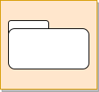

<!-- SPDX-License-Identifier: CC-BY-4.0 -->
<!-- Copyright Contributors to the Egeria project. -->

--8<-- "snippets/content-status/in-development.md"

# Data Manager Open Metadata Access Service (OMAS)

The Data Manager OMAS provides APIs for technologies wishing to register new data assets, connections and related schema from data resources located in database servers, file systems, event brokers, API gateways and file managers and content managers.

The caller of this interface may be the data manager itself, or an [integration daemon](/egeria-docs/concepts/integration-daemon) if the data manager does not support open metadata directly.
The integration daemon calls the Data Manager OMAS client through the following
[integration services](/egeria-docs/services/omis).

* [API Integrator OMIS](/egeria-docs/services/omis/api-integrator/overview) for API Gateways
* [Database Integrator OMIS](/egeria-docs/services/omis/database-integrator/overview) for database managers
* [Display Integrator OMIS](/egeria-docs/services/omis/display-integrator/overview) for reports and forms
* [Files Integrator OMIS](/egeria-docs/services/omis/files-integrator/overview) for file systems and file managers
* [Topic Integrator OMIS](/egeria-docs/services/omis/topic-integrator/overview) for event-based brokers and managers

There are specific APIs for different types of data managers and assets.  These reflect
the terminology typically associated with the specific type of data manager to make it easier
for people to map the Data Manager OMAS APIs and events to the actual technology.
However, the specific implementation objects supported by these APIs all inherit from common
open metadata types so it is possible to work with the resulting metadata in a technology
agnostic manner using services such as the [Asset Consumer OMAS](/egeria-docs/services/omas/asset-consumer/overview).

## Basic metadata model

Figure 1 shows the types of metadata captured by the Data Manager OMAS.

> **Figure 1:** Basic metadata capture by the Data Manager OMAS

These are:

* **Asset** - Asset describes the data asset such as the data set, database schema, topic, API etc.
* **Connection**, **Connector Type** and **Endpoint** are used to create a [connector](/egeria-docs/concepts/connector)
to access the data in the data asset.
* **Schema Element(s)** describe the structure of the data managed by the data asset.

To make it possible to search for particular types of asset, there are many specialized asset types defined in Egeria.
The full list is shown [here](../docs/concepts/assets), however Data Manager OMAS supports
the following subtypes of Asset (and any additional subtypes of these types that you wish to define yourself).

* **DeployedAPI** for API descriptions.
* **Topic** for topics supported by an event manager.
* **DataFile** for a file with sub types of:
   * **CSVFile** for CSV files.
   * **AvroFile** for files using the Avro format.
   * **JSONFile** for files using the JSON format.
* **Database** for databases.
* **DeployedDatabaseSchema** for schemas within a database.
* **DeployedReport** for reports.
* **Form** for interactive forms.

The Data Manager OMAS APIs needs to accommodate slight variations between different vendor
implementations of data managers, along with information relating to local deployment standards.
As such there is provision in these interfaces to support:

* `VendorProperties` for properties unique to a specific vendor implementation, and
* `AdditionalProperties` for properties that the metadata team wish to add to the metadata.

## Data Managers

The Data Manager OMAS Supports the following types of data managers:

| Icon                                   | Name     | Provenance | Description |
| :----------------------------------:   | :---------- | :------------------------------------------------------: | :---------- |
|    | File System | Local Cohort | Create metadata elements for files and folders along with their data connections and any known schema information. Catalogued files and folders are members of the local cohort because many different types of processes may work with them. |
|  | File Manager | External  | Create metadata elements for files and folders along with their data connections and any known schema information. Catalogued files and folders are members of the data manager's metadata collection because it is responsible for their maintenance.|
|  | Database Manager | External | Create metadata elements for databases, database schemas, tables, views, columns, primary keys and foreign keys. Catalogued elements are members of the data manager's metadata collection because it is responsible for their maintenance.|
|  | Event Broker | Local Cohort or External | Create metadata elements for topics and the event payloads they support. Catalogued elements are members of the data manager's metadata collection (ie External provenance) if it is responsible for their maintenance.|
|  | API Manager | Local Cohort or External | Create metadata elements for APIs and their supported headers and payloads. Catalogued elements are members of the data manager's metadata collection (ie External provenance) if it is responsible for their maintenance.|
|  | Display Tools | Local Cohort or External | Create metadata elements for reporting tools, forms and associated queries. Catalogued elements are members of the data manager's metadata collection (ie External provenance) if it is responsible for their maintenance.|

## More information

* [What is an Asset?](/egeria-docs/concepts/asset)
* [Building an asset catalog](/egeria-docs/metadata-manager)
* [Modeling schema structures](/egeria-docs/guides/developer/mapping-technology/modelling-schemas)

--8<-- "snippets/abbr.md"
