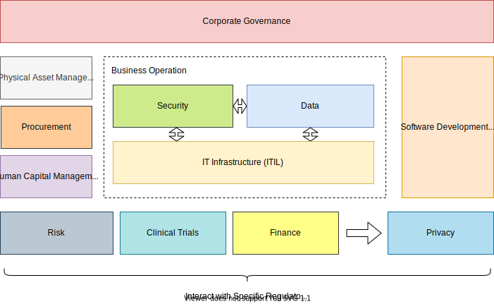
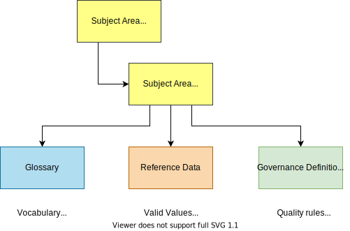
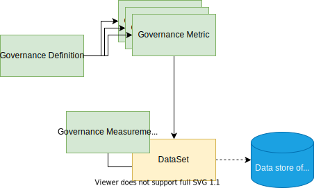
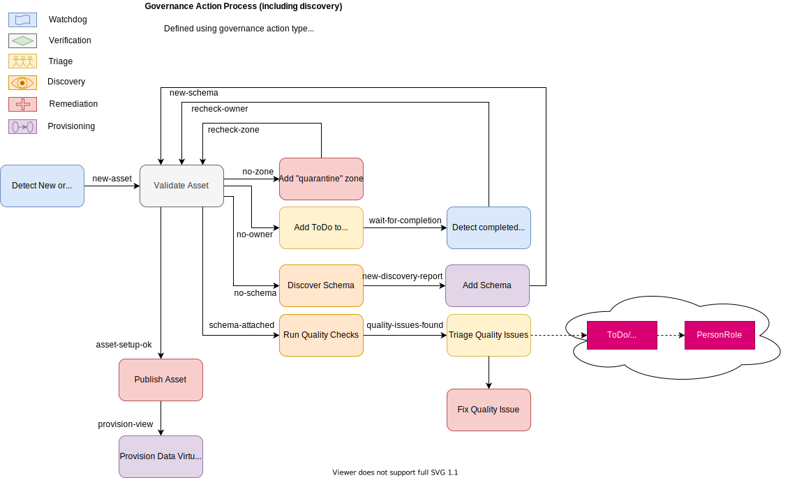

<!-- SPDX-License-Identifier: CC-BY-4.0 -->
<!-- Copyright Contributors to the Egeria project. -->

--8<-- "snippets/content-status/in-development.md"

# Governance Program Open Metadata Access Service (OMAS)

The Governance Program OMAS provides APIs and events for tools and applications focused on defining a data strategy, planning support for a regulation and/or developing a governance program for the data landscape.

It assumes an organization is operating an active governance program that is iteratively reviewed and developed.

It covers:

- Understanding the business drivers and regulations that provide the motivation and direction to the governance program.

- Laying down the governance policies (principles, obligations and approaches) that frame the governance program.

- Planning and defining the governance controls that detail how these governance policies will be implemented in the organization, and enumerating the implications of these decisions and the expected outcomes.

- Defining the organization's roles and responsibilities that will support the governance program.

- Defining the classifications and governance zones that will organize the assets being governed.

- Defining the subject areas that will organize the data-oriented definitions such as glossary terms, valid values and quality rules.

- Reviewing the impact of the governance program.
  
   - adjusting governance definitions and metrics as necessary.
  
- Reviewing the strategy, business and regulatory landscape.
  
   - adjusting the governance definitions and metrics as necessary.

## Governance Definitions

A *Governance Definition* is a metadata element that describes the context or purpose for an activity that supports the organization's operation. Figure 1 shows the main types of governance definition and how they link together to create a coherent response to a business strategy or regulation.

> **Figure 1:** Using governance definitions to provide traceability from business drivers and regulations to actions.

## Governance domains

Governance domains are the areas of an organization's operation that receive specific focus from a governance point of view.

> **Figure 2:** Examples of different governance domains within an organization.  Each domain is typically the responsibility of a different executive in the organization.  They may use slightly different terminology and often different tools but in fact they are very similar in the way that the operate.  Egeria allows the teams from the different governance domains to collaborate and benefit from each others efforts.

Governance domains are represented by *[Governance Domain Descriptions](/types/4/0401-Governance-Definitions)* that are referenced by the *domainIdentifier* property.  This is an integer and by convention "0" means "applies to all domains".  

It is possible to set up a default list of domains using the [`createStandardGovernanceDomains`](https://odpi.github.io/egeria/org/odpi/openmetadata/accessservices/governanceprogram/api/GovernanceDomainInterface.html) method. This will give you the following governance domain definitions:

| Domain Identifier | Description |
| :-------- | :----- |
| 1 | DATA - the governance of data and its use.
| 2 | PRIVACY - the support for data privacy.
| 3 | SECURITY - the governance that ensures IT systems and the data they hold are secure.
| 4 | IT_INFRASTRUCTURE - the governance of the configuration and management of IT infrastructure and the software that runs on it.
| 5 | SOFTWARE_DEVELOPMENT - the governance of the software development lifecycle.
| 6 | CORPORATE - the governance of the organization as a legal entity.
| 7 | ASSET_MANAGEMENT - the governance of physical assets.

## Subject areas

Subject areas are topics or domains of knowledge that are of interest to the governance leaders.

> **Figure 3:** Defining a subject area

Governance Program OMAS provides an [interface to create subject area definitions](https://odpi.github.io/egeria/org/odpi/openmetadata/accessservices/governanceprogram/api/SubjectAreasInterface.html).  The work is then handed off to the subject area owners:

* [Subject Area OMAS](/services/omas/subject-area/overview) supports the definition of glossary terms for subject areas.  
* [Digital Architecture OMAS](/services/omas/digital-architecture/overview) supports the definition of reference data and quality rules for the subject area.
* [Asset Manager OMAS](/services/omas/asset-manager/overview) supports the exchange of subject area information with other catalogs and quality tools.

!!! education "Further information"
    
    * [Common Data Definitions](/practices/common-data-definitions/overview) describes the management and use of subject areas.
    
    * The [Defining Subject Areas](/practices/coco-pharmaceuticals/scenarios/defining-subject-areas/overview/) scenario for Coco Pharmaceuticals walks through the process of setting up.
    
    * There are two code samples associated with this set of subject areas:
    
        * [Setting up the subject area definitions :material-github:](https://github.com/odpi/egeria/tree/master/open-metadata-resources/open-metadata-samples/access-services-samples/governance-program-client-samples/governance-subject-area-sample){ target=gh }
        * [Setting up glossary categories for each subject area :material-github:](https://github.com/odpi/egeria/tree/master/open-metadata-resources/open-metadata-samples/access-services-samples/subject-area-client-samples/subject-area-definition-sample){ target=gh } ready for subject area owners to start defining glossary terms associated with their subject area.

## Governance classification, tagging and linking

One of the ways to reduce the cost of governance is to define groups of similar assets/resources along with the governance definitions that apply to members of the group.  This avoids having to make decisions on how to manage each asset/resource.  The cataloguing process just needs to work out which group(s) to place the asset in.  Labels such as classifications, and tags of different types are used to identify these group assignments.  When a governance process is operating on the asset/resource, it looks up the labels and follows the governance definitions for the group.

> **Figure 4:** Different types of tags used to group assets for governance

The different types of labels used to group assets/resources are used for different purposes and may indicate how official they are:

* [Governance Zones](/concepts/governance-zone) group assets according to their use.  They are typically is used for [controlling visibility to the resource's asset definition](/features/governance-zoning/overview).

* [Governance Classifications](#setting-up-the-levels-for-your-governance-classifications) define the groups used for specific types of governance.

    * Confidence Governance Classification defines the level of confidence that should be placed in the accuracy of related data items.  This limits the scope that the data can be used in.
    * Confidentiality Governance Classification defines the level of confidentiality or secrecy needed with particular data.
    * Criticality Governance Classification defines how critical the related resources are to the continued operation of the organization.
    * Impact Governance Classification defines how much of an impact a particular situation is to the operation of the organization.
    * Retention Governance Classification defines how long a resource (typically data) must be retained by the organization.

* License Types define the contract aka (terms and conditions) that define how the asset/resource can be used.

* Certification Types define specific characteristics of an asset/resource that has been verified for a particular span of time.

* [SecurityTags](/concepts/security-tags) identify labels and properties that are used in determining which data protection rules should be executed when particular data is requests. They can be attached to assets or schema elements depending on the scope of data that the security tags apply to. The synchronized access control feature describes how security tags are set up and used.

The labels may be assigned directly to the asset, or to elements, such as schemas and glossary terms that are linked to the asset.

## Setting up the levels for your governance classifications

The values used in governance classifications show the specific group that the classified asset belongs to.  Often an organization has their own levels defined and they can be set up in [`GovernanceClassificationLevel`](/types/4/0421-Governance-Classification-Levels/) definitions.

> **Figure 5:** Governance classifications that use governance level definitions

Egeria has a set of default values that can be set up using the [`createStandardGovernanceClassificationLevels`](https://odpi.github.io/egeria/org/odpi/openmetadata/accessservices/governanceprogram/api/GovernanceClassificationLevelInterface.html#createStandardGovernanceClassificationLevels(java.lang.String,java.lang.String) method.

## Measures and metrics

As important aspect of the governance program is the ability to measure its effectiveness and identify the assets that are delivering the highest value, or operating with the greatest efficiency etc.

A value that should be captured to demonstrate the effectiveness of the governance program is documented using the `GovernanceMetric` entity. It is linked to the appropriate governance definition and can be linked to a data set where the specific measurements are being gathered.

The calculation of governance metrics is often a summary of many other measurements associated with specific resources (such as data sources and processes) operating under the scope of the governance program. These resources are catalogued as [`Assets`](/concepts/asset). 

> **Figure 6:** Measuring governance through an external data set

The definition of their expected behavior or content can be captured using the `GovernanceExpectations` classification attached to the `Asset`. The measurements that support the assessment of a particular resource can be gathered and stored in a `GovernanceMeasurements` classification attached to its `Asset`.

> **Figure 7:** Setting expectations and gathering results in classifications

The measurement classification may be attached to a related element that describes an aspect for its operation.  For example, in figure 8 the measurement is attached to a process instance that captures a specific run of a process.  The expected values are attached to its parent process.

> **Figure 8:** Attaching the measurements to related elements

## Execution points

A governance execution point defines specific activity that is supporting governance.

There are three types:

* A Control Point is a place in the processing where a decision needs to be made. It may be a choice on whether to tolerate a reported situation or to resolve it - or it may be a decision on how to solve it.

* A Verification Point describes processing that is testing if a desired condition is true. Quality rules are examples of verification points. The result of a verification point is the output of the test. It may, for example, be a boolean, classification or a set of invalid values.

* An Enforcement Point describes processing that enforces an specific condition. For example, data may need to be encrypted at a certain point in the processing. The encryption processing is an enforcement point.

The ExecutionPointDefinition elements are created during the design of the governance program. They characterize the types of execution points that are needed to support the governance requirements. They are linked to the Governance Definition that they support using the ExecutionPointUse relationship. Typically the governance definitions linked to the governance execution point definitions are:

* Governance Processes
* Governance Procedures

Often execution points need to be integrated with the normal activity of the business, but they may also represent additional standalone activity.

The classifications ControlPoint, VerificationPoint and EnforcementPoint are used to label governance implementation elements with the type of execution point and the qualified name of the corresponding definition if any. They are often found on element such as:

* Governance Action Types
* Governance Actions

These classifications help in the review of the implementation of the governance program and can be used to drive additional audit logging. 

> Implementing the actions defined in your governance definitions.

## Related OMASs

- The [Community Profile OMAS](/services/omas/community-profile/overview) supports the definition of the profiles for people and teams that will support the governance program.  These are linked to the governance roles defined by the governance program.

* The [Project Management OMAS](/services/omas/project-management/overview) supports the rollout of the governance program by commissioning campaigns and projects to implement the governance controls and the collection of measurements to assess the success of the program.

* The [Digital Architecture OMAS](/services/omas/digital-architecture/overview) provides the set up of the digital landscape that supports the governance program.  This includes the definitions of the information supply chains and solution components that support the organization's activities.

* The [Digital Service OMAS](/services/omas/digital-service/overview) documents the business capabilities along with their digital services that are supported by the governance program.

* The [Governance Engine OMAS](/services/omas/governance-engine/overview) supports the implementation of technical controls and the choreography of their execution.

* The [Stewardship Action OMAS](/services/omas/stewardship-action/overview) supports the stewards as they manage the exceptions detected to the governance program.
  
* The [Data Privacy OMAS](/services/omas/data-privacy/overview) supports the operational aspects of managing privacy as part of the organization's activities.

* The [Subject Area OMAS](/services/omas/subject-area/overview) supports the definitions of the vocabularies associated with a subject area.

* The [Data Manager OMAS](/services/omas/data-manager/overview) support the automated cataloging of assets and configuration of technology that is managing them.

* The [Security Manager OMAS](/services/omas/security-manager/overview) support the configuration of technology that is managing the security of assets.

* The [Security Officer OMAS](/services/omas/security-officer/overview) support the definitions of users and groups and related definitions that make up the user directory.

* The [Asset Manager OMAS](/services/omas/asset-manager/overview) supports the automated exchange of governance definitions between catalogs and asset managers to create a consistent rollout of governance requirements.
  
* The [Asset Owner OMAS](/services/omas/asset-owner/overview) supports the linking of governance definitions and classifications to assets to define how they should be governed.

* The [Asset Consumer OMAS](/services/omas/asset-consumer/overview) supports the visibility of the governance definitions and classification by consumers of the assets.

--8<-- "snippets/abbr.md"
