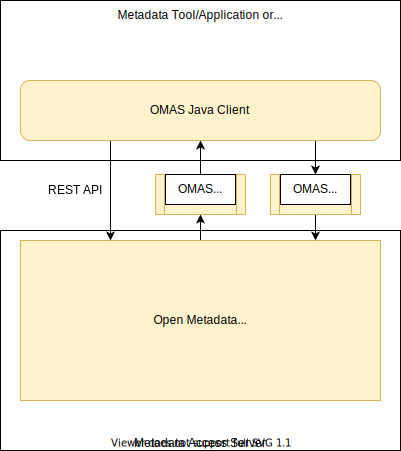

---
hide:
- toc
---

<!-- SPDX-License-Identifier: CC-BY-4.0 -->
<!-- Copyright Contributors to the Egeria project. -->
  
# Open Metadata Access Services (OMAS)

The Open Metadata Access Services (OMAS) provide domain-specific services for data tools, engines and platforms to integrate with open metadata.  They run in a [Metadata Access Server](/concepts/metadata-access-server).

The access services are as follows:

| OMAS                                                                 | Description                                                                                                                                                                                                                                                                                                                                                                                                                                                                                                                                                       | Supplied APIs and events to                                                                                                                                                                                                                                                                                                                         |
|----------------------------------------------------------------------|-------------------------------------------------------------------------------------------------------------------------------------------------------------------------------------------------------------------------------------------------------------------------------------------------------------------------------------------------------------------------------------------------------------------------------------------------------------------------------------------------------------------------------------------------------------------|-----------------------------------------------------------------------------------------------------------------------------------------------------------------------------------------------------------------------------------------------------------------------------------------------------------------------------------------------------|
| [Asset Consumer](/services/omas/asset-consumer/overview)             | The Asset Consumer OMAS is designed for applications that are using [OCF](/frameworks/ocf/overview) connectors to access data stores, APIs and functions such as analytics. The Asset Consumer OMAS provides a factory function for the connectors, the ability to retrieve all of the metadata about the asset and the ability to add feedback on the asset.                                                                                                                                                                                                     | [Search Integrator OMIS](/services/omis/search-integrator/overview), [Asset Catalog OMVS](/services/omvs/asset-catalog/overview)                                                                                                                                                                                                                    |
| [Asset Lineage](/services/omas/asset-lineage/overview)               | The Asset Lineage OMAS listens to relevant lineage related events on the enterprise topic level and publishes these on the Asset Lineage OutTopic, combined with relevant context information on the described entities. These events are listened to by the open lineage services governance server.                                                                                                                                                                                                                                                             | [Lineage Warehouse Services](/services/lineage-warehouse-services)                                                                                                                                                                                                                                                                                  |
| [Asset Manager](/services/omas/asset-manager/overview)               | The Asset Manager OMAS manages the exchange of metadata with third party metadata catalogs and asset managers. It is typically called by the [Catalog Integrator OMIS](/services/omis/catalog-integrator/overview) to send and receive asset information, including schemas, profiles, policies and lineage information with a third party asset manager. Typical examples of asset managers include data catalogs that are managing metadata for a collection of data assets for a data-serving solution.                                                        | [Catalog Integrator OMIS](/services/omis/catalog-integrator/overview), [Lineage Integrator OMIS](/services/omis/lineage-integrator/overview), [Glossary Browser OMVS](/services/omvs/glossary-browser/overview), [Glossary Workflow OMVS](/services/omvs/glossary-workflow/overview)                                                                |
| [Asset Owner](/services/omas/asset-owner/overview)                   | The Asset Owner OMAS provides services for an asset owner to curate metadata about their asset(s) and understand how these assets are being used and governed.                                                                                                                                                                                                                                                                                                                                                                                                    | [Survey Action OMES](/services/omes/survey-action/overview), [Automated Curation OMVS](/services/omvs/automated-curation/overview)                                                                                                                                                                                                                  |
| [Community Profile](/services/omas/community-profile/overview)       | The Community Profile OMAS supports the administration for a community and related user profiles. These communities are involved in reviewing and crowd-sourcing knowledge about the data assets and their use.                                                                                                                                                                                                                                                                                                                                                   | [Organization Integrator OMIS](/services/omis/organization-integrator/overview), [My Profile OMVS](/services/omvs/my-profile/overview)                                                                                                                                                                                                              |
| [Data Engine](/services/omas/data-engine/overview)                   | The Data Engine OMAS provides APIs and events for a data movement/processing engine to record the changes it is making the the data landscape. This information forms a key part of asset lineage.                                                                                                                                                                                                                                                                                                                                                                | [Data Engine Proxy Services](/services/data-engine-proxy-services)                                                                                                                                                                                                                                                                                  |
| [Data Manager](/services/omas/data-manager/overview)                 | The Data Manager OMAS provides an integration point to enable technologies that manage collections of data such as database servers, file systems, file managers and content managers to publish metadata to the metadata repositories about the changing structures and content stored in the data platform. It is typically called from the [Database Integrator OMIS](/services/omis/database-integrator/overview) and [Files Integrator OMIS](/services/omis/files-integrator/overview) integration services.                                                 | [API Integrator OMIS](/services/omis/api-integrator/overview), [Database Integrator OMIS](/services/omis/database-integrator/overview), [Display Integrator OMIS](/services/omis/display-integrator/overview), [Files Integrator OMIS](/services/omis/files-integrator/overview), [Topic Integrator OMIS](/services/omis/topic-integrator/overview) |
| [Data Privacy](/services/omas/data-privacy/overview)                 | The Data Privacy OMAS supports a privacy officer as they manage data privacy in their organization. This includes managing privacy impact assessments and reviews of software services that use personal data as they move through their development, deployment and use.                                                                                                                                                                                                                                                                                         |                                                                                                                                                                                                                                                                                                                                                     |
| [Data Science](/services/omas/data-science/overview)                 | The Data Science OMAS provides access to metadata for data assets, connections and projects, plus the ability to maintain metadata about data science notebooks and models and log activity during the analytics development process. It is designed for data science and analytics management tools.                                                                                                                                                                                                                                                             | [Analytics Integrator OMIS](/services/omis/analytics-integrator/overview), [Event Action OMES](/services/omes/event-action/overview)                                                                                                                                                                                                                |
| [Design Model](/services/omas/design-model/overview)                 | The Design Model OMAS provides the ability to manage information from all types of design models. These models may come from tools or be part of a packaged standard. This content is useful for governance, system integration and software development.                                                                                                                                                                                                                                                                                                         |                                                                                                                                                                                                                                                                                                                                                     |
| [DevOps](/services/omas/dev-ops/overview)                            | The DevOps OMAS provides services for a DevOps pipeline to query and maintain metadata about systems, processes and software components that are being deployed into the information landscape.                                                                                                                                                                                                                                                                                                                                                                   |                                                                                                                                                                                                                                                                                                                                                     |
| [Digital Architecture](/services/omas/digital-architecture/overview) | The Digital Architecture OMAS provides the ability to define information standards, definitions, solution blueprints and models for an organization. It is designed for architecture tools. It is able to support the definition and management of a digital service through concept to deployment.                                                                                                                                                                                                                                                               |                                                                                                                                                                                                                                                                                                                                                     |
| [Digital Service](/services/omas/digital-service/overview)           | The Digital Service OMAS provides services for a managing the lifecycle of an Egeria Digital Service.                                                                                                                                                                                                                                                                                                                                                                                                                                                             | [Collection Manager OMVS](/services/omvs/collection-manager/overview)                                                                                                                                                                                                                                                                               |
| [Discovery Engine](/services/omas/discovery-engine/overview)         | The Discovery Engine OMAS provides an API for a discovery engine to access and store metadata from an open metadata repository (or open metadata repository cohort).                                                                                                                                                                                                                                                                                                                                                                                              | [Asset Analysis OMES](/services/omes/asset-analysis/overview)                                                                                                                                                                                                                                                                                       |
| [Governance Engine](/services/omas/governance-engine/overview)       | The Governance Engine OMAS provides APIs and events that retrieve and manage metadata for [governance action services](/concepts/governance-action-service).                                                                                                                                                                                                                                                                                                                                                                                                      | [Governance Action OMES](/services/omes/governance-action/overview)                                                                                                                                                                                                                                                                                 |
| [Governance Program](/services/omas/governance-program/overview)     | The Governance Program OMAS provides the ability to maintain a governance program in the open metadata repositories. It is designed for governance and CDO tools.                                                                                                                                                                                                                                                                                                                                                                                                 |                                                                                                                                                                                                                                                                                                                                                     |
| [Governance Server](/services/omas/governance-server/overview)       | The Governance Server OMAS supplies the [governance engine definitions](/concepts/governance-engine-definition) to the [engine hosts](/concepts/engine-host) and the and [integration group definitions](/concepts/integration-group) to the [integration daemons](/concepts/integration-daemon).                                                                                                                                                                                                                                                                 | [Integration Daemon Services](/services/integration-daemon-services), [Engine Host Services](/services/engine-host-services)                                                                                                                                                                                                                        |
| [IT Infrastructure](/services/omas/it-infrastructure/overview)       | The IT Infrastructure OMAS provides support for the design and planning of the information infrastructure that supports the data assets. This includes the development of system blueprints that link down to the metadata about real infrastructure components. This metadata helps in the linkage between information governance metadata and IT infrastructure management (ITIL) metadata typically stored in a Configuration Management Database (CMDB).                                                                                                      | [Infrastructure Integrator OMIS](/services/omis/infrastructure-integrator/overview)                                                                                                                                                                                                                                                                 |
| [Project Management](/services/omas/project-management/overview)     | The Project Management OMAS supports the metadata associated with projects and campaigns. These projects and campaigns may be for governance projects, or generic data use projects.                                                                                                                                                                                                                                                                                                                                                                              | [Project Manager OMVS](/services/omvs/project-manager/overview)                                                                                                                                                                                                                                                                                     |
| [Security Manager](/services/omas/security-manager/overview)         | The Security Manager OMAS provides the services to exchange security tags with access control and data protection technology services. It is called by the [Security Integrator OMIS](/services/omis/security-integrator/overview).                                                                                                                                                                                                                                                                                                                               | [Security Integrator OMIS](/services/omis/security-integrator/overview)                                                                                                                                                                                                                                                                             |
| [Security Officer](/services/omas/security-officer/overview)         | The Security Officer OMAS provides the services to support the definition of roles and rules for managing the protection of metadata and assets, plus work with the audit logs captured by the open metadata and governance tools. It is typically used by the security, compliance and auditing teams.                                                                                                                                                                                                                                                           |                                                                                                                                                                                                                                                                                                                                                     |
| [Software Developer](/services/omas/software-developer/overview)     | The Software Development OMAS provides access to metadata needed to build compliant APIs, data stores and related software components.                                                                                                                                                                                                                                                                                                                                                                                                                            |                                                                                                                                                                                                                                                                                                                                                     |
| [Stewardship Action](/services/omas/stewardship-action/overview)     | The Stewardship Action OMAS provides services for managing exceptions discovered in the information landscape that need correcting. These exceptions may be quality errors, missing or outdated information, invalid licensing, job failures, and many more. The Stewardship Action OMAS also enables the review and triage of the exceptions, simple remediation and status reporting.                                                                                                                                                                           | [Stewardship Integrator OMIS](/services/omis/stewardship-integrator/overview), [Notification Manager OMVS](/services/omvs/notification-manager/overview)                                                                                                                                                                                            |
| [Subject Area](/services/omas/subject-area/overview)                 | The Subject Area OMAS is for tools that support subject matter experts who are defining glossaries, reference data and rules around data for a specific subject area, such as "customer data". It supports the development of a comprehensive definition of the subject area and the standards that support it. These definitions can then be folded into the Governance Program, and used by Asset Owner's to improve the findability and understandability of their assets by linking their asset's structure to relevant parts of the subject area definition. | [Glossary Author OMVS](/services/omvs/glossary-author/overview)                                                                                                                                                                                                                                                                                     |

## Using the OMAS's

The OMAS's run in a [metadata access server](/concepts/metadata-access-server).  They can be configured and activated individually or as a complete set through the [administration services](/guides/admin/servers/by-section/access-services-section).

Each OMAS typically supports a Java API, an optional topic where it publishes notifications of interest to its callers (called the [OutTopic](/concepts/out-topic)), and an optional topic where new metadata requests can be posted to the OMAS (called the [InTopic](/concepts/in-topic)).

Internally, the Java client calls the REST API of the server module to allow it to reside in remote servers. This java client is embedded in the [integration services](/services/omis), [engine services](/services/omes) and [view services](/services/omvs) to facilitate exchange of metadata between the OMAG servers.

## Inside an OMAS

Although each OMAS provides a unique API, the internal structure of each OMAS is pretty similar.  

Typically, an OMAS supports a Java client interface that runs locally in the metadata tool, service, or application.  These client interfaces support both synchronous and asynchronous calls to the OMAS server-side.

For callers that do not use Java, behind the client there is an OMAS REST API and an event notification interface (typically supported by [Apache Kafka](https://kafka.apache.org/)) that can be called directly.  The event notification interface for each OMAS has a topic to allow an external caller to post metadata updates to the open metadata repositories (OMAS In Topic) and another topic (OMAS Out Topic) to receive relevant updates that have come from other parts of the open metadata and governance ecosystem.

Today, direct calls to the REST APIs and topics are not guaranteed  to be backward compatible.  They are also not documented.  However, we are moving to a position where these interfaces are both documented and supported.  The change in their disposition will occur when the documentation is contributed.

The interfaces are illustrated in Figure 1:

> **Figure 1:** Structure of an Open Metadata Access Service (OMAS)

The OMAS receives metadata from the [Open Metadata Repository Cohort](/concepts/cohort-member)through the [Open Metadata Repository Services (OMRS)](/services/omrs).

Figure 2 shows the repository services.

> **Figure 2:** Calling the repository services

The OMRS subsystem called the enterprise repository services offers both an Enterprise OMRS Repository Connector and Enterprise OMRS Topic.  The Enterprise OMRS Repository Connector queries all repositories in the cohorts that the local server is connected to.  The Enterprise OMRS Topic aggregates events from all connected cohorts.

The OMAS is passed the enterprise repository service objects at initialization.  It can then register a listener with the Enterprise OMRS Topic to receive the cohort events.

While running, the OMAS can call the Enterprise OMRS Repository Connector directly.  However, there are many common functions that all OMASs need and these are provided by the [common services](/services/#common-services).

Figure 3 shows the common services.

> Figure 3: Using the common services

The common services provide most of the metadata management implementation logic for the OMASs.  This means that the code in each OMAS's modules is able to
focus on supporting its specific interfaces and mapping them to the common services.

 * The [Repository Handler](/services/repository-handler) provides an object-oriented interface over the Enterprise OMRS Repository Connector.

 * The [Generic Handlers](/services/generic-handlers) provide support for maintaining and accessing specific [Open Metadata Types](/types) (such as Asset, Connection, ...).  They also support calls to metadata security, visibility of metadata based on governance zones and the maintenance of [anchorGUIDs](/concepts/anchor) in dependent instances.

 * [Metadata security](/features/metadata-security/overview) manages calls to the  [OpenMetadataServerSecurityConnector](/concepts/server-metadata-security-connector) if it is installed in the server.

## Further Information

* [Design Guidelines for an OMAS](/services/omas/access-services-design-guidelines)

--8<-- "snippets/abbr.md"
