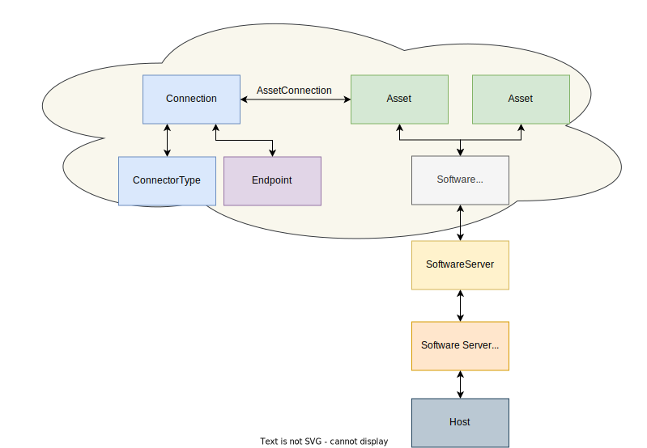
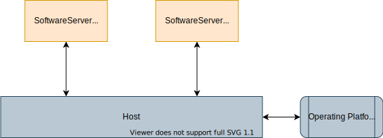
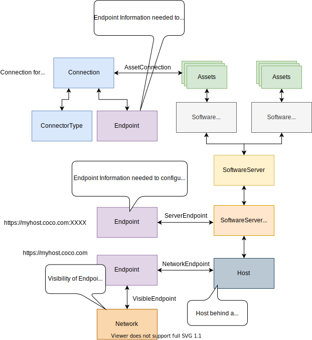
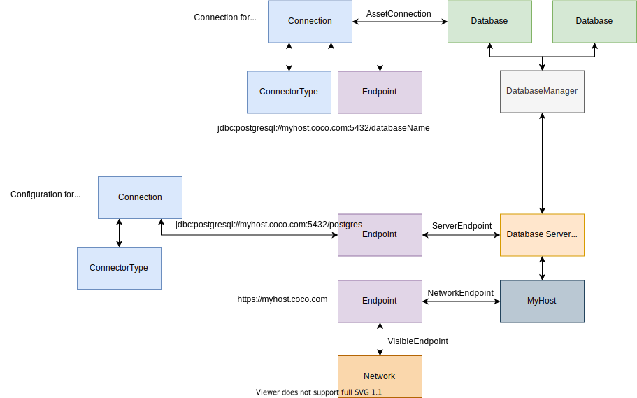

<!-- SPDX-License-Identifier: CC-BY-4.0 -->
<!-- Copyright Contributors to the Egeria project. -->

--8<-- "snippets/content-status/stable.md"

# IT Infrastructure Open Metadata Access Service (OMAS)

The IT Infrastructure OMAS provides APIs for tools and applications managing the IT infrastructure that supports the data assets and software.

It is typically used by the [Infrastructure Integrator OMIS](/services/omis/infrastructure-integrator/overview) to capture metadata from deployment artifacts, or to generate deployment artifacts from open metadata.

The other major use of IT Infrastructure OMAS is to [manually catalog the key pieces of IT Infrastructure used by an organization](/practices/coco-pharmaceuticals/scenarios/cataloguing-infrastructure/overview). The creation of this metadata may be used to kick off the automated cataloging of the capabilities and assets associated with the infrastructure.

## Basic Concepts

At the base is the notion of a **Host**.  This could be:

- *BareMetalComputer* - traditional computer hardware or
- *VirtualMachine* - a virtualized machine (such as VMWare or VirtualBox) that uses a hypervisor to virtualize machine hardware or
- *VirtualContainer* - a software system using a container library to virtualize the operating system it uses or
- *HostCluster* - a cluster of Hosts that are operating as a single operational environment (such as a Hadoop cluster or kubernetes cluster).

Hosts are composable and reusable.  For example, figure 1 shows a Virtual Container that is deployed to two Bare Metal Computers.  The relationship between them is called *DeployedOn*.

> **Figure 1:** A virtual container deployed to two bare metal computers

Figure 2 shows an example of Host Cluster, such as a Hadoop Cluster, that manages multiple Hosts (Bare Metal Computers in this example).  The relationship between the Host Cluster and each subordinate Host is *HostClusterMember*.  The host cluster may not have all of its members active.  The membership denotes the pool of resources that the cluster has to work with.

> **Figure 2:** A cluster of bare metal computers operating as single host

### Storage

A host may have its own storage - or it may be shared.  One or more hosts can be linked to a *StorageVolume* via the *AttachedStorage* relationship.

> **Figure 3:** Showing how storage is allocated to the hosts

A host typically runs an operating system and may have various hardware characteristics of interest (such as byte ordering). Collectively this information is called the *OperatingPlatform*. 

The Operating Platform can be linked to many hosts through the *OperatingPlatformUse* relationship.  This is shown in figure 4. It documents that these hosts are running the software identified by the operating platform. This is particularly useful if you are using standard software stack builds that are deployed to multiple hosts since it is easy to see which hosts are at which levels of the software and to manage the rollout of upgrades to the stack.

> **Figure 4:** A collection of hosts using the same operating platform

The *SoftwarePackageManifest* shown in figure 5 details the software stack for the operating platform.  It is represented as a *Collection* linked to the operating platform using the *OperatingPlatformManifest* relationship.

> **Figure 5:** The software stack definition for an operating platform

Linked to a host via the *DeployedOn* relationship are the *SoftwareServerPlatform*s.  They describe the operating system processes running on the Host that use software described in the Operating Platform. This is shown in figure 6.

> **Figure 6:** The software server platforms running on the host

The functions of the software server platform are described using *SoftwareCapabilities*.  They typically host/manage assets such as *DataSets*, *DataStores* and *Processes* that are linked to the software capability using the **ServerAssetUse** relationship.

Some technologies are written as a single stack.
Figure 7 shows the structure of the metadata elements
for a technology - such as Apache Kafka or a Database Server - that is a single stack.

> **Figure 7:** The metadata elements to represent a single stack technology

Figure 8 shows the representation of the stack
of a platform that allows multiple virtual servers to be configured.
The servers are represented by *SoftwareServers*.  Software capabilities can be attached to the software servers as well as the software server platforms.

> **Figure 8:** The metadata elements to represent a configurable software server platform

Egeria's [OMAG Server Platform](/concepts/omag-server-platform) is an example of this type of technology. This is illustrated in figure 9.  The software servers are [OMAG Servers](/concepts/omag-server) and the registered services are software capabilities of type *SoftwareService*.  More specifically:

* Open Metadata Access Services (OMASs) are software capabilities of type  *MetadataAccessService*
* Open Metadata Engine Services (OMESs) are software capabilities of type *EngineHostingService*
* Open Metadata Integration Services (OMISs) are software capabilities of type *MetadataIntegrationService*
* Open Metadata View Services (OMVSs) are software capabilities of type
*UserViewService*.  

> **Figure 9:** The OMAG server platform

The assets managed by the OMAG server's software server capabilities are *DeployedConnectors*.  The APIs are linked to the OMAG Server Platform.  Specific API operations can be linked to the software services using the *ProcessCall* relationship.

### IT Infrastructure Assets

Hosts, software server platforms and software servers are all types of *ITInfrastructure* assets.  The *OperatingPlatformUse* relationship does in fact link the operating platform with any type of IT infrastructure assets.  This means that software used by specific parts of the IT landscape can nailed down.

The *DeployedOn* relationship is between an IT infrastructure asset and an asset that represented its real world counterpart's deployment destination.  This means that the deployment "stack" can be represented with as many levels as needed to describe the environment.  At the base of the stack, it is possible to link an asset of type *Infrastructure* (rather than *ITInfrastructure*) to show the physical deployment of the software.

### Server Purposes

IT Infrastructure assets can be associated with *ServerPurpose* classification to further clarify the role that its real-world counterpart is performing.  The server purposes are:

* *ApplicationServer* - hosting application logic.
* *Webserver* - hosting endpoint for HTTP requests.
* *DatabaseServer* - hosting a database management system (DBMS).
* *IntegrationServer* - hosting data movement processes.
* *MetadataServer* - manages and stores a collection of metadata.
* *RepositoryProxy* - Acts as an adapter for a metadata server, translating requests between different APIs, formats and protocols.
* *StewardshipServer* - hosting stewardship processes.
* *GovernanceDaemon* - hosting automated governance processing.

### Software Capabilities

There are many types of software capability. The list below
contains the Software Capabilities defined in the open metadata types.

* *APIManager* - A capability that manages callable APIs that typically delegate onto Software Services.
* *Application* - A capability supporting a specific business function.
* *Catalog* - A capability that manages collections of descriptions about people, places, digital assets, things, ...
* *DataManager* - A capability that manages collections of data.
    * *Database Manager* - A capability that manages data organized as relational schemas.
* *Engine* - A programmable engine for running automated processes.
    * *Workflow Engine* - An engine capable of running a mixture of human and automated tasks as part of a workflow process.
    * *Reporting Engine* - An engine capable of creating reports by combining information from multiple data sets.
    * *Analytics Engine* - An engine capable of running analytics models using data from one or more data sets.
    * *Data Movement Engine* - An engine capable of copying data from one data store to another.
    * *Data Virtualization Engine* - An engine capable of creating new data sets by dynamically combining data from one or more data stores or data sets.
* *EventBroker* - A capability that supports event-based services, typically around topics.
* *Software Services* - A capability that provides externally callable functions to other services.
    * *Application Service* - A software service that supports a reusable business function.
    * *Metadata Integration Service* - A software service that exchanges metadata between servers.
    * *Metadata Access Service* - A software service that provides access to stored metadata.
    * *Engine Hosting Service* - A software service that provides services that delegate to a hosted engine.
    * *User View Service* - A software service that provides user interfaces access to digital resources.
* *Network Gateway* - A connection point enabling network traffic to pass between two networks.
* *Enterprise Access Layer* - Repository services for the Open Metadata Access Services (OMAS) supporting federated queries and aggregated events from the connected cohorts.
* *Cohort Member* - A capability enabling a server to access an open metadata repository cohort.
* *Governance Engine* - A collection of related governance services of the same type.
    * *Governance Action Engine* - A collection of related governance services supporting the Open Governance Framework (OGF).
    * *Open Discovery Engine* - A collection of related governance services supporting the Open Discovery Framework (ODF).

In addition it is possible to augment software capabilities with classifications.
The following classifications are typically associated with the **DataManager**:

* *Content Collection Manager* - A manager of controlled documents and related media.
* *File System* - A capability that supports a store of files organized into a hierarchy of file folders for general use.
* *File Manager* - A manager of a collection of files and folders.

The following are more generally applied.

* *Notification Manager* - A software capability that is distributing events from a topic to its subscriber list.
* *Cloud Service* - A software capability enabled for a tenant on a cloud platform.

### Types of endpoints

An *Endpoint* describes the address (URL, port etc) of a component that can be called across the network.  With so much infrastructure running as software today, it is common to see endpoints linked at all levels of the IT infrastructure metadata.

Figure 10 shows some examples.  The relationships used to link the endpoint indicate how it is used.

* *ConnectionEndpoint* links an endpoint to a connection.  The connection provides the information used to connect to the [resource](/concepts/resource) described by an asset.

* *ServerEndpoint* indicates that the real-world counterpart of an IT infrastructure asset is called for requests at this address. The REST API paths are examples of server endpoints. So is Egeria's [platform ULR root](/concepts/platform-url-root).

* *NetworkEndpoint* indicates that the endpoint address represents a connection to the network.

* *VisibleEndpoint* indicates that the endpoint address is visible through the linked network.  

The *NetworkEndpoint* and *VisibleEndpoint* are used in threat modelling.

> **Figure 10:** Types of endpoints

### Technology Examples

Using the basic concepts described above, here are some examples of metadata for different types of technologies.

Figure 11 shows the example of the software stack for Apache Kafka.

> **Figure 11:** The metadata elements to represent an Apache Kafka Server

Figure 12 shows the example of the software stack for a database.

> **Figure 12:** The metadata elements to represent a database

### Attachments and Classifications

In addition, the IT Infrastructure assets can be linked to governance metadata as follows:

* Locations - the IT Infrastructure assets can be linked to the locations defined in the [Digital Architecture OMAS](/services/omas/digital-architecture/overview).
* Zones - the IT Infrastructure assets can be published and withdrawn to control their visibility while they are being maintained
* Ownership and origin - the *Ownership* and *DigitalResourceOrigin* classifications can be applied.
* External References - links to external online documentation can be added.
* Non-personal accounts (NPAs) - *ITProfiles* and *UserIdentities* can be set up to describe system users and assigned to the IT Infrastructure assets that are using them.

## Infrastructure Managers (external sources)

When the IT Infrastructure OMAS is capturing metadata from deployment artifacts that are managed wholly by a specific technology or automated process, this technology should be catalogued as a *SoftwareCapability* and its guid and qualifiedName passed as the infrastructureManagerGUID and infrastructureManagerName parameters on the API.  This will mark the metadata elements as managed by an external source which makes the metadata read-only to all but the caller responsible for cataloguing the artifact.

Where Egeria is the primary catalog of the infrastructure metadata, or deployment artifacts that the metadata is derived from are either manually created or maintained by multiple process, the infrastructure manager identifiers are left blank so the resulting metadata elements are editable by any authorized caller.

See [Metadata Provenance](/features/metadata-provenance/overview)
for more information about the use of external source identifiers.

--8<-- "snippets/abbr.md"
