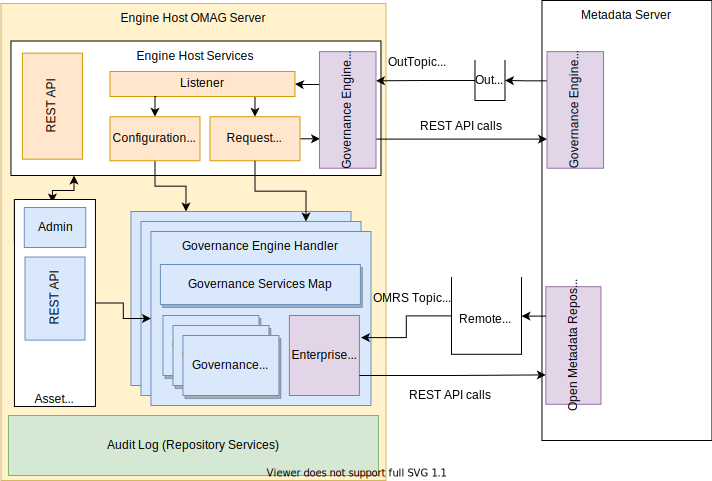

---
hide:
- toc
---

<!-- SPDX-License-Identifier: CC-BY-4.0 -->
<!-- Copyright Contributors to the Egeria project. -->

--8<-- "snippets/content-status/in-development.md"

# Archive Manager Open Metadata Engine Services (OMES)

The Archive Manager Open Metadata Engine Service (OMES) runs in an [Engine Host OMAG Server](/concepts/engine-host). It hosts [archive engines](/concepts/archive-engine) that consist of one or more related [archive services](/guides/developer/archive-services/overview).  Archive services are pluggable connectors that maintain [open metadata archives](/concepts/open-metadata-archive) based on the live metadata in the connected open metadata repositories.

The Archive Manager OMES provides access to the open metadata ecosystem for the archive services through a context. It also provides an API to allow a third party tool to validate that a specific archive service implementation will load in the engine host server, and it returns the usage information encoded in the service's implementation.

## Using the Archive Manager OMES

The definitions for both the archive engines and their linked services are stored in a [governance engine definition](/concepts/governance-engine-definition).  The governance metadata definitions are loaded as metadata into the open metadata ecosystem.

When the Archive Manager OMES is configured in the engine host, a list of archive engine names is supplied.  These names are used to retrieve the governance engine definitions for the archive engines in order to configure the Archive Manager OMES.

The Archive Manager OMES is responsible for initializing the archive engines and providing the context and runtime environment for the archive services when they are requested through the [governance action](/concepts/governance-action) processing of the [Governance Engine OMAS](/services/omas/governance-engine/overview).

--8<-- "snippets/abbr.md"
