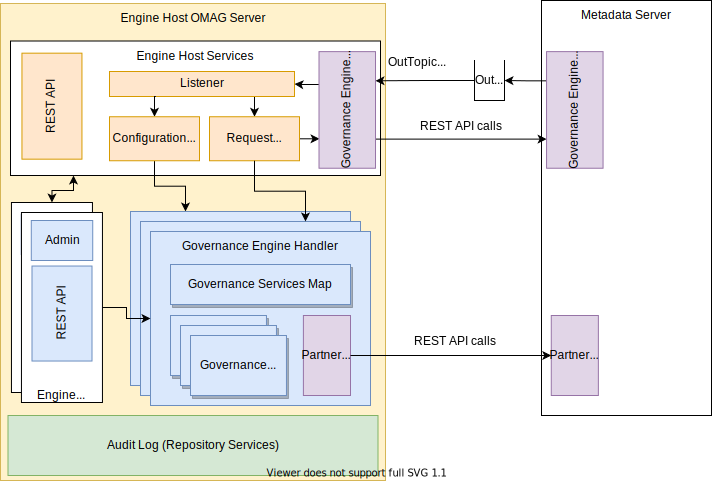

---
hide:
- toc
---

<!-- SPDX-License-Identifier: CC-BY-4.0 -->
<!-- Copyright Contributors to the Egeria project. -->

# Open Metadata Engine Services (OMES)

The engine services run in the [engine host](/concepts/engine-host).  They provide the special services that are available to the [governance services](/concepts/governance-service) through their context.  There is an engine service for each type of governance service.  Each engine service also maps the calls from the governance service to calls to the services of a [metadata access server](/concepts/metadata-access-server).  The table below summarizes the engine services, the type of governance service they support and the service on the metadata access server that they call.

| Name of the Engine Service                                                  | Type of Governance Service supported                                     | Partner service in the metadata                            |
|-----------------------------------------------------------------------------|--------------------------------------------------------------------------|------------------------------------------------------------|
| [Survey Action OMES](/services/omes/survey-action/overview)                 | [Survey Action Service](/concepts/survey-action-service)                 | [Open Metadata Store](/services/open-metadata-store)       |
| [Governance Action OMES](/services/omes/governance-action/overview)         | [Governance Action Service](/concepts/governance-action-service)         | [Open Metadata Store](/services/open-metadata-store)       |
| [Repository Governance OMES](/services/omes/repository-governance/overview) | [Repository Governance Service](/concepts/repository-governance-service) | [Open Metadata Repository Services (OMRS)](/services/omrs) |
| [Watchdog Action OMES](/services/omes/watchdog-action/overview)             | [Watchdog Action Service](/concepts/watchdog-action-service)             | [Open Metadata Store](/services/open-metadata-store)       |

The diagram below shows the generic picture of an engine service plugged into the Engine Host.  The [engine host services](/services/engine-host-services) provide most of the capability of the Engine Host.  This includes managing the retrieval of the [governance engine definitions](/concepts/governance-engine-definition) from the metadata access server that map the engine action requests to calls to the governance services.  

The engine services each provide an implementation of the governance engine handler that is able to run a particular type of governance service.  When an [engine action](/concepts/engine-action) is initiated, the engine host services receives it, claims it, selects the right engine handler and passes the engine action to it.   The governance engine handler runs the governance service through its governance service handler, making calls to the partner service as required.  It records the outcome in the engine outcome in the metadata access server.

--8<-- "snippets/abbr.md"
