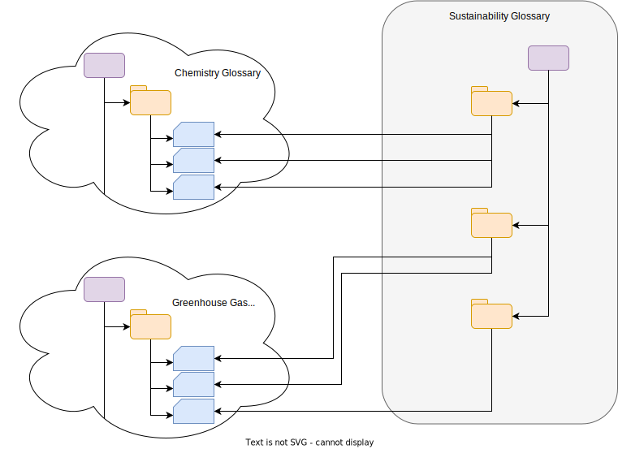

<!-- SPDX-License-Identifier: CC-BY-4.0 -->
<!-- Copyright Contributors to the Egeria project. -->

### Harvested glossary

Consider a situation where a new project needs to understand a new standard, or regulation, or a new field of operation.  They may wish to collate and organize glossary terms from a variety of sources to help the team get up to speed with the new terminology.

In the example below, the team working on a new sustainability initiative have assembled a glossary from the terms of other existing glossaries.

The harvested style of glossary helps teams that do not have the time/resources to create their own glossary terms.

