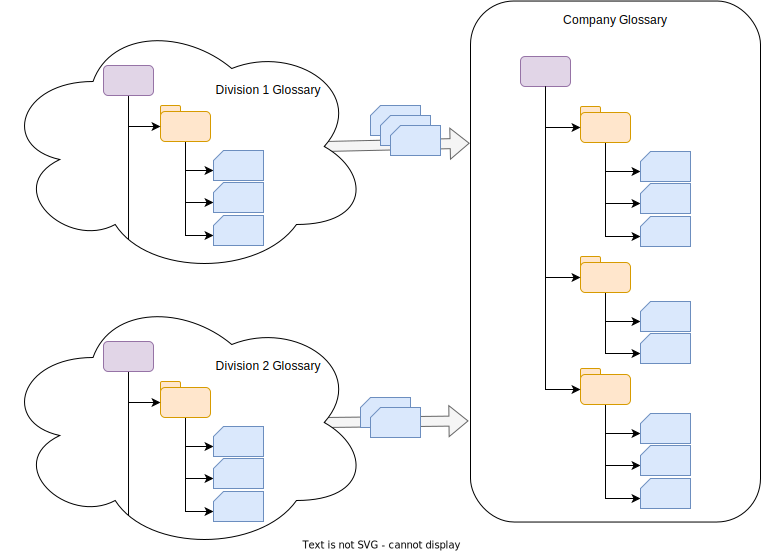

<!-- SPDX-License-Identifier: CC-BY-4.0 -->
<!-- Copyright Contributors to the Egeria project. -->

### Multi-level glossaries

Consider an organization that wants to build a shared glossary for all of its divisions.   Each division has expertise in different topics and there is inconsistent use of terms both within and across the divisions.

A simple approach is for each division to have their own glossary to develop and agree on their terms.  When a division has a term that they think should be in the company glossary they submit it for review.  The term is reviewed by a cross-division team. If it is accepted, a copy of the term is added to the company glossary.  If there are revisions to make, comments are passed back to the originating division.

Whether the term is accepted or not, the originating team is free to continue to make changes to their copy of the term.  They can then choose when they submit an updated version to the company glossary for review.

In this example, the company glossary’s content is controlled.   All editing of terms happens in the division glossaries.   There is little support to reconcile differences in the definition of a term across the divisions.

--8<-- "snippets/abbr.md"