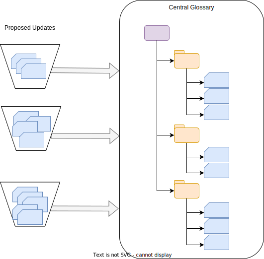

<!-- SPDX-License-Identifier: CC-BY-4.0 -->
<!-- Copyright Contributors to the Egeria project. -->

### Open contribution glossary

An open contribution glossary style is for creating new glossary content using subject matter experts that are distributed across the organization and may be contributing glossary content on an ad hoc, or as needed basis.

The contributions are batched into small updates - for example, providing changes to a couple of terms plus adding a new relationship.  The batches are reviewed by the team that own the central glossary and if they are acceptable, they are included in the glossary.

This style of glossary allows an organization to draw on the expertise from across its teams and build the glossary in an evolutionary manner.

--8<-- "snippets/abbr.md"