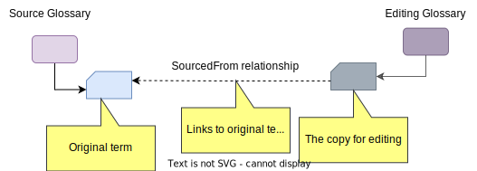
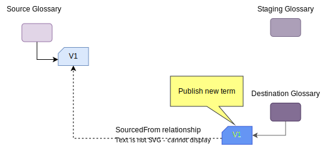
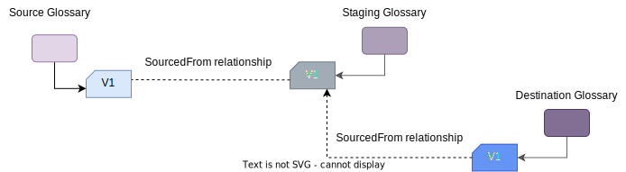
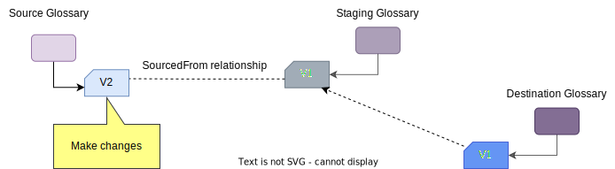
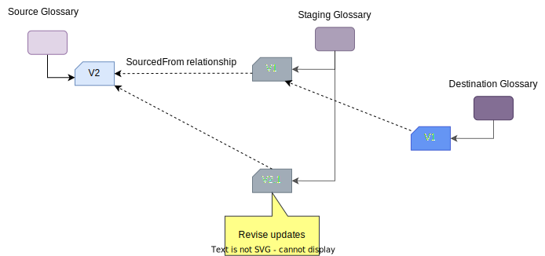
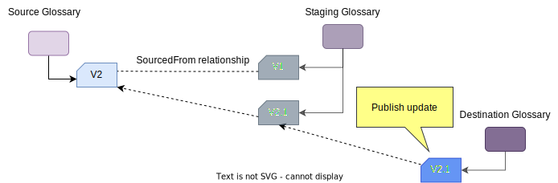
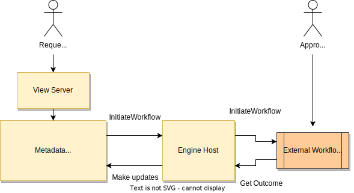
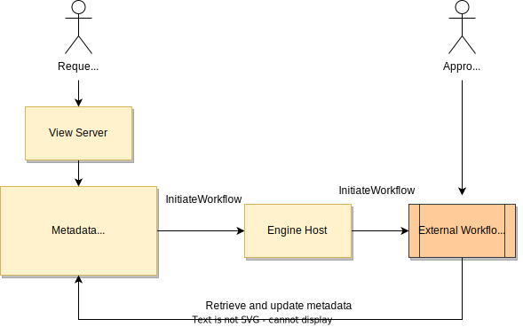

<!-- SPDX-License-Identifier: CC-BY-4.0 -->
<!-- Copyright Contributors to the Egeria project. -->

--8<-- "snippets/content-status/in-development.md"

# Glossary Workflow OMVS

The Glossary Workflow Open Metadata View Service (OMVS) is a REST API designed to support UIs that enable the maintenance of [glossary content](/practices/common-data-definitions/anatomy-of-a-glossary) using a controlled workflow process.  It runs in a [View Server](/concepts/view-server) and calls the [Asset Manager OMAS](/services/omas/asset-manager/overview) to retrieve and make changes to the glossary.

## Why use a controlled glossary workflow

The purpose of a controlled glossary workflow is to manage the visibility of glossary terms and any updates to them that are “in progress”.  Typically, this visibility’s is restricted to the authors of the glossary terms and the approvers.  Once approved, and incorporated back into the "live" glossary, the updates are visible to all.

Although the general idea is simple, there are a number of choices to make on how the workflow operates.  This includes:

* How are updates grouped? For example, are glossary terms updated individually or grouped together in a batch.
* How complex is the approval process? For example, does it involve multiple approvers and what happens if the approvers request changes?  Egeria has simple workflow capabilities, but a complex process is better handled in an external workflow engine.
* Are the glossary terms versioned?  What constitutes a version change?  Who decides?
* What type of revision history is required?  Every save of a glossary term to the repository is a new version in the repository.  However, does the team wish to have a version identifier that reflects how often it has been published, and whether it is a major or minor version. Do the team wish to add a description of the changes being made to the glossary terms (called the revision history). When are descriptions in the revision history created and by whom?
* How much access is needed to previous versions of a glossary term or glossary category, particularly once it has been approved?

## Styles of glossary workflow operation

The different styles of glossary workflow provide choices on who is providing content, how decisions are made on whats it accepted and how the updates are grouped, both for the review process and when they are published.  Where multiple glossaries are in play, each can operate a different style.

=== "Summary"
    | Maintenance Style           | Contributors             | Controls                                                                                                                        | Limitations                                                                                                                                   | Uses                                                                                                                      |
    |-----------------------------|--------------------------|---------------------------------------------------------------------------------------------------------------------------------|-----------------------------------------------------------------------------------------------------------------------------------------------|---------------------------------------------------------------------------------------------------------------------------|
    | Harvested glossary          | Source glossaries.       | Choice on which terms are included in the harvested glossary.                                                                   | Glossary terms change without knowledge or agreement from the curators of the harvested glossary.                                             | Organizing terms from standards, regulations and other external sources.                                                  |
    | Multi-level glossaries      | Upstream glossaries.     | Choice on which terms are included, their exact content and whether updates are to be included.                                 | Difficult for upstream glossaries to reconcile differences in their definitions.                                                              | Consolidating definitions from across areas of domain expertise in the organization.                                      |
    | Open contribution glossary  | Subject-matter experts.  | Choice on which terms are included, their exact content and whether updates are to be included.                                 | Content is developed in narrow independent scopes, making it difficult to coordinate changes from different groups of subject-matter experts. | Development of new glossary content when the subject-matter experts are distributed across the organization (and beyond). |
    | Release-controlled glossary | Glossary authoring team. | Coordination of all changes to the glossary, which terms are included, their exact content and when updates are to be included. | Changes are delayed waiting for the next release.                                                                                             | For glossaries that must present a coherent scope.                                                                        |

=== "Harvested Glossary"
    ---8<-- "docs/services/omvs/glossary-workflow/harvested-glossary.md"

=== "Multi-level Glossaries"
    ---8<-- "docs/services/omvs/glossary-workflow/multi-level-glossaries.md"

=== "Open Contribution Glossary"
    ---8<-- "docs/services/omvs/glossary-workflow/open-contribution-glossary.md"

=== "Release Controlled Glossary"
    ---8<-- "docs/services/omvs/glossary-workflow/release-controlled-glossary.md"

----

## Implementation

The different styles of glossary operation are complementary and may be used in combination allowing your approach to change as the glossary matures.  For example, you may begin your glossary with the harvesting style and use the open contribution style to fill in the gaps with new terms.

This flexibility is possible because there is a simple mechanism that underpins Egeria's glossary workflow and this can be used in different combinations to create the affects described above.

### Linked copies of glossary terms

Except the harvested glossary style, controlled glossary development requires multiple copies of the same term to be maintained so that a new version can be created and agreed on while the previous version is still in use.  The copy is made from an original term using the `createTermByTemplate()` call.  This creates a copy of the term, linked by the [*SourcedFrom*](/types/0/0011-Managing-Referenceables) relationship.

The copy of the term is typically managed in another glossary called the [editing glossary](/types/3/0385-Controlled-Glossary-Development/#editingglossary-classification).  This is a glossary that holds changes while they are in progress - and for future reference.

There is also a type of glossary called the [staging glossary](/types/3/0385-Controlled-Glossary-Development/#stagingglossary-classification).  This is a glossary that holds changes that have been made in a source glossary and are waiting to be added to a destination glossary.

The use of either the editing or staging glossaries, and the way the copy is managed and merged into the appropriate destination depends on the style of glossary and whether you wish each published version to be retained.
Care is made to copy the contents, rather than replace the term itself during these maneuvers, because terms have many relationships to other elements (such as data assets) and these relationships need to be preserved.

#### Temporary editing glossary

The first pattern of operation is where the copies are managed in a temporary editing glossary as follows:

| Action                                      | Description                                                                  |
|---------------------------------------------|------------------------------------------------------------------------------|
|  | The copy of the term is created in the editing glossary.                     |
|  | Updates are made to the copy of the term and approved as a new version (V2). |
|  | The original term is updated to reflect the approved changed from the copy.  |
|  | The editing glossary is deleted, which deletes the copy of the term.         |

If a batch of terms is being updated together, then the editing glossary can hold copies of all the terms being updated together. The editing glossary can be deleted when all desired changes have been made to the original terms.  When a glossary is deleted, all its terms and categories are deleted too.

#### Rolling editing glossary

In this next pattern, the editing glossary maintains an audit trail of each version of the term.

| Action                                    | Description                                                                                                                                                                    |
|-------------------------------------------|--------------------------------------------------------------------------------------------------------------------------------------------------------------------------------|
|  | The live glossary begins empty.  Version 1 on the term is created in the editing glossary.                                                                                     |
|  | When version 1 of the term is ready, a copy of the term is created in the live glossary.                                                                                       |
|  | When an update is required to the term, a copy is made of V1 in the editing glossary.                                                                                          |
|  | Changes are made to V2 of the glossary term.                                                                                                                                   |
|  | When V2 is complete, the term in the live glossary is updated to match the content in V2 and its *SourcedFrom* relationship is updated to point to V2 in the editing glossary. |

#### Temporary staging glossary

The temporary staging glossary pattern of operation is where an editing glossary is used to hold the copies of terms that are proposed for including into another (destination) glossary.

| Action                                      | Description                                                                                                                                                                                       |
|---------------------------------------------|---------------------------------------------------------------------------------------------------------------------------------------------------------------------------------------------------|
|  | A copy of the term to include in the destination glossary is created in the staging glossary.                                                                                                     |
|  | The team that owns the destination glossary review the term and if they approve of it, they it to the destination glossary.  It is still linked back to the original term in the source glossary. |
|  | The staging glossary is removed.                                                                                                                                                                  |
|  | The term in the source glossary can be updated without affecting the destination glossary's term.                                                                                                 |
|  | If V2 of the term is to be included in the destination glossary, a copy of it is added to a staging glossary.                                                                                     |
|  | In this case, the team that owns the destination glossary want to make some minor changes to the term.  They label their updates as V2.1 to show there was a change.                              |
|  | V2.1 of the term is copied into the V1 term in the destination glossary and linked back to the V2 in the source glossary.                                                                         |
|  | The staging glossary is deleted, which deletes its V2.1 copy of the term.                                                                                                                         |

#### Rolling staging glossary

The rolling staging glossary pattern of operation is where an editing glossary is used to hold all versions of terms that are proposed for including into another (destination) glossary.

| Action                                    | Description                                                                                                                                                                                                   |
|-------------------------------------------|---------------------------------------------------------------------------------------------------------------------------------------------------------------------------------------------------------------|
|  | A copy of the term to include in the destination glossary is created in the staging glossary.                                                                                                                 |
|  | The team that owns the destination glossary review the term and if they approve of it, they create a copy of it for the destination glossary.  It is linked back to the version term in the staging glossary. |
|  | The term in the source glossary can be updated without affecting the destination glossary's term.                                                                                                             |
|  | If V2 of the term is to be included in the destination glossary, a copy of it is added to the staging glossary.                                                                                               |
|  | If the team that owns the destination glossary want to make some minor changes to the term, they can do so in the staging glossary.  They label their updates as V2.1 to show there was a change.             |
|  | V2.1 of the term is copied into the V1 term in the destination glossary and linked back to the V2.1 in the staging glossary.                                                                                  |

### Controlled glossary terms

The patterns above show how copies of terms are linked and managed throughout the update process.  While a specific term is under review it may be helpful to identify where it is in the review process.

The [*ControlledGlossaryTerm*](/types/3/0385-Controlled-Glossary-Development) extends the standard [GlossaryTerm](/types/3/0330-Terms) with additional valid [instance statuses](/concepts/instance-status) for supporting a complex development lifecycle.  The statuses are:

* DRAFT      - The term is incomplete.
* PREPARED   - The term is ready for review.
* PROPOSED   - The term is in review.
* APPROVED   - The term is approved and awaiting activation.
* REJECTED   - The term is rejected and should not be used.
* ACTIVE     - The term is approved and in use.
* DEPRECATED - The term is out of date and should not be used.
* OTHER      - The term is in a locally defined state.

These status values can be thought of as the system-defined statuses.  It is possible to replace, or extend these statuses using the `userDefinedStatus` attribute that can be controlled through the use of [valid metadata values](/guides/planning/valid-metadata-values/overview).

### Relationship statuses

Similarly, the relationship between glossary terms have a status that can also be used to show where the relationship is in the review process.

* DRAFT - The relationship is under development.
* ACTIVE - The relationship is validated and in use.
* DEPRECATED - The relationship is being phased out.
* OBSOLETE - The relationship should not be used anymore.
* OTHER - The status is not one of the statuses listed above.  The description field can be used to add more details.

## Revision history

Updates to glossary terms are automatically recorded in a revision history.  It is possible to add a description about a particular change through the *updateDescription* parameter on the update or create requests.

## External workflow

If the approval process is complex, you may wish to control it through a workflow engine that is running outside of Egeria.  There are two basic approaches.

In the first example shown below, the request for approval of a change results in a [governance action service](/concepts/governance-action-service) running in an engine host.  This governance action service gathers information about the change to be approved and passes it to the external workflow engine.  Then depending on the capabilities of the external workflow engine, it then polls for a result, or registers a listener, so it is notified of the result.  When the decision is made, the governance action service is informed of the result.  It makes the necessary changes to the glossary.

This approach provides a simple integration path that acts when the external process is complete.  However, you may choose to have the updates to the glossary made by the workflow process itself during its execution.  This may be useful if the process is approving a large batch of terms, for example, and the decisions for each term need to be recorded as they are made (rather than at the end).  This second approach shown below has the external workflow process calling the [Asset Manager OMAS](/services/omas/asset-manager/overview) during the process execution.

The Asset Manager OMAS is the same service called by the Glossary Workflow OMAS.

---8<-- "snippets/abbr.md"

