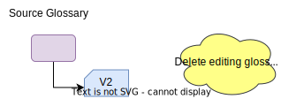
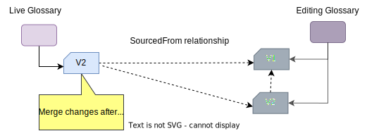
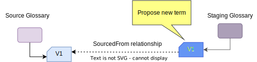
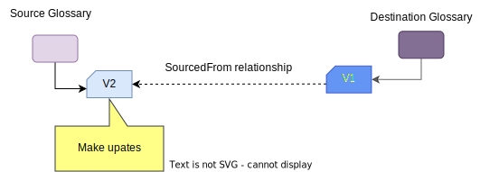
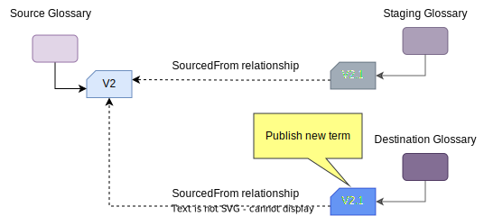
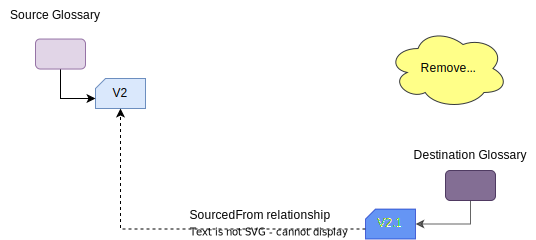
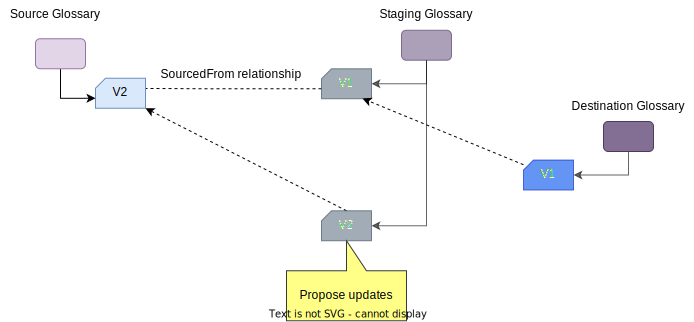

<!-- SPDX-License-Identifier: CC-BY-4.0 -->
<!-- Copyright Contributors to the Egeria project. -->

--8<-- "snippets/content-status/in-development.md"

# Glossary Workflow Open Metadata View Services (OMVS)

The Glossary Workflow OMVS is a REST API designed to support UIs that enable the maintenance of glossary content using a controlled workflow process.

## Why use a controlled glossary workflow

The purpose of a controlled glossary workflow is to manage the visibility of glossary terms and any updates to them that are “in progress”.  Typically, this visibility’s is restricted to the authors of the glossary terms and the approvers.  Once approved, the updates are visible to all.

Although the general idea is simple, there are a number of choices to make on how the workflow operates.  This includes:

* How are updates grouped? For example, are glossary terms updated individually or grouped together in a batch.
* How complex is the approval process? For example, does it involve multiple approvers and what happens if the approvers request changes?  Egeria has simple workflow capabilities, but a complex process is better handled in an external workflow engine.
* Are the glossary terms versioned?  What constitutes a version change?  Who decides?
* What type of revision history is required?  Every save of a glossary term to the repository is a new version in the repository.  However, does the team wish to have a version identifier that reflects how often it has been published, and whether it is a major or minor version. Do the team wish to add a description of the changes being made to the glossary terms (called the revision history). When are descriptions in the revision history created and by whom?
* How much access is needed to previous versions of a glossary term or glossary category, particularly once it has been approved?

## Styles of glossary workflow operation

The different styles of glossary workflow provide choices on who is providing content, making decisions and how the updates are grouped.  Where multiple glossaries are in play, each can operate a different style.

=== "Summary"

| Maintenance Style           | Contributors            | Controls                                                                                                                        | Limitations                                                                                                                                   | Uses                                                                                                                      |
|-----------------------------|-------------------------|---------------------------------------------------------------------------------------------------------------------------------|-----------------------------------------------------------------------------------------------------------------------------------------------|---------------------------------------------------------------------------------------------------------------------------|
| Harvested glossary          | Source glossaries.      | Choice on which terms are included in the aggregated glossary.                                                                  | Glossary terms change without knowledge or agreement from the curators of the aggregated glossary.                                            | Organizing terms from standards, regulations and other external sources.                                                  |
| Multi-level glossaries      | Upstream glossaries.    | Choice on which terms are included, their exact content and whether updates are to be included.                                 | Difficult for upstream glossaries to reconcile differences in their definitions.                                                              | Consolidating definitions from across areas of domain expertise in the organization.                                      |
| Open contribution           | Subject matter experts. | Choice on which terms are included, their exact content and whether updates are to be included.                                 | Content is developed in narrow independent scopes, making it difficult to coordinate changes from different groups of subject matter experts. | Development of new glossary content when the subject matter experts are distributed across the organization (and beyond). |
| Release-controlled glossary | Glossary authoring team | Coordination of all changes to the glossary, which terms are included, their exact content and when updates are to be included. | Changes are delayed waiting for the next release.                                                                                             | For glossaries that must present a coherent scope.                                                                        |
|
=== "Harvested Glossary"
---8<-- "docs/services/omvs/glossary-workflow/harvested-glossary.md"

=== "Multi-level Glossaries"
---8<-- "docs/services/omvs/glossary-workflow/multi-level-glossary.md"

=== "Open Contribution Glossary"
---8<-- "docs/services/omvs/glossary-workflow/open-contribution-glossary.md"

=== "Release Controlled Glossary"
---8<-- "docs/services/omvs/glossary-workflow/release-controlled-glossary.md"

## Implementation

### Linked copies of glossary terms

Except the harvested glossary style, controlled glossary development requires multiple copies of the same term to be maintained so that a new version can be created and agreed on while the previous version is still in use.  The copy is made from an original term using the `createTermByTemplate()` call.  This creates a copy of the term, linked by the [*SourcedFrom*](/types/0/0011-Managing-Referenceables) relationship.

The copy of the term is typically managed in another glossary called the [editing glossary](/types/3/0385-Controlled-Glossary-Development/#editingglossary-classification)

The way the copy is managed and merged back into the original (or the place where the updates are to be published) depends on the style of glossary and whether you wish each published version to be retained.

#### Temporary editing glossary

The first pattern of operation is where the copies are managed in a temporary editing glossary as follows:

| Action                                      | Description                                                                  |
|---------------------------------------------|------------------------------------------------------------------------------|
|  | The copy of the term is created in the editing glossary.                     |
|  | Updates are made to the copy of the term and approved as a new version (V2). |
|  | The original term is updated to reflect the approved changed from the copy.  |
|  | The editing glossary is deleted, which deletes the copy of the term.         |

If a batch of terms is being updated together, then the editing glossary can hold copies of all the terms being updated together. The editing glossary can be deleted when all desired changes have been made to the original terms.  When a glossary is deleted, all its terms and categories are deleted too.

#### Rolling editing glossary

In this next pattern, the editing glossary maintains an audit trail of each version of the term.

| Action                                    | Description                                                                                                                                                                    |
|-------------------------------------------|--------------------------------------------------------------------------------------------------------------------------------------------------------------------------------|
|  | The live glossary begins empty.  Version 1 on the term is created in the editing glossary.                                                                                     |
|  | When version 1 of the term is ready, a copy of the term is created in the live glossary.                                                                                       |
|  | When an update is required to the term, a copy is made of V1 in the editing glossary.                                                                                          |
|  | Changes are made to V2 of the glossary term.                                                                                                                                   |
|  | When V2 is complete, the term in the live glossary is updated to match the content in V2 and its *SourcedFrom* relationship is updated to point to V2 in the editing glossary. |

#### Temporary staging glossary

The temporary staging glossary pattern of operation is where an editing glossary is used to hold the copies of terms that are proposed for including into another (destination) glossary.

| Action                                      | Description                                                                                                                                                                                                   |
|---------------------------------------------|---------------------------------------------------------------------------------------------------------------------------------------------------------------------------------------------------------------|
|  | A copy of the term to include in the destination glossary is created in the staging glossary.                                                                                                                 |
|  | The team that owns the destination glossary review the term and if they approve of it, they create a copy of it for the destination glossary.  It is linked back to the original term in the source glossary. |
|  | The staging glossary is removed.                                                                                                                                                                              |
|  | The term in the source glossary can be updated without affecting the destination glossary's term.                                                                                                             |
|  | If V2 of the term is to be included in the destination glossary, a copy of it is added to a staging glossary.                                                                                                 |
|  | In this case, the team that owns the destination glossary want to make some minor changes to the term.  They label their updates as V2.1 to show there was a change.                                          |
|  | V2.1 of the term is copied into the V1 term in the destination glossary and linked back to the V2 in the source glossary.                                                                                     |
|  | The staging glossary is deleted, which deletes its V2.1 copy of the term.                                                                                                                                     |

#### Rolling staging glossary

The rolling staging glossary pattern of operation is where an editing glossary is used to hold all versions of terms that are proposed for including into another (destination) glossary.

| Action                                    | Description                                                                                                                                                                                                   |
|-------------------------------------------|---------------------------------------------------------------------------------------------------------------------------------------------------------------------------------------------------------------|
|  | A copy of the term to include in the destination glossary is created in the staging glossary.                                                                                                                 |
|  | The team that owns the destination glossary review the term and if they approve of it, they create a copy of it for the destination glossary.  It is linked back to the version term in the staging glossary. |
|  | The term in the source glossary can be updated without affecting the destination glossary's term.                                                                                                             |
|  | If V2 of the term is to be included in the destination glossary, a copy of it is added to the staging glossary.                                                                                               |
|  | If the team that owns the destination glossary want to make some minor changes to the term, they can do so in the staging glossary.  They label their updates as V2.1 to show there was a change.             |
|  | V2.1 of the term is copied into the V1 term in the destination glossary and linked back to the V2.1 in the staging glossary.                                                                                  |

### Controlled glossary terms

---8<-- "snippets/abbr.md"

