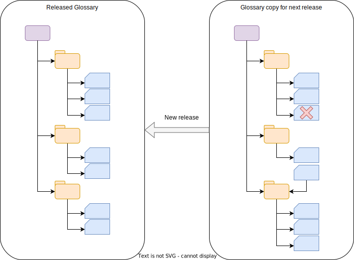

<!-- SPDX-License-Identifier: CC-BY-4.0 -->
<!-- Copyright Contributors to the Egeria project. -->

### Release controlled glossary

A released-controlled glossary is one where changes to the glossary terms are made through formal releases.  Typically there is a dedicated team working on the glossary and tey are attempting to provide a glossary that is complete, coherent and with consistent granularity of definition.  Such a glossary can be used, for example, to link entities representing data fields with glossary terms via the [SemanticAssignment](/types/3/0370-Semantic-Assignment) relationship to indicate that the glossary term describes the meaning of the data stored in the data field.

--8<-- "snippets/abbr.md"