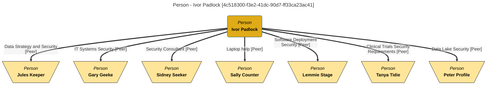

<!-- SPDX-License-Identifier: CC-BY-4.0 -->
<!-- Copyright Contributors to the Egeria project. -->

--8<-- "snippets/content-status/stable.md"

# People Organizer API

The People Organizer API is a REST API used to define links between people and teams to show how an organization is linked together.  There are two types of relationships it supports:

* the [Peer](/types/1/0112-People) relationship that shows a person's peer network.
* the [TeamStructure](/types/1/0113-Team) relationship that shows how teams are linked together to form the organizational structure.


---8<-- "snippets/services/api-forms.md"

??? info "Code reference"

    === "REST API"
        * HTTP Client Collection [Egeria-api-people-organizer.http](https://raw.githubusercontent.com/odpi/egeria/refs/heads/main/open-metadata-implementation/view-services/people-organizer/Egeria-api-people-organizer.http) shows each of the REST API operations along with their request body structures.
    
    === "Java"
        * The [Actor Profile Client](https://odpi.github.io/egeria/org/odpi/openmetadata/frameworks/openmetadata/connectorcontext/ActorProfileClient.html) describes the methods available to connector writers via the connector's context object.
    
    === "Python"
        * The [people_organizer.py](https://github.com/odpi/egeria-python/blob/main/pyegeria/omvs/people_organizer.py) python file defines the python methods for this API. 

The sections that follow describe working with each of these relationship types, with examples for each of the API's forms.

## Defining a Peer Network

Everyone working in an organization builds a network of people that they rely on for help, support and/or information.  These people are called peers.  They may not work in the same team, nor even in the same building, but reach across the organization.  Peer relationships are critical for the efficiency of an organization because they create lateral communication links between people in different parts of the organization.

Peer relationships are not equally important to the individuals at either end of the relationship.  The strength of the relationship is determined by the frequency and quality of the interactions between the individuals.  The strength of the relationship can be used to determine the level of trust and confidence that can be placed in the information shared between the people and the direction it flows.  Therefore, peer relationships should be thought of as expressing the individual at end 1's perspective on the relationship with their peer.  Their peer may, or may not, create a peer relationship in the opposite direction. 

The diagram below shows [Ivor Padlock's](/practices/coco-pharmaceuticals/personas/ivor-padlock) peer relationships.  He is the head of security, and so he sees his network as the people he goes to for discussions on different aspects of security.  Some people in a peer network may not be there because of their job role, but due to past interactions.  For example, [Sally Counter](/practices/coco-pharmaceuticals/personas/sally-counter) works in finance. However, Ivor relies on her to help him with his laptop issues.


> **Figure 1:** Peer relationships from Ivor Padlock's perspective

The benefit of defining your personal peer relationships is that they can be used as a personal contact list that includes the context explaining why each person is in the list.

One final point to mention is that although the label and description in the peer relationship reflect the personal opinion of the creator, they are not private.  In fact they are visible to all users of the open metadata and governance services that cans see Personal profiles.  So keep it professional :).

??? info "Code sample - set up a peer relationship"

    === "REST"

        ???+ post "POST {{baseURL}}/servers/{{viewServer}}/api/open-metadata/people-organizer/actor-profiles/{{ivorPadlockGUID}}/peer-persons/{{peterProfileGUID}}/attach"
            ```
            Authorization: Bearer {{token}}
            Content-Type: application/json
    
            {
                "class" : "NewRelationshipRequestBody",
                "properties": {
                "class": "PeerProperties",
                "label" : "Data Lake Security",
                "description" : "Builds pipelines feeding the data lake."
                }
            }
            ```
    
    === "Python"
        ```
        Python example to follow
        ```
    
    === "Java"
        ```java
        ActorProfileClient client = context.getActorProfileClient(OpenMetadataType.PERSON.typeName);
        
        PeerProperties peerProperties = new PeerProperties();
        peerProperties.setLabel("Data Lake Security");
        peerProperties.setDescription("Builds pipelines feeding the data lake.");
        
        client.linkPeerPerson(ivorPadlockGUID, peterProfileGUID, null, peerProperties);

        ```

The mermaid graph below shows Ivor's profile with his peer network defined.  It was generated using the [HTTP Collection of Commands](https://github.com/odpi/egeria/blob/main/open-metadata-implementation/view-services/people-organizer/Egeria-coco-peer-networks.http).



## Creating an Organizational Hierarchy

Organizations are made up of teams.  These teams (they may be called divisions, sectors, departments, ...) are the building blocks of an organization.  They are typically organized in a hierarchy to explain how the responsibilities for delivering the products and services that the organization provides are distributed.

The [TeamStructure](/types/1/0115-Teams) relationship is used to define this hierarchical organizational structure.


> **Figure 2:** Top of organizational structure of the Coco Pharmaceuticals organization

---8<-- "snippets/abbr.md"


