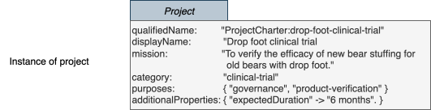

<!-- SPDX-License-Identifier: CC-BY-4.0 -->
<!-- Copyright Contributors to the Egeria project. -->

--8<-- "snippets/content-status/stable.md"

# Valid Metadata API

The *Valid Metadata API* manages lists of valid values and definitions to support the consistent and effective use of metadata - since consistency in metadata increases trust in its content, helps to communicate clear information, and enables reliable automation.

The API supports three types of operations:

* Maintain and query the lists of valid values for open metadata attributes.
* Query details of the [defined open metadata types](/types).
* Maintain and query the *specification properties* used to create [usage specifications](/concepts/specification) for [templates](/concepts/template), [connectors](/concepts/connector) and [governance actions](/concepts/governance-action).

The sections that follow describe each of these types of operations, showing examples in each of the API's forms.

---8<-- "snippets/services/api-forms.md"

## Valid value sets for open metadata

Egeria uses [ValidMetadataValue](/types/5/0545-Reference-Data) entities to manage valid value lists for Open Metadata attributes.  
 


There are three types of valid metadata values:

1. Lists of values for string attributes and for array of strings (`array<string>`) attributes.
2. Values for the map names found in attributes that map from name to string value (`map<string, string>`).
3. Values for the map values found in attributes tha map from name to string value (`map<string, string>`).

These valid values can be set up for either all types that support this property; or it can be restricted to a specific type.
 

For example, in the [*Project*](/types/1/0130-Projects) open metadata type:

* *category* is a string.  Valid values for this are typically used with any type.
* *purposes* is an array of strings.
* *additionalProperties* is a map from a string name to a string value.  Although it is supported by the many types that inherit from *Referenceable*, it is possible to define map names and values just for *Project* instances.

The diagram below shows possible valid values for these attributes:

* The *category* attribute can only take a single string, so it could be set to either "clinical-trial" or "manufacturing-improvement" or "security-assessment" or "incident-investigation".

* The *purposes* attribute takes a list of strings which can include any or all of the following values: "governance", "market-analysis", "product-development", "product-verification", "patient-treatment". 

* The *additionalProperties* can have an entry in its map of "expectedDuration" that can be mapped to one of the following: "1 month", "2 months", "6 months", "1 year", or "other".  The "expectedDuration" is called a *mapName* and the values "1 month", "2 months", "6 months", "1 year", and "other" are called the *mapValues*.


> Valid values for Project attributes


This is how these values could appear in an instance of a project:



There are twelve operations for maintaining the valid value list got each attribute:

* Three for creating a valid value.
* Three for deleting a valid value.
* Three for querying if a valid value is valid.
* Three for retrieving the properties of a specific valid value.

The reason for three operations for each operation is that Egeria needs to distinguish between:

1. A valid value for a primitive attribute (string, integer, etc) or a primitive value in an array attribute.
2. A valid key in a map attribute (called a mapName).
3. A valid value associated with a key in a map attribute.

In addition, there is an operation for retrieving the entire list of valid values for an attribute, plus two methods for managing *Consistent Values* relationships.


??? info "Code reference"

    === "REST API"
        * HTTP Client Collection [Egeria-valid-metadata-omvs.http](https://raw.githubusercontent.com/odpi/egeria/refs/heads/main/open-metadata-implementation/view-server-generic-services/valid-metadata/Egeria-valid-metadata-omvs.http) shows each of the REST API operations along with their request body structures.
    
    === "Java"
        * The [Valid Metadata Values Client](https://odpi.github.io/egeria/org/odpi/openmetadata/frameworks/openmetadata/connectorcontext/ValidMetadataValuesClient.html) describes the methods available to connector writers via the connector's context object.
    
    === "Python"
        * The [valid_metadata_omvs.py](https://github.com/odpi/egeria-python/blob/main/pyegeria/valid_metadata_omvs.py) python file defines the python methods for managing all types of valid metadata values. 


### Creating valid metadata values

#### Setting up a valid metadata for a string property

The code snippets below shows how to set up the "clinical-trial" string as a specific valid value for the *category* property.  The type name parameter is set to null to indicate that these values are valid for a category attribute in any type.

??? info "Code sample - set up category valid metadata value - clinical-trial"
    === "REST"
        ???+ post "POST {{baseURL}}/servers/{{viewServer}}/api/open-metadata/valid-metadata/setup-value/category"
            ```
            Authorization: Bearer {{token}}
            Content-Type: application/json
            
            {                                       
                "displayName": "Clinical Trial",
                "description": "Element supporting one or more clinical trials.",
                "preferredValue": "clinical-trial",
                "dataType": "string",
                "isCaseSensitive": false
            }
            ```
    
    === "Python"
        ```
        Python example to follow
        ```
    
    === "Java"
        ```java
        ValidMetadataValueClient client = context.getValidMetadataValueClient();
        
        ValidMetadataValue validMetadataValue = new ValidMetadataValue();
        
        validMetadataValue.setDisplayName("Clinical Trial");
        validMetadataValue.setPreferredValue("clinical-trial");
        validMetadataValue.setDescription("Element supporting one or more clinical trials.");
        
        client.setUpValidMetadataValue(null, OpenMetadataProperty.CATEGORY.name, validMetadataValue);
        
        ```

Next, are the code snippets for setting up the "governance" value for the *purposes* property.  Notice that the *Project* type name is set to indicate that this valid value only applies to the *purposes* attribute in *project* elements.

??? info "Code sample - set up purposes valid metadata value - governance"

    === "REST"

        ???+ post "POST {{baseURL}}/servers/{{viewServer}}/api/open-metadata/valid-metadata/setup-value/purposes?typeName=Project"
            ```
            Authorization: Bearer {{token}}
            Content-Type: application/json
    
            {                                       
                "displayName": "Governance",
                "description": "Indicates that this project is supporting a governance requirement.",
                "preferredValue": "governance",
                "dataType": "string",
                "isCaseSensitive": false
            }
            ```
    
    === "Python"
        ```
        Python example to follow
        ```
    
    === "Java"
        ```java
        ValidMetadataValueClient client = context.getValidMetadataValueClient();
        
        ValidMetadataValue validMetadataValue = new ValidMetadataValue();
        
        validMetadataValue.setDisplayName("Governance");
        validMetadataValue.setPreferredValue("governance");
        validMetadataValue.setDescription("Indicates that this project is supporting a governance requirement.");
        
        client.setUpValidMetadataValue(OpenMetadataType.PROJECT.typeName, OpenMetadataProperty.PURPOSES.name, validMetadataValue);
        
        ```

#### Setting up a valid metadata for a map property

To set up the valid values for *additionalProperties*, you first define the mapName valid value for "expectedDuration", and then each of the valid values for that name: "1 month", "2 months" etc.

These first code snippets are for "expectedDuration".

??? info "Code sample - set up expectedDuration map name"

    === "REST"

        ???+ post "POST {{baseURL}}/servers/{{viewServer}}/api/open-metadata/valid-metadata/setup-map-name/additionalProperties?typeName=Project"
            ```
            Authorization: Bearer {{token}}
            Content-Type: application/json
    
            {                                       
                "displayName": "Expected Duration",
                "description": "How long (roughly) is this project expected to run?",
                "preferredValue": "expectedDuration",
                "dataType": "string",
                "isCaseSensitive": false
            }
            ```
    
    === "Python"
        ```
        Python example to follow
        ```
    
    === "Java"
        ```java
        ValidMetadataValueClient client = context.getValidMetadataValueClient();
        
        ValidMetadataValue validMetadataValue = new ValidMetadataValue();
        
        validMetadataValue.setDisplayName("Expected Duration");
        validMetadataValue.setPreferredValue("expectedDuration");
        validMetadataValue.setDescription("How long (roughly) is this project expected to run?");
        
        client.setUpValidMetadataMapName(OpenMetadataType.PROJECT.typeName, OpenMetadataProperty.ADDITIONAL_PROPERTIES.name, validMetadataValue);
        
        ```

These code snippets are for the value "1 month".

??? info "Code sample - set up map value - 1 month"

    === "REST"

        ???+ post "POST {{baseURL}}/servers/{{viewServer}}/api/open-metadata/valid-metadata/setup-value/additionalProperties?typeName=Project"
            ```
            Authorization: Bearer {{token}}
            Content-Type: application/json
    
            {                                       
                "displayName": "One Month",
                "description": "The project is expected to run for a month.",
                "preferredValue": "1 month",
                "dataType": "string",
                "isCaseSensitive": false
            }
            ```
    
    === "Python"
        ```
        Python example to follow
        ```
    
    === "Java"
        ```java
        ValidMetadataValueClient client = context.getValidMetadataValueClient();
        
        ValidMetadataValue validMetadataValue = new ValidMetadataValue();
        
        validMetadataValue.setDisplayName("One Month");
        validMetadataValue.setPreferredValue("1 month");
        validMetadataValue.setDescription("The project is expected to run for a month.");
        
        client.setUpValidMetadataMapValue(OpenMetadataType.PROJECT.typeName, OpenMetadataProperty.ADDITIONAL_PROPERTIES.name, validMetadataValue);
        
        ```
The same set-up requests can be used to update a value.  There are also "clear" requests for removing a valid value:

* clearValidMetadataValue - Remove a valid value for a property.
* clearValidMetadataMapName - Remove a valid map name value for a property.
* clearValidMetadataMapValue - Remove a valid map name value for a property.


### Retrieving valid metadata values

Once defined, valid metadata values can be retrieved either as a single value or as a set.

#### Retrieving single valid metadata values

The next code snippet shows how to retrieve information about the "clinical-trial" valid metadata value for the *category* attribute.

??? info "Code sample - retrieve single valid metadata value - clinical-trial"

    === "REST"

        ???+ get "GET {{baseURL}}/servers/{{viewServer}}/api/open-metadata/valid-metadata/get-value/category?typeName=Project&preferredValue=clinical-trial"
            ```
            Authorization: Bearer {{token}}
            Content-Type: application/json
            ```
    
    === "Python"
        ```
        Python example to follow
        ```
    
    === "Java"
        ```java
        ValidMetadataValueClient client = context.getValidMetadataValueClient();
        
        ValidMetadataValueDetail validMetadataValue = client.getValidMetadataValue(OpenMetadataType.PROJECT.typeName, 
                                                                                   OpenMetadataProperty.CATEGORY.name, 
                                                                                   "clinical-trial");
        
        ```


This is the result in JSON:

??? info "Results - retrieve single valid metadata value - clinical-trial"

    ```json
    {
      "class": "ValidMetadataValueResponse",
      "relatedHTTPCode": 200,
      "element": {
        "category": "Valid Metadata Values",
        "displayName": "Clinical Trial",
        "description": "Element supporting one or more clinical trials.",
        "preferredValue": "clinical-trial",
        "dataType": "string",
        "isCaseSensitive": false,
        "propertyName": "category"
      }
    }
    ```

This is how to retrieve a map name ...

??? info "Code sample - retrieve single valid metadata map name - expectedDuration"

    === "REST"

        ???+ get "GET {{baseURL}}/servers/{{viewServer}}/api/open-metadata/valid-metadata/get-map-name/additionalProperties?typeName=Project&mapName=expectedDuration"
            ```
            Authorization: Bearer {{token}}
            Content-Type: application/json
            ```
    
    === "Python"
        ```
        Python example to follow
        ```
    
    === "Java"
        ```java
        ValidMetadataValueClient client = context.getValidMetadataValueClient();

        ValidMetadataValueDetail validMetadataValue = client.getValidMetadataMapName(OpenMetadataType.PROJECT.typeName, 
                                                                                     OpenMetadataProperty.ADDITIONAL_PROPERTIES.name, 
                                                                                     "expectedDuration");
        
        ```
Returning a result like this:

??? info "Results - retrieve single valid metadata map name - expectedDuration"

    ```json
    {
      "class": "ValidMetadataValueResponse",
      "relatedHTTPCode": 200,
      "element": {
        "category": "Valid Metadata Values",
        "displayName": "Expected Duration",
        "description": "How long (roughly) is this project expected to run?",
        "preferredValue": "expectedDuration",
        "dataType": "string",
        "isCaseSensitive": false,
        "propertyName": "additionalProperties",
        "typeName": "Project"
      }
    }
    ```

And finally a map value ...

??? info "Code sample - retrieve single valid metadata map value - 1 month"

    === "REST"

        ???+ get "GET {{baseURL}}/servers/{{viewServer}}/api/open-metadata/valid-metadata/get-map-value/additionalProperties/expectedDuration?typeName=Project&preferredValue=1 month"
            ```
            Authorization: Bearer {{token}}
            Content-Type: application/json
            ```
    
    === "Python"
        ```
        Python example to follow
        ```
    
    === "Java"
        ```java
        ValidMetadataValueClient client = context.getValidMetadataValueClient();

        ValidMetadataValueDetail validMetadataValue = client.getValidMetadataMapValue(OpenMetadataType.PROJECT.typeName, 
                                                                                     OpenMetadataProperty.ADDITIONAL_PROPERTIES.name, 
                                                                                     "expectedDuration", 
                                                                                     "1 month");
        
        ```

With this type of result:

??? info "Results - retrieve single valid metadata map value - 1 month"

    ```json
    {
      "class": "ValidMetadataValueResponse",
      "relatedHTTPCode": 200,
      "element": {
        "category": "Valid Metadata Values",
        "displayName": "One Month",
        "description": "The project is expected to run for a month.",
        "preferredValue": "1 month",
        "dataType": "string",
        "isCaseSensitive": false,
        "propertyName": "additionalProperties",
        "typeName": "Project",
        "mapName": "expectedDuration"
      }
    }
    ```

#### Retrieving all valid metadata values for an attribute

These next code snippets shows how to retrieve all the valid values for the *purposes* attribute.

??? info "Code sample - retrieve all valid metadata values for an attribute - purposes"

    === "REST"

        ???+ get "GET {{baseURL}}/servers/{{viewServer}}/api/open-metadata/valid-metadata/get-valid-metadata-values/purposes?typeName=Project&startFrom=0&pageSize=0"
            ```
            Authorization: Bearer {{token}}
            Content-Type: application/json
            ```
    
    === "Python"
        ```
        Python example to follow
        ```
    
    === "Java"
        ```java
        ValidMetadataValueClient client = context.getValidMetadataValueClient();
        
        ValidMetadataValueDetail validMetadataValue = client.getValidMetadataValues(OpenMetadataType.PROJECT.typeName, 
                                                                                   OpenMetadataProperty.PURPOSES.name, 
                                                                                   0, 0);
        
        ```

Again here is the result in JSON:

??? info "Results - retrieve all valid metadata values for an attribute - purposes"

    ```json
    {
      "class": "ValidMetadataValueListResponse",
      "relatedHTTPCode": 200,
      "elements": [
        {
          "category": "Valid Metadata Values",
          "displayName": "Governance",
          "description": "Indicates that this project is supporting a governance requirement.",
          "preferredValue": "governance",
          "dataType": "string",
          "isCaseSensitive": true,
          "propertyName": "purposes",
          "typeName": "Project"
        },
        {
          "category": "Valid Metadata Values",
          "displayName": "Patient Treatment",
          "description": "Indicates that this project is supporting the treatment of a patient.",
          "preferredValue": "patient-treatment",
          "dataType": "string",
          "isCaseSensitive": true,
          "propertyName": "purposes",
          "typeName": "Project"
        },
        {
          "category": "Valid Metadata Values",
          "displayName": "Product Verification",
          "description": "Indicates that this project is supporting the verification of all aspects of a new product (including clinical trials).",
          "preferredValue": "product-verification",
          "dataType": "string",
          "isCaseSensitive": true,
          "propertyName": "purposes",
          "typeName": "Project"
        },
        {
          "category": "Valid Metadata Values",
          "displayName": "Market Analysis",
          "description": "Indicates that this project is supporting analysis of a new market requirement, or the perception of the company and/or its products in the market.",
          "preferredValue": "market-analysis",
          "dataType": "string",
          "isCaseSensitive": true,
          "propertyName": "purposes",
          "typeName": "Project"
        },
        {
          "category": "Valid Metadata Values",
          "displayName": "Product Development",
          "description": "Indicates that this project is supporting the development of a new product.",
          "preferredValue": "product-development",
          "dataType": "string",
          "isCaseSensitive": true,
          "propertyName": "purposes",
          "typeName": "Project"
        }
      ]
    }
    ```

### Validating attribute values

If you wanted to validate whether an attribute has a valid value, you could use the command above to retrieve the complete list and step through it.  Alternatively, the Valid Value API offers special operations to validate a value.

This next set of code snippets shows how to validate that an actual value from an instance (*actualValue*) is a valid value:

??? info "Code sample - validate the value stored in an attribute - clinical-trial"

    === "REST"

        ???+ get "GET {{baseURL}}/servers/{{viewServer}}/api/open-metadata/valid-metadata/validate-value/purposes?typeName=Project&actualValue=marketing"
            ```
            Authorization: Bearer {{token}}
            Content-Type: application/json
            ```
    
    === "Python"
        ```
        Python example to follow
        ```
    
    === "Java"
        ```java
        ValidMetadataValueClient client = context.getValidMetadataValueClient();
        
        if (client.getValidMetadataValues(OpenMetadataType.PROJECT.typeName, 
                                          OpenMetadataProperty.PURPOSES.name, 
                                          "marketing"))
        {
        }
        ```

In Java and python, this operation returns a boolean.  Below is the JSON result for REST.  Use the `flag` property to determine if the value is valid.  In this case it is not because "marketing" is not in the list.
   
??? info "Results - validate the value stored in an attribute - clinical-trial"

    ```json
    {
      "class": "BooleanResponse",
      "relatedHTTPCode": 200,
      "flag": false
    }
    ```

### Identifying consistent values

It is not uncommon for a particular value in one attribute implies another particular value in another attribute in the same element.  In Open Metadata, we use the [ConsistentValidValues](/types/5/0545-Reference-Data) to identify values that should be used together.

For example, if the *category* of a *Project* is "clinical-trial" then one of the *purposes* should be "product-verification".

#### Linking value values to show they should be used together

The code snippets below show how to link two valid values each together to show they are consistent with one another.  In this example we are linking "clinical-trial" (category) with ""

??? info "Code sample - linking consistent values - clinical-trials (category) and product-verification (purposes)"

    === "REST"

        ???+ post "POST {{baseURL}}/servers/{{viewServer}}/api/open-metadata/valid-metadata/category/consistent-metadata-values/purposes?preferredValue1=clinical-trial&typeName2=Project&preferredValue2=product-verification"
            ```
            Authorization: Bearer {{token}}
            Content-Type: application/json
            ```
    
    === "Python"
        ```
        Python example to follow
        ```
    
    === "Java"
        ```java
        ValidMetadataValueClient client = context.getValidMetadataValueClient();
        
        client.setConsistentMetadataValues(null,
                                          OpenMetadataProperty.CATEGORY.name,
                                          null,
                                          "clinical-trials",
                                          OpenMetadataType.PROJECT.typeName, 
                                          OpenMetadataProperty.PURPOSES.name,
                                          null,
                                          "marketing");

        ```

#### Retrieving consistent values

Once the consistent values are linked, it is possible to retrieve the consistent values for a property ...

??? info "Code sample - retrieve consistent values for an attribute - clinical-trial"

    === "REST"

        ???+ post "GET {{baseURL}}/servers/{{viewServer}}/api/open-metadata/valid-metadata/category/consistent-metadata-values?typeName=Project&preferredValue=clinical-trial&startFrom=0&pageSize=0"
            ```
            Authorization: Bearer {{token}}
            Content-Type: application/json
            ```
    
    === "Python"
        ```
        Python example to follow
        ```
    
    === "Java"
        ```java
        ValidMetadataValueClient client = context.getValidMetadataValueClient();
        
        List<ValidMetadataValueDetail> consistentValues = client.getConsistentMetadataValues(null,
                                                                                             OpenMetadataProperty.CATEGORY.name,
                                                                                             null,
                                                                                             "clinical-trials",
                                                                                             0, 0);
        ```

This is the JSON showing the results:

??? info "Results - retrieve consistent values for an attribute - clinical-trial"

    ```json
    {
      "class": "ValidMetadataValueListResponse",
      "relatedHTTPCode": 200,
      "elements": [
        {
          "category": "Valid Metadata Values",
          "displayName": "Product Verification",
          "description": "Indicates that this project is supporting the verification of all aspects of a new product (including clinical trials).",
          "preferredValue": "product-verification",
          "dataType": "string",
          "isCaseSensitive": true,
          "propertyName": "purposes",
          "typeName": "Project"
        }
      ]
    }
    ```

Below is another example of consistent values.  They come from the [CoreContentPack](/content-packs/core-content-pack/overview/) and describe the consistent values for the following attributes for a [DataFile](/types/2/0220-Files-and-Folders) asset:

* fileType
* fileExtension
* deployedImplementationType

This JSON shows a query for the consistent values for the *fileType* of "CSV File":

??? info "Results - retrieve consistent values for fileType attribute - CSV File"

    ```json
    {
      "class": "ValidMetadataValueListResponse",
      "relatedHTTPCode": 200,
      "elements": [
        {
          "category": "Valid Metadata Values",
          "displayName": "csv",
          "preferredValue": "csv",
          "dataType": "string",
          "isCaseSensitive": false,
          "propertyName": "fileExtension"
        },
        {
          "category": "Valid Metadata Values",
          "displayName": "CSV Data File",
          "description": "A file containing comma-separated (or similar delimited) data.",
          "preferredValue": "CSV Data File",
          "dataType": "string",
          "isCaseSensitive": false,
          "additionalProperties": {
            "typeName": "CSVFile"
          },
          "propertyName": "deployedImplementationType"
        }
      ]
    }
    ```

This values are used by the connectors and services in Egeria's [leveraging your files](/egeria-solutions/leveraging-files/overview) solution.  If a connector defines a file with an extension of `csv`, it looks up the consistent values to determine the correct values for the open metadata type ([CSVFile](types/2/0220-Files-and-Folders)), *deployedImplementationType* ("CSV Data File") and *fileType* ("CSV File").
The result is a richer catalog entry for the file, plus the ability to use attributes such as the *fileType* and *deployedImplementationType* to create summary statistics.

??? education "Further information on file reference data"
    * [deployedImplementationType](/concepts/deployed-implementation-type/)
    * [fileType](/concepts/file-type)

----

## Retrieving open metadata types

The standard open metadata types are described [on this website](/types).  It is also possible to [define your own](/guides/developer/open-metadata-archives/defining-new-types) open metadata types. The Valid Metadata OMVS provides services to query all the defined types, irrespective of their origin and understand how they link together.

??? info "Code reference"

    === "REST API"
        * HTTP Client Collection [Egeria-valid-metadata-omvs.http](https://raw.githubusercontent.com/odpi/egeria/refs/heads/main/open-metadata-implementation/view-server-generic-services/valid-metadata/Egeria-valid-metadata-omvs.http) shows each of the REST API operations along with their request body structures.
    
    === "Java"
        * The [Open Metadata Types Client](https://odpi.github.io/egeria/org/odpi/openmetadata/frameworks/openmetadata/connectorcontext/OpenMetadataTypes.html) describes the methods available to connector writers via the connector's context object.
    
    === "Python"
        * The [valid_metadata_omvs.py](https://github.com/odpi/egeria-python/blob/main/pyegeria/valid_metadata_omvs.py) python file defines the python methods for managing all types of valid metadata values.


### Retrieving the TypeDef Gallery

The *TypeDef Gallery* is a structure containing [definitions of all the open metadata types](/concepts/open-metadata-type-definitions).  It is divided into two parts.  

* The *AttributeTypeDefs* are the definitions of the different types of attributes, and
* The *TypeDefs* describe the entity types (EntityDef), relationship types (RelationshipDef) and classification types (ClassificationDef) that use the attributes.

It is also possible to retrieve the EntityDefs, RelationshipDefs and ClassificationDefs each as a single list, or to retrieve a single TypeDef. 

### Retrieving a single type definition

The code snippets below show how to retrieve the definition for the *Project* type used in the examples above:

??? info "Code sample - retrieve a TypeDef - Project"

    === "REST"

        ???+ get "GET {{baseURL}}/servers/{{viewServer}}/api/open-metadata/valid-metadata/open-metadata-types/name/Project"
            ```
            Authorization: Bearer {{token}}
            Content-Type: application/json
            ```
    
    === "Python"
        ```
        Python example to follow
        ```
    
    === "Java"
        ```java
        OpenMetadtaTypes client = context.getOpenMetadataTypes();
        
        OpenMetadataTypeDef typeDef = client.getTypeDefByName(OpenMetadataType.PROJECT.typeName);
        ```
The resulting type definition has a header and a list of attributes.  If it is a RelationshipDef or ClassificationDef it also includes information of the entity types it connects to.


Here is the typeDef for *Project*.

??? info "Project type definition (EntityDef)"

    ```json
    {
      "class": "TypeDefResponse",
      "relatedHTTPCode": 200,
      "typeDef": {
        "class": "OpenMetadataEntityDef",
        "guid": "0799569f-0c16-4a1f-86d9-e2e89568f7fd",
        "name": "Project",
        "status": "ACTIVE_TYPEDEF",
        "version": 2,
        "versionName": "1.0",
        "category": "ENTITY_DEF",
        "superType": {
          "guid": "a32316b8-dc8c-48c5-b12b-71c1b2a080bf",
          "name": "Referenceable",
          "status": "ACTIVE_TYPEDEF"
        },
        "description": "An organized activity, typically to achieve a well-defined goal.",
        "descriptionGUID": "1d8eed39-17e2-400c-adac-4d0c8f3063ad",
        "descriptionWiki": "https://egeria-project.org/types/1/0130-Projects/",
        "beanClassName": "ProjectProperties",
        "origin": "bce3b0a0-662a-4f87-b8dc-844078a11a6e",
        "createdBy": "ODPi Egeria",
        "updatedBy": "Egeria",
        "createTime": "2020-01-01T13:42:11.090+00:00",
        "updateTime": "2020-04-30T15:42:46.992+00:00",
        "validElementStatusList": [
          "ACTIVE",
          "DELETED"
        ],
        "initialStatus": "ACTIVE",
        "attributeDefinitions": [
          {
            "attributeName": "projectStatus",
            "attributeType": {
              "class": "OpenMetadataPrimitiveDef",
              "version": 1,
              "versionName": "1.0",
              "category": "PRIMITIVE",
              "guid": "b34a64b9-554a-42b1-8f8a-7d5c2339f9c4",
              "name": "string",
              "primitiveDefCategory": "OM_PRIMITIVE_TYPE_STRING"
            },
            "attributeStatus": "ACTIVE_ATTRIBUTE",
            "attributeDescription": "Short description on current status of the project.",
            "attributeDescriptionGUID": "39643f86-185b-465e-9e84-3f74905bad82",
            "valuesMinCount": 0,
            "valuesMaxCount": 1,
            "attributeCardinality": "AT_MOST_ONE",
            "indexable": true,
            "unique": false
          },
          {
            "attributeName": "mission",
            "attributeType": {
              "class": "OpenMetadataPrimitiveDef",
              "version": 1,
              "versionName": "1.0",
              "category": "PRIMITIVE",
              "guid": "b34a64b9-554a-42b1-8f8a-7d5c2339f9c4",
              "name": "string",
              "primitiveDefCategory": "OM_PRIMITIVE_TYPE_STRING"
            },
            "attributeStatus": "ACTIVE_ATTRIBUTE",
            "attributeDescription": "The high-level goal of the activity.",
            "attributeDescriptionGUID": "cb870681-de85-406b-bea6-6d138777cfe9",
            "valuesMinCount": 0,
            "valuesMaxCount": 1,
            "attributeCardinality": "AT_MOST_ONE",
            "indexable": true,
            "unique": false
          },
          {
            "attributeName": "plannedStartDate",
            "attributeType": {
              "class": "OpenMetadataPrimitiveDef",
              "version": 1,
              "versionName": "1.0",
              "category": "PRIMITIVE",
              "guid": "1bef35ca-d4f9-48db-87c2-afce4649362d",
              "name": "date",
              "primitiveDefCategory": "OM_PRIMITIVE_TYPE_DATE"
            },
            "attributeStatus": "ACTIVE_ATTRIBUTE",
            "attributeDescription": "Provides a planned date/time when the event should start.",
            "attributeDescriptionGUID": "43bdc270-4f2b-4fa9-a897-561940cd1d6a",
            "valuesMinCount": 0,
            "valuesMaxCount": 1,
            "attributeCardinality": "AT_MOST_ONE",
            "indexable": true,
            "unique": false
          },
          {
            "attributeName": "projectHealth",
            "attributeType": {
              "class": "OpenMetadataPrimitiveDef",
              "version": 1,
              "versionName": "1.0",
              "category": "PRIMITIVE",
              "guid": "b34a64b9-554a-42b1-8f8a-7d5c2339f9c4",
              "name": "string",
              "primitiveDefCategory": "OM_PRIMITIVE_TYPE_STRING"
            },
            "attributeStatus": "ACTIVE_ATTRIBUTE",
            "attributeDescription": "Indicator on how well the project is tracking to plan.",
            "attributeDescriptionGUID": "eabe799d-72d7-46a2-aa56-5ceaf723a65f",
            "valuesMinCount": 0,
            "valuesMaxCount": 1,
            "attributeCardinality": "AT_MOST_ONE",
            "indexable": true,
            "unique": false
          },
          {
            "attributeName": "projectPhase",
            "attributeType": {
              "class": "OpenMetadataPrimitiveDef",
              "version": 1,
              "versionName": "1.0",
              "category": "PRIMITIVE",
              "guid": "b34a64b9-554a-42b1-8f8a-7d5c2339f9c4",
              "name": "string",
              "primitiveDefCategory": "OM_PRIMITIVE_TYPE_STRING"
            },
            "attributeStatus": "ACTIVE_ATTRIBUTE",
            "attributeDescription": "The phase in the lifecycle of the project.",
            "attributeDescriptionGUID": "9178fece-e112-4250-9c08-5c336bd93f78",
            "valuesMinCount": 0,
            "valuesMaxCount": 1,
            "attributeCardinality": "AT_MOST_ONE",
            "indexable": true,
            "unique": false
          },
          {
            "attributeName": "purposes",
            "attributeType": {
              "class": "OpenMetadataCollectionDef",
              "version": 1,
              "versionName": "1.0",
              "category": "COLLECTION",
              "guid": "0428b5d3-f824-459c-b7f5-f8151de59707",
              "name": "array<string>",
              "description": "An array of strings.",
              "descriptionGUID": "4a384611-d8c1-4909-a6f8-1385ffe210e2",
              "collectionDefCategory": "OM_COLLECTION_ARRAY",
              "argumentCount": 1,
              "argumentTypes": [
                "OM_PRIMITIVE_TYPE_STRING"
              ]
            },
            "attributeStatus": "ACTIVE_ATTRIBUTE",
            "attributeDescription": "The reasons why some processing is occurring or some data is retained",
            "attributeDescriptionGUID": "33abef8e-5a15-43ca-9d44-2c191792f8dd",
            "valuesMinCount": 0,
            "valuesMaxCount": 1,
            "attributeCardinality": "AT_MOST_ONE",
            "indexable": true,
            "unique": false
          },
          {
            "attributeName": "actualCompletionDate",
            "attributeType": {
              "class": "OpenMetadataPrimitiveDef",
              "version": 1,
              "versionName": "1.0",
              "category": "PRIMITIVE",
              "guid": "1bef35ca-d4f9-48db-87c2-afce4649362d",
              "name": "date",
              "primitiveDefCategory": "OM_PRIMITIVE_TYPE_DATE"
            },
            "attributeStatus": "ACTIVE_ATTRIBUTE",
            "attributeDescription": "Provides a date/time when the event did complete.",
            "attributeDescriptionGUID": "f48ddf01-cafd-4c37-af5c-bc075c3649db",
            "valuesMinCount": 0,
            "valuesMaxCount": 1,
            "attributeCardinality": "AT_MOST_ONE",
            "indexable": true,
            "unique": false
          },
          {
            "attributeName": "actualStartDate",
            "attributeType": {
              "class": "OpenMetadataPrimitiveDef",
              "version": 1,
              "versionName": "1.0",
              "category": "PRIMITIVE",
              "guid": "1bef35ca-d4f9-48db-87c2-afce4649362d",
              "name": "date",
              "primitiveDefCategory": "OM_PRIMITIVE_TYPE_DATE"
            },
            "attributeStatus": "ACTIVE_ATTRIBUTE",
            "attributeDescription": "Provides a definitive date/time when the event did start.",
            "attributeDescriptionGUID": "0190f608-84f0-43d5-b0a6-18dac1eeaefd",
            "valuesMinCount": 0,
            "valuesMaxCount": 1,
            "attributeCardinality": "AT_MOST_ONE",
            "indexable": true,
            "unique": false
          },
          {
            "attributeName": "plannedCompletionDate",
            "attributeType": {
              "class": "OpenMetadataPrimitiveDef",
              "version": 1,
              "versionName": "1.0",
              "category": "PRIMITIVE",
              "guid": "1bef35ca-d4f9-48db-87c2-afce4649362d",
              "name": "date",
              "primitiveDefCategory": "OM_PRIMITIVE_TYPE_DATE"
            },
            "attributeStatus": "ACTIVE_ATTRIBUTE",
            "attributeDescription": "Provides an expected date/time when the event is complete.",
            "attributeDescriptionGUID": "1643e955-e2d6-4ea0-871a-d1f351ee58eb",
            "valuesMinCount": 0,
            "valuesMaxCount": 1,
            "attributeCardinality": "AT_MOST_ONE",
            "indexable": true,
            "unique": false
          },
          {
            "attributeName": "priority",
            "attributeType": {
              "class": "OpenMetadataPrimitiveDef",
              "version": 1,
              "versionName": "1.0",
              "category": "PRIMITIVE",
              "guid": "7fc49104-fd3a-46c8-b6bf-f16b6074cd35",
              "name": "int",
              "primitiveDefCategory": "OM_PRIMITIVE_TYPE_INT"
            },
            "attributeStatus": "ACTIVE_ATTRIBUTE",
            "attributeDescription": "An indication of the relative position in which this work item should be tackled compared to others in the overall work list.",
            "attributeDescriptionGUID": "6168ae13-f6ee-49e7-9f21-693e7a401926",
            "valuesMinCount": 0,
            "valuesMaxCount": 1,
            "attributeCardinality": "AT_MOST_ONE",
            "indexable": true,
            "unique": false
          },
          {
            "attributeName": "qualifiedName",
            "attributeType": {
              "class": "OpenMetadataPrimitiveDef",
              "version": 1,
              "versionName": "1.0",
              "category": "PRIMITIVE",
              "guid": "b34a64b9-554a-42b1-8f8a-7d5c2339f9c4",
              "name": "string",
              "primitiveDefCategory": "OM_PRIMITIVE_TYPE_STRING"
            },
            "attributeStatus": "ACTIVE_ATTRIBUTE",
            "attributeDescription": "Unique name for the element.",
            "attributeDescriptionGUID": "e31e5b9b-0f96-42a9-8e67-0e3fc66ad305",
            "valuesMinCount": 1,
            "valuesMaxCount": 1,
            "attributeCardinality": "ONE_ONLY",
            "indexable": true,
            "unique": true
          },
          {
            "attributeName": "identifier",
            "attributeType": {
              "class": "OpenMetadataPrimitiveDef",
              "version": 1,
              "versionName": "1.0",
              "category": "PRIMITIVE",
              "guid": "b34a64b9-554a-42b1-8f8a-7d5c2339f9c4",
              "name": "string",
              "primitiveDefCategory": "OM_PRIMITIVE_TYPE_STRING"
            },
            "attributeStatus": "ACTIVE_ATTRIBUTE",
            "attributeDescription": "Identifier used in an external system.",
            "attributeDescriptionGUID": "2f831c53-0c71-4e03-92ed-20a899ed771f",
            "valuesMinCount": 0,
            "valuesMaxCount": 1,
            "attributeCardinality": "AT_MOST_ONE",
            "indexable": true,
            "unique": false
          },
          {
            "attributeName": "displayName",
            "attributeType": {
              "class": "OpenMetadataPrimitiveDef",
              "version": 1,
              "versionName": "1.0",
              "category": "PRIMITIVE",
              "guid": "b34a64b9-554a-42b1-8f8a-7d5c2339f9c4",
              "name": "string",
              "primitiveDefCategory": "OM_PRIMITIVE_TYPE_STRING"
            },
            "attributeStatus": "ACTIVE_ATTRIBUTE",
            "attributeDescription": "Display name of the element used for summary tables and titles.",
            "attributeDescriptionGUID": "a42ceece-6cd8-4c71-9920-e3c96df3c8bb",
            "valuesMinCount": 0,
            "valuesMaxCount": 1,
            "attributeCardinality": "AT_MOST_ONE",
            "indexable": true,
            "unique": false
          },
          {
            "attributeName": "description",
            "attributeType": {
              "class": "OpenMetadataPrimitiveDef",
              "version": 1,
              "versionName": "1.0",
              "category": "PRIMITIVE",
              "guid": "b34a64b9-554a-42b1-8f8a-7d5c2339f9c4",
              "name": "string",
              "primitiveDefCategory": "OM_PRIMITIVE_TYPE_STRING"
            },
            "attributeStatus": "ACTIVE_ATTRIBUTE",
            "attributeDescription": "Description of the element or associated resource in free-text.",
            "attributeDescriptionGUID": "ee09b6f9-e15b-40fb-9799-ef3b98c1de2c",
            "valuesMinCount": 0,
            "valuesMaxCount": 1,
            "attributeCardinality": "AT_MOST_ONE",
            "indexable": true,
            "unique": false
          },
          {
            "attributeName": "versionIdentifier",
            "attributeType": {
              "class": "OpenMetadataPrimitiveDef",
              "version": 1,
              "versionName": "1.0",
              "category": "PRIMITIVE",
              "guid": "b34a64b9-554a-42b1-8f8a-7d5c2339f9c4",
              "name": "string",
              "primitiveDefCategory": "OM_PRIMITIVE_TYPE_STRING"
            },
            "attributeStatus": "ACTIVE_ATTRIBUTE",
            "attributeDescription": "Version identifier to allow different versions of the same resource to appear in the catalog as separate assets.",
            "attributeDescriptionGUID": "6e765a3f-04c2-4eca-bd2d-519cae777c03",
            "valuesMinCount": 0,
            "valuesMaxCount": 1,
            "attributeCardinality": "AT_MOST_ONE",
            "indexable": true,
            "unique": false
          },
          {
            "attributeName": "category",
            "attributeType": {
              "class": "OpenMetadataPrimitiveDef",
              "version": 1,
              "versionName": "1.0",
              "category": "PRIMITIVE",
              "guid": "b34a64b9-554a-42b1-8f8a-7d5c2339f9c4",
              "name": "string",
              "primitiveDefCategory": "OM_PRIMITIVE_TYPE_STRING"
            },
            "attributeStatus": "ACTIVE_ATTRIBUTE",
            "attributeDescription": "Descriptive name of the concept that this element applies to.",
            "attributeDescriptionGUID": "385d7ca6-bcdd-43e4-925f-026a1043e37d",
            "valuesMinCount": 0,
            "valuesMaxCount": 1,
            "attributeCardinality": "AT_MOST_ONE",
            "indexable": true,
            "unique": false
          },
          {
            "attributeName": "url",
            "attributeType": {
              "class": "OpenMetadataPrimitiveDef",
              "version": 1,
              "versionName": "1.0",
              "category": "PRIMITIVE",
              "guid": "b34a64b9-554a-42b1-8f8a-7d5c2339f9c4",
              "name": "string",
              "primitiveDefCategory": "OM_PRIMITIVE_TYPE_STRING"
            },
            "attributeStatus": "ACTIVE_ATTRIBUTE",
            "attributeDescription": "Primary address where this external source can be accessed from.",
            "attributeDescriptionGUID": "604dbf10-335d-4132-8a32-c30fa9fec154",
            "valuesMinCount": 0,
            "valuesMaxCount": 1,
            "attributeCardinality": "AT_MOST_ONE",
            "indexable": true,
            "unique": false
          },
          {
            "attributeName": "additionalProperties",
            "attributeType": {
              "class": "OpenMetadataCollectionDef",
              "version": 1,
              "versionName": "1.0",
              "category": "COLLECTION",
              "guid": "005c7c14-ac84-4136-beed-959401b041f8",
              "name": "map<string,string>",
              "description": "A map from string to string.",
              "descriptionGUID": "f285d0ca-50ab-4564-b129-c7e3ba4e8545",
              "collectionDefCategory": "OM_COLLECTION_MAP",
              "argumentCount": 2,
              "argumentTypes": [
                "OM_PRIMITIVE_TYPE_STRING",
                "OM_PRIMITIVE_TYPE_STRING"
              ]
            },
            "attributeStatus": "ACTIVE_ATTRIBUTE",
            "attributeDescription": "Additional properties for the element.",
            "attributeDescriptionGUID": "534b5665-73d4-4bdc-b83b-1a8fed19dba3",
            "valuesMinCount": 0,
            "valuesMaxCount": 1,
            "attributeCardinality": "AT_MOST_ONE",
            "indexable": true,
            "unique": false
          }
        ]
      }
    }
    ```

### Retrieving a list of a type's subtypes

The Valid Metadata API is able to return the list of types that inherit from a particular type (called the super type).  This is useful because the different Egeria APIs often focus around maintain a particular entity type that is quite high in the inheritance hierarchy.  Understanding their subtypes helps to appreciate the scope that the API covers.  For example, it is probably no surprise that the [Collection Manager API](/services/omvs/collection-manager/overview) supports the [Collection](/types/1/0021-Collections) entity type.  Now consider the subtypes of *Collection* to appreciate how important this API is:

??? info "Code sample - retrieve subtypes of a TypeDef - Collection"

    === "REST"

        ???+ get "GET {{baseURL}}/servers/{{viewServer}}/api/open-metadata/valid-metadata/open-metadata-types/sub-types/Collection"
            ```
            Authorization: Bearer {{token}}
            Content-Type: application/json
            ```
    
    === "Python"
        ```
        Python example to follow
        ```
    
    === "Java"
        ```java
        OpenMetadtaTypes client = context.getOpenMetadataTypes();
        
        OpenMetadataTypeDef typeDef = client.getSubtypes(OpenMetadataType.COLLECTION.typeName);
        ```

The resulting response is too big for paste in here, but this is the mermaid graph returned that shows the subtypes for *Collection* in a tree.

```mermaid
---
title: Subtypes for - Collection [347005ba-2b35-4670-b5a7-12c9ebed0cf7]
---
flowchart BT
%%{init: {"flowchart": {"htmlLabels": false}} }%%

1@{ shape: rounded, label: "*Open  Metadata  Type*
**Collection**"}
2@{ shape: rounded, label: "*Open  Metadata  Type*
**CollectionFolder**"}
3@{ shape: rounded, label: "*Open  Metadata  Type*
**DigitalProductFamily**"}
4@{ shape: rounded, label: "*Open  Metadata  Type*
**Glossary**"}
5@{ shape: rounded, label: "*Open  Metadata  Type*
**SolutionBlueprint**"}
6@{ shape: rounded, label: "*Open  Metadata  Type*
**BusinessCapability**"}
7@{ shape: rounded, label: "*Open  Metadata  Type*
**DigitalProductCatalog**"}
8@{ shape: rounded, label: "*Open  Metadata  Type*
**DesignModel**"}
9@{ shape: rounded, label: "*Open  Metadata  Type*
**ConceptModel**"}
10@{ shape: rounded, label: "*Open  Metadata  Type*
**DataDictionary**"}
11@{ shape: rounded, label: "*Open  Metadata  Type*
**DigitalSubscription**"}
12@{ shape: rounded, label: "*Open  Metadata  Type*
**DataSpec**"}
13@{ shape: rounded, label: "*Open  Metadata  Type*
**SoftwareArchive**"}
14@{ shape: rounded, label: "*Open  Metadata  Type*
**InformationSupplyChain**"}
15@{ shape: rounded, label: "*Open  Metadata  Type*
**Agreement**"}
16@{ shape: rounded, label: "*Open  Metadata  Type*
**EventSet**"}
17@{ shape: rounded, label: "*Open  Metadata  Type*
**DigitalProduct**"}
18@{ shape: rounded, label: "*Open  Metadata  Type*
**RootCollection**"}
19@{ shape: rounded, label: "*Open  Metadata  Type*
**NamingStandardRuleSet**"}
2==>1
3==>17
4==>1
5==>8
6==>1
7==>1
8==>1
9==>8
10==>1
11==>15
12==>1
13==>1
14==>1
15==>1
16==>1
17==>1
18==>1
19==>1
style 11 color:#492673, fill:#af8cd9, stroke:#492673
style 12 color:#492673, fill:#af8cd9, stroke:#492673
style 13 color:#492673, fill:#af8cd9, stroke:#492673
style 14 color:#492673, fill:#af8cd9, stroke:#492673
style 15 color:#492673, fill:#af8cd9, stroke:#492673
style 16 color:#492673, fill:#af8cd9, stroke:#492673
style 17 color:#492673, fill:#af8cd9, stroke:#492673
style 18 color:#492673, fill:#af8cd9, stroke:#492673
style 19 color:#492673, fill:#af8cd9, stroke:#492673
style 1 color:#e4d9f2, fill:#7940bf, stroke:#e4d9f2
style 2 color:#492673, fill:#af8cd9, stroke:#492673
style 3 color:#492673, fill:#af8cd9, stroke:#492673
style 4 color:#492673, fill:#af8cd9, stroke:#492673
style 5 color:#492673, fill:#af8cd9, stroke:#492673
style 6 color:#492673, fill:#af8cd9, stroke:#492673
style 7 color:#492673, fill:#af8cd9, stroke:#492673
style 8 color:#492673, fill:#af8cd9, stroke:#492673
style 9 color:#492673, fill:#af8cd9, stroke:#492673
style 10 color:#492673, fill:#af8cd9, stroke:#492673
click 11 "https://egeria-project.org/types/7/0712-Digital-Subscription/" "Click for more documentation" _blank
click 12 "https://egeria-project.org/types/5/0580-Data-Dictionaries/" "Click for more documentation" _blank
click 13 "https://egeria-project.org/types/0/0030-Hosts-and-Platforms/" "Click for more documentation" _blank
click 14 "https://egeria-project.org/types/7/0720-Information-Supply-Chains/" "Click for more documentation" _blank
click 15 "https://egeria-project.org/types/7/0711-Agreements/" "Click for more documentation" _blank
click 16 "https://egeria-project.org/types/5/0535-Event-Schemas/" "Click for more documentation" _blank
click 17 "https://egeria-project.org/types/7/0710-Digital-Products/" "Click for more documentation" _blank
click 18 "https://egeria-project.org/types/0/0021-Collections/" "Click for more documentation" _blank
click 19 "https://egeria-project.org/types/4/0438-Naming-Standards/" "Click for more documentation" _blank
click 1 "https://egeria-project.org/types/0/0021-Collections/" "Click for more documentation" _blank
click 2 "https://egeria-project.org/types/0/0021-Collections/" "Click for more documentation" _blank
click 3 "https://egeria-project.org/types/7/0710-Digital-Products/" "Click for more documentation" _blank
click 4 "https://egeria-project.org/types/3/0310-Glossary/" "Click for more documentation" _blank
click 5 "https://egeria-project.org/types/7/0740-Solution-Blueprints/" "Click for more documentation" _blank
click 6 "https://egeria-project.org/types/7/0715-Digital-Business/" "Click for more documentation" _blank
click 7 "https://egeria-project.org/types/7/0710-Digital-Products/" "Click for more documentation" _blank
click 8 "https://egeria-project.org/types/5/0565-Design-Models/" "Click for more documentation" _blank
click 9 "https://egeria-project.org/types/5/0571-Concept-Models/" "Click for more documentation" _blank
click 10 "https://egeria-project.org/types/5/0580-Data-Dictionaries/" "Click for more documentation" _blank
```



----

## Maintaining specification properties

A *specification property* describes a single property that can be passed to a connector or a template.  Each specification property is an entity of type [SpecificationPropertyValue](/types/5/0545-Reference-Data) that is linked to the connector/template element using the [SpecificationPropertyAssignment](/types/5/0545-Reference-Data) relationship.  The type of property is stored in the *propertyName* attribute in the relationship.


The types of specification properties supported by Egeria are:

| Specification Property Type    | Specification Property Type Description                                                                                                                                                                                                                      |
|--------------------------------|--------------------------------------------------------------------------------------------------------------------------------------------------------------------------------------------------------------------------------------------------------------|
| replacementAttribute           | Name of attribute that should be provided when using the attached template.  Replacement attributes map to the root entity of the template, or, the first occurrence of the attribute in attached relationships, classifications or entities.                |
| placeholderProperty            | Placeholder names are located through the attribute values found in a template.  They are identified with tilda+left-curley-brace...right-curley-brace+tilda, for example ~{variableName}~.  The value supplied is substituted for the placeholder variable. |
| supportedTemplate              | Description of a template that should be used by the connector when creating new elements of a certain type.                                                                                                                                                 |
| supportedConfigurationProperty | Description of a configuration property that is used to affect the behaviour of a connector.                                                                                                                                                                 |
| supportedRequestType           | Description of a request type used to describe a request to a governance engine/service.                                                                                                                                                                     |
| supportedRequestParameter      | Description of a request parameter that is used to affect the behaviour of a governance service.                                                                                                                                                             |
| supportedActionTarget          | Description of an element that is linked to a governance action request.  The resulting call to the governance engine/service will work with this element.                                                                                                   |
| supportedAnalysisStep          | Description of an analysis step supported by a survey action service.                                                                                                                                                                                        |
| producedGuard                  | Description of a guard that is returned by a governance service when it completes.                                                                                                                                                                           |
| producedAnnotationType         | Description of a type of annotation produced by a survey action service.                                                                                                                                                                                     |
| producedRequestParameter       | Description of a request parameter that is produced by a governance service and is used to affect the behaviour of the next governance service(s) called in the same governance action process.                                                              |
| producedActionTarget           | Description of an element that is produced by a governance service and is passed to the next governance service(s) called in the same governance action process as an action target.                                                                         |

??? info "Code reference"

    === "REST API"
        * HTTP Client Collection [Egeria-specification-properties.http](https://raw.githubusercontent.com/odpi/egeria/refs/heads/main/open-metadata-implementation/view-server-generic-services/valid-metadata/Egeria-specification-properties.http) shows each of the REST API operations along with their request body structures.
    
    === "Java"
        * The [Specification Properties](https://odpi.github.io/egeria/org/odpi/openmetadata/frameworks/openmetadata/connectorcontext/SpecificationPropertyClient.html) describes the methods available to connector writers via the connector's context object.
    
    === "Python"
        * The [valid_metadata_omvs.py](https://github.com/odpi/egeria-python/blob/main/pyegeria/valid_metadata_omvs.py) python file defines the python methods for managing all types of valid metadata values.


### Retrieving the list of specification property types

The list of specification property types can be retrieved using the `getSpecificationPropertyTypes` operation.  It returns the name of the bean class to use on the create operation (below) as well as the name of the property and its description.

??? info "Code sample"

    === "REST"
        ???+ get "GET - getSpecificationPropertyTypes - Return the list of specification property types."
            ```
            GET {{platformURLRoot}}/servers/{{viewServer}}/api/open-metadata/valid-metadata/specification-properties/type-names
            Authorization: Bearer {{token}}
            Content-Type: application/json
            ```
        Which returns a response something like this ...
        ```json
        {
            "class": "StringMapResponse",
            "relatedHTTPCode": 200,
            "stringMap": {
                "ProducedRequestParameter": "producedRequestParameter --> Description of a request parameter that is produced by a governance service and is used to affect the behaviour of the next governance service(s) called in the same governance action process.",
                "ProducedActionTarget": "producedActionTarget --> Description of an element that is produced by a governance service and is passed to the next governance service(s) called in the same governance action process as an action target.",
                "SupportedTemplate": "supportedTemplate --> Description of a template that should be used by the connector when creating new elements of a certain type.",
                "PlaceholderProperty": "placeholderProperty --> Placeholder names are located through the attribute values found in a template.  They are identified with tilda+left-curley-brace...right-curley-brace+tilda, for example ~{variableName}~.  The value supplied is substituted for the placeholder variable.",
                "ProducedAnnotationType": "producedAnnotationType --> Description of a type of annotation produced by a survey action service.",
                "SupportedRequestType": "supportedRequestType --> Description of a request type used to describe a request to a governance engine/service.",
                "SupportedConfigurationProperty": "supportedConfigurationProperty --> Description of a configuration property that is used to affect the behaviour of a connector.",
                "SupportedRequestParameter": "supportedRequestParameter --> Description of a request parameter that is used to affect the behaviour of a governance service.",
                "ProducedGuard": "producedGuard --> Description of a guard that is returned by a governance service when it completes.",
                "ReplacementAttribute": "replacementAttribute --> Name of attribute that should be provided when using the attached template.  Replacement attributes map to the root entity of the template, or, the first occurrence of the attribute in attached relationships, classifications or entities.",
                "SupportedActionTarget": "supportedActionTarget --> Description of an element that is linked to a governance action request.  The resulting call to the governance engine/service will work with this element.",
                "SupportedAnalysisStep": "supportedAnalysisStep --> Description of an analysis step supported by a survey action service."
            }
        }
        ```
    === "Python"
        Python example to follow
    
    === "Java"
        For Java, the `getSpecificationPropertyTypes` method is not needed because there is an Enum called [SpecificationPropertyType](https://odpi.github.io/egeria/org/odpi/openmetadata/frameworks/openmetadata/refdata/SpecificationPropertyType.html) implemented to provide you with the list of valid values.


These property types are used as follows:
                  
| Specification Property Type    | Template | Integration Connector | Governance Service | Governance Action | 
|--------------------------------|----------|-----------------------|--------------------|-------------------|
| replacementAttribute           | Yes      |                       |                    |                   | 
| placeholderProperty            | Yes      |                       |                    |                   | 
| supportedTemplate              |          | Yes                   | Yes                | Yes               | 
| supportedConfigurationProperty |          | Yes                   | Yes                | Yes               | 
| supportedRequestType           |          |                       | Yes                |                   | 
| supportedRequestParameter      |          |                       | Yes                | Yes               | 
| supportedActionTarget          |          |                       | Yes                | Yes               | 
| supportedAnalysisStep          |          |                       | Yes                | Yes               | 
| producedGuard                  |          |                       | Yes                |                   | 
| producedAnnotationType         |          |                       | Yes                | Yes               | 
| producedRequestParameter       |          |                       | Yes                |                   | 
| producedActionTarget           |          |                       | Yes                |                   | 


### Creating a placeholder property


---8<-- "snippets/abbr.md"
