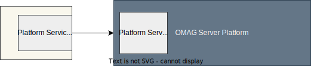

<!-- SPDX-License-Identifier: CC-BY-4.0 -->
<!-- Copyright Contributors to the Egeria project. -->

--8<-- "snippets/content-status/stable.md"


??? info "Summary"
    | Description              | Value                                                                                                                                                                    |
    |--------------------------|--------------------------------------------------------------------------------------------------------------------------------------------------------------------------|
    | Link to Implementation   | [open-metadata-implementation/platform-services :material-github:](https://github.com/odpi/egeria/tree/main/open-metadata-implementation/platform-services){ target=gh } |
    | Audit Log Component Id   | 185                                                                                                                                                                      |
    | Audit Log Message Prefix | OMAG-PLATFORM                                                                                                                                                            |
    | Service URL Marker       | platform-services                                                                                                                                                        |
    | Javadoc                  | [Platform Service Clients](https://odpi.github.io/egeria/org/odpi/openmetadata/platformservices/client/PlatformServicesClient.html)                                      |
    | Debug logger             | logging.level.org.odpi.openmetadata.platformservices                                                                                                                     |

# Platform Services

The platform services provide the methods for:

* Querying the origin and capabilities of the [OMAG Server Platform](/concepts/omag-server-platform).
* Starting and stopping OMAG Servers on the platform and shutting down the platform itself.
* Discovering information about the [OMAG Servers](/concepts/omag-server) that the platform is hosting.
* Dynamically setting up the [platform metadata security connector](/concepts/platform-metadata-security-connector).
* Shutting down the OMAG Server Platform

These methods are available through a Java client, or directly by calling the REST API.



## Platform services client

The Platform Services client is called `PlatformServicesClient`. It is located in the `platform-services-client` module and use definitions from the `platform-services-api`.

--8<-- "docs/guides/developer/java-clients/platform-constructor-parameters.md"

Below is an example of the code used to construct the `PlatformServicesClient`.

??? example "Example: Creating a platform services client"
    ```java linenums="1"
    PlatformServicesClient platformServicesClient = new PlatformServicesClient("MyPlatform", platformURLRoot);
    ```

Once the client is created, use it to call the API it offers which is documented using [Javadoc](https://odpi.github.io/egeria/org/odpi/openmetadata/platformservices/client/PlatformServicesClient.html).  All calls take the userId of the caller.  Methods that are specific to an OMAG server will also take the server name as a parameter.

## Querying the origin and capabilities of the platform

The OMAG Server Platform can be built in a variety of ways, both expanding and removing the services delivered by the Egeria community.  Therefore it is useful to be able to query a particular OMAG Server Plaftorm to discover what it can do.

### Platform origin

The platform origin method is used to confirm that the platform is running, and the release of Egeria it is built from.

??? example "Example: Retrieving the platform origin"
    
    === "Java"
    
        ```java linenums="1"
        String platformOrigin = platformServicesClient.getPlatformOrigin(clientUserId);
        ```
    
    === "REST API"
    
        !!! post "getServerPlatformOrigin"
            ```
            POST {{platformURLRoot}}/open-metadata/platfrom-services/users/{{adminUserId}}/server-platform/origin
            ```
    

The call returns a string value of:
```text
Egeria OMAG Server Platform (version {release})
```
It is a simple check that the platform is running.

### Registered services

It is also possible to list the [registered services](/services/#registered-services) that are available in the platform.

??? example "Example: Retrieving the registered services"

    === "Java"

        ```java linenums="1"
        List<RegisteredOMAGService> registeredOMASs = platformServicesClient.getAccessServices(clientUserId);
        List<RegisteredOMAGService> registeredOMESs = platformServicesClient.getEngineServices(clientUserId);
        List<RegisteredOMAGService> registeredOMISs = platformServicesClient.getIntegrationServices(clientUserId);
        List<RegisteredOMAGService> registeredOMVSs = platformServicesClient.getViewServices(clientUserId);
        ```

    === "REST API"
    
        !!! get "getRegisteredServices"
            ```
            GET {{platformURLRoot}}/open-metadata/platfrom-services/users/{{adminUserId}}/registered-services/access-services
            GET {{platformURLRoot}}/open-metadata/platfrom-services/users/{{adminUserId}}/registered-services/engine-services
            GET {{platformURLRoot}}/open-metadata/platfrom-services/users/{{adminUserId}}/registered-services/integration-services
            GET {{platformURLRoot}}/open-metadata/platfrom-services/users/{{adminUserId}}/registered-services/view-services
            ```

Each entry in `RegisteredOMAGService` details:

* `serviceId` - the component identifier used by the service when it registers with the audit log.
* `serviceName` - the name of the service.        
* `serviceDevelopmentStatus` - the status of the service.
* `serviceURLMarker` - the unique string used in this service's REST API path names.
* `serviceDescription` - the description of the service.
* `serviceWiki` - the page in Egeria's documentation that provides more detail of the service.        

### Supported connectors

It is possible to validate whether a specific connector's implementation is included in the OMAG Server Platform's classpath by using the getConnectorType method.  This takes the class name of the connector's provider class.  It tries to create an instance of the connector and returns it supported connector type.

??? example "Example: Retrieving a connector type"
    The example retrieves the connector type for the Coco Pharmaceutical's sample platform metadata security connector whose connector provider class is `org.odpi.openmetadata.metadatasecurity.samples.CocoPharmaPlatformSecurityProvider`.

    === "Java"
    
        ```java linenums="1"
        ConnectorType connectorType = platformServicesClient.getConnectorType(clientUserId, "org.odpi.openmetadata.metadatasecurity.samples.CocoPharmaPlatformSecurityProvider");
        ```
        [Javadoc for ConnectorType](https://odpi.github.io/egeria/org/odpi/openmetadata/frameworks/connectors/properties/beans/ConnectorType.html)
    
    === "REST API"
    
        !!! post "getConnectorType"
            ```
            POST {{platformURLRoot}}/open-metadata/platform-services/users/{{user}}/server-platform/connector-types/org.odpi.openmetadata.metadatasecurity.samples.CocoPharmaPlatformSecurityProvider
            ```
        Returns
        ```json
        {
            "class": "ConnectorTypeResponse",
            "relatedHTTPCode": 200,
            "connectorType": {
                "class": "ConnectorType",
                "headerVersion": 0,
                "type": {
                    "typeId": "954421eb-33a6-462d-a8ca-b5709a1bd0d4",
                    "typeName": "ConnectorType",
                    "typeVersion": 1,
                    "typeDescription": "A set of properties describing a type of connector."
                },
                "guid": "c7026446-8d9e-4149-8da0-5c800cf7fc23",
                "qualifiedName": "Egeria:Sample:PlatformSecurity:CocoPharmaceuticals",
                "displayName": "Coco Pharmaceuticals Platform Security Connector",
                "description": "Connector supports a hard-coded user registry and authorization rules for Coco Pharmaceuticals.",
                "connectorProviderClassName": "org.odpi.openmetadata.metadatasecurity.samples.CocoPharmaPlatformSecurityProvider",
                "connectorFrameworkName": "Open Connector Framework (OCF)",
                "connectorInterfaceLanguage": "Java",
                "connectorInterfaces": [
                    "org.odpi.openmetadata.frameworks.connectors.SecureConnectorExtension",
                    "org.odpi.openmetadata.metadatasecurity.OpenMetadataPlatformSecurity"
                ]
            }
        }
        ```


## Starting OMAG Servers and stopping OMAG Servers


The code sample shows the method calls to start and stop named OMAG Servers.

??? example "Example: starting and stopping servers"
    ```java linenums="1"
        /**
         * Start the named server on the platform.  This will fail if the platform is not running,
         * or if the user is not authorized to issue operations requests to the platform or if the
         * server is not configured.
         *
         * @param serverName string name
         */
        private void startServer(String serverName)
        {
            try
            {
                PlatformServiceClient client = new PlatformServiceClient(serverName, platformURLRoot);
    
                System.out.println("Starting " + serverName + " ...");
                System.out.println(client.activateWithStoredConfig(clientUserId));
            }
            catch (Exception error)
            {
                System.out.println("There was an " + error.getClass().getName() + " exception when calling the platform.  Error message is: " + error.getMessage());
            }
        }
        
        
        /**
         * Stop the requested server.    This will fail if the server or the platform is not running,
         * or if the user is not authorized to issue operations requests to the platform.
         *
         * @param serverName string name
         */
        private void stopServer(String serverName)
        {
            try
            {
                PlatformServiceClient client = new PlatformServiceClient(serverName, platformURLRoot);
     
                System.out.println("Stopping " + serverName + " ...");
     
                client.deactivateTemporarily(clientUserId);
     
                System.out.println(serverName + " stopped.");
            }
            catch (Exception error)
            {
                System.out.println("There was an " + error.getClass().getName() + " exception when calling the platform.  Error message is: " + error.getMessage());
            }
        }
    ```
            
## Querying the status of the OMAG Servers on the platform

### Known servers

The *known servers* are those servers that have run on the platform since it started.  The `getKnownServers` method returns a list of server names which is useful for stepping through each of the servers in a `for` loop.

??? example "Example: Retrieving the list of known servers"

    === "Java"
    
        ```java linenums="1"
        List<String> serverList = platformServicesClient.getKnownServers(clientUserId);
    
        if (serverList != null)
        {
            for (String serverName : serverList)
            {
                if (serverName != null)
                {
                   /*
                    * Add code here
                    */
               }
            }
        }
        ```

### Active servers

The *active servers* are those servers running on the platform. The `getActiveServers` returns a list of names of the servers running when the request was made.

??? example "Example: Retrieving the list of active servers"
    ```java linenums="1"
    List<String> serverList = platformServicesClient.getActiveServers(clientUserId);

    if (serverList != null)
    {
        for (String serverName : serverList)
        {
            if (serverName != null)
            {
                /*
                 * Add code here
                 */
            }
        }
    }

    ```

Once you have the `serverName`, you can query the status of an OMAG Server running on the platform:

??? example "Example: Retrieving a server's status"
    ```java linenums="1"
    ServerStatus platformServerStatus = platformServicesClient.getServerStatus(clientUserId, serverName);
    ```

The `platformServerStatus` returned includes:

- `serverName` - Name of the server.
- `isActive` - Boolean flag indicating whether it is active (running) on the server.
- `serverStartTime` - The most recent date/time that the server started.
- `serverEndTime` - The most recent date/time that the server stopped.
- `serverHistory` - The list of start and stop times for the previous restarts of the server.

This helps to ascertain when the server was available.

### Querying the active server status

It is also able to retrieve the status of the services running within an active server.

??? example "Example: retrieving the status of the services in an active server"
    ```java linenums="1"

    ServerServicesStatus serverServicesStatus = serverOperationsClient.getServerStatus();
    
    if (adminServerStatus != null)
    {
        System.out.println(adminServerStatus.getServerActiveStatus());
        System.out.println(adminServerStatus.getServerType());
        System.out.println(adminServerStatus.getServices());
    }
    ````

The status of the server (and its nested services) is one of 5 values:

- Unknown - The state of the server is unknown.  This is equivalent to a null value.
- Starting - The server is starting.
- Running - The server has completed start up and is running.
- Stopping - The server has received a request to shutdown.
- Inactive - The server is not running.

The server type is derived by the platform services when it starts the server.  It is based on an assessment of the capabilities requested in the configuration document.

!!! education "Further information"

    * The [administration guide](/guides/admin) describes how to use the administration services to configure OMAG Server Platforms and OMAG Servers.
    * The [operations guide](/guides/operations/overview) describes how to use the platfrom services to start/stop OMAG Servers on OMAG Server Platforms and retrieve diagnostics.

## Dynamically configuring the platform metadata security connector

The [OMAG Server Platform](/concepts/omag-server-platform) provides both configuration and diagnostic services for [OMAG Servers](/concepts/omag-server) which in themselves provide access to a wide variety of information and control points.  Therefore, it is necessary to provide authorization services relating to the dynamic management of the platform.

Egeria provides [a platform security authorization capability](/services/metadata-security-services). It is implemented in a [platform metadata security connector](/concepts/platform-metadata-security-connector) that is called whenever requests are made to the server platform services.

Security is configured for a specific platform once it is running by using the following command.

#### Determine configured security

!!! post "POST - configure platform metadata security connector"
    ```
    {{platformURLRoot}}/open-metadata/admin-services/users/{{adminUserId}}/platform/security/connection
    ```

    The request body should be a connection object used to create the platform security connector and
    the [platform URL root](/concepts/omag-server/#platform-url-root) of the platform.

??? example "Example: sample platform security connector"
    For example, this is the request body that would set up the [sample platform security connector :material-github:](https://github.com/odpi/egeria/tree/main/open-metadata-resources/open-metadata-samples/open-metadata-security-samples){ target=gh } provided for the Coco Pharmaceuticals case study:

    ```json
    {
        "class": "PlatformSecurityRequestBody",
        "urlRoot": "{{platformURLRoot}}",
        "platformSecurityConnection" : 
        {
    	    "class": "Connection",
    	    "connectorType": 
    	    {
    	        "class": "ConnectorType",
    	        "connectorProviderClassName": "org.odpi.openmetadata.metadatasecurity.samples.CocoPharmaPlatformSecurityProvider"
    	    }
        }
    }
    ```

#### Determine configured security

It is possible to query the setting of the platform security connector using the following command:

!!! get "GET - retrieve configured platform security"
    ```
    {{platformURLRoot}}/open-metadata/admin-services/users/{{adminUserId}}/platform/security/connection
    ```

    ??? success "Response indicating no security"
        ```json
        {
            "class": "ConnectionResponse",
            "relatedHTTPCode": 200
        }
        ```

    ??? success "Response indicating a specific security connector"
        If the response looks more like the JSON below, a connector is configured. The `connectorProviderClassName` tells you which connector is being used.
    
        ```json hl_lines="8"
        {
            "class": "ConnectionResponse",
            "relatedHTTPCode": 200,
            "connection": {
                "class": "Connection",
                "connectorType": {
                    "class": "ConnectorType",
                    "connectorProviderClassName": "org.odpi.openmetadata.metadatasecurity.samples.CocoPharmaPlatformSecurityProvider"
                }
            }
        }
        ```

#### Remove configured security

It is possible to remove the configuration for the connector using the following command:

!!! delete "DELETE - remove configured platform security"
    ```
    {{platformURLRoot}}/open-metadata/admin-services/users/{{adminUserId}}/platform/security/connection
    ```

This removes all authorization checking from the platform services.

## Shutting down the OMAG Server Platform

In release 4.2 we introduced a new method to shut down an OMAG Server Platform.  This allows a remote client to terminate the OMAG Server Platform.  When this method is called , the platform terminates immediately and a "connection closed" error response is returned to the caller.

??? example "Example: Shutting down an OMAG Server Platform"

    === "Java"
    
        ```java linenums="1"
        try
        {
            platformServicesClient.shutdownPlatform(clientUserId);
        }
        catch (Exception platformGone)
        {
        }
        ```
    
    === "REST API"
    
        !!! delete "shutdownPlatform"
            ```
            DELETE {{platformURLRoot}}/open-metadata/platfrom-services/users/{{adminUserId}}/server-platform/instance
            ```


--8<-- "snippets/abbr.md"
