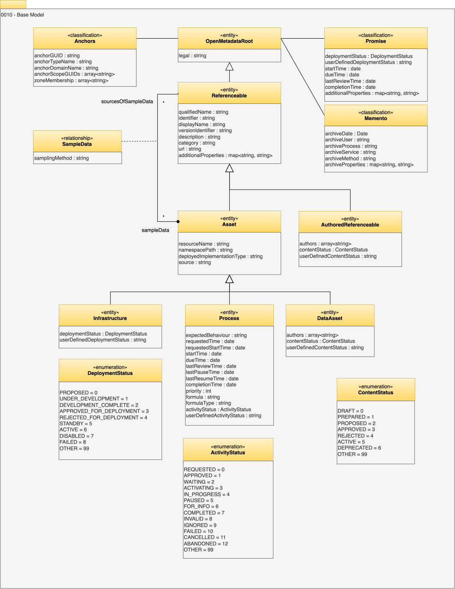

<!-- SPDX-License-Identifier: CC-BY-4.0 -->
<!-- Copyright Contributors to the Egeria project. -->

# 0010 Base model

The base model is the starting point for the open metadata type model.

## ActivityStatus enumeration

The *ActivityStatus* enumeration indicates the execution status of a process.

| Enumeration | Value | Name        | Description                                                                                                                                 |
|-------------|-------|-------------|---------------------------------------------------------------------------------------------------------------------------------------------|
| REQUESTED   | 0     | Requested   | The description of the activity has been created and is pending.                                                                            |
| APPROVED    | 1     | Approved    | The activity is approved to run. This means that the mandatory preconditions have been satisfied.                                           |
| WAITING     | 2     | Waiting     | The activity is waiting for its start time or an actor to claim it.                                                                         |
| ACTIVATING  | 3     | Activating  | The process that will perform the activity is being activated.                                                                              |
| IN_PROGRESS | 4     | In Progress | The work for the activity is in progress.                                                                                                   |
| PAUSED      | 5     | In Progress | The work for the activity has been paused.                                                                                                  |
| COMPLETED   | 7     | Completed   | The work for the activity has successfully completed.                                                                                       |
| INVALID     | 8     | Invalid     | The activity has not happened because it is not appropriate (for example, created by an automated process as a result of a false positive). |
| IGNORED     | 9     | Ignored     | The activity has not been actioned because it is not important, or another activity has superseded it.                                      |
| FAILED      | 10    | Failed      | The process that is performing the work (normally an automated process) failed during start up or execution.                                |
| CANCELLED   | 11    | Cancelled   | The activity was cancelled by an external caller.                                                                                           |
| ABANDONED   | 12    | Abandoned   | The activity was abandoned because it was not possible to complete the assigned work, or it is no longer relevant.                          |
| OTHER       | 99    | Other       | Undefined or user-defined status.                                                                                                           |

It is used with *Process* entities.

## ContentStatus enumeration

The *ContentStatus* shows the lifecycle states of an element that is being authored through open metadata.

| Enumeration | Value | Name       | Description                                              |
|-------------|-------|------------|----------------------------------------------------------|
| DRAFT       | 0     | Draft      | The content is incomplete.                               |
| PREPARED    | 1     | Prepared   | The content is ready for review.                         |
| PROPOSED    | 2     | Proposed   | The content is in review.                                |
| APPROVED    | 3     | Approved   | The content is approved.                                 |
| REJECTED    | 4     | Rejected   | The request or proposal is rejected.                     |
| ACTIVE      | 5     | Active     | The instance is approved and in use.                     |
| DEPRECATED  | 6     | Deprecated | The instance is out of date and should not be used.      |
| OBSOLETE    | 7     | Obsolete   | The instance is no longer active and should not be used. |
| OTHER       | 99    | Other      | The instance is in a locally defined state.              |

It is used in *AuthoredReferenceable* and *DataAsset* entities.

## DeploymentStatus enumeration

The *DeploymentStatus* shows the status of digital resources as they are developed, deployed, operated and eventually decommissioned.

| Java/JSON name          | Ordinal | Name                    | Description                                               |
|-------------------------|---------|-------------------------|-----------------------------------------------------------|
| PROPOSED                | 0       | Proposed                | The content is in review.                                 |
| UNDER_DEVELOPMENT       | 1       | Under development       | The instance is being developed.                          |
| DEVELOPMENT_COMPLETE    | 2       | Development complete    | The development of the instance is complete.              |
| APPROVED_FOR_DEPLOYMENT | 3       | Approved for deployment | The instance is approved for deployment.                  |
| REJECTED_FOR_DEPLOYMENT | 4       | Rejected for deployment | The instance is not approved for deployment.              |
| STANDBY                 | 5       | StandBy                 | The instance is deployed in standby mode.                 |
| ACTIVE                  | 6       | Active                  | The instance is approved and in use.                      |
| DISABLED                | 7       | Disabled                | The instance is shutdown or disabled.                     |
| FAILED                  | 8       | Failed                  | The instance is not in use due to failure.                |
| OTHER                   | 99      | Other                   | The instance is in a locally defined state.               |

It is used in *Infrastructure* and [DigitalProduct](/types/7/0710-Digital-Products) entities.

## OpenMetadataRoot entity

*OpenMetadataRoot* is the root entity (super-type) for all open metadata entity types.  It has the following attribute:

* *legal* - copyright and/or license information for the element or associated resource.

## Referenceable entity

*Referenceable* is the super type for many of the open metadata entity types. A *Referenceable* entity is something that is important enough to be assigned a unique (qualified) name within its type. This unique name is called the *qualifiedName* and may be set to the unique identifier value used outside the open metadata ecosystem. Alternatively, it is often set to a concatenation of an element's type name along with a number of its properties to create a unique string.

Referenceable also has provision for storing optional descriptive information:

* *identifier* - an identifier typically used in external systems or manual processes.  It is typically unique and meaningful beyond the open metadata ecosystem.
* *displayName* - short name for use in tables and titles.
* *description* - detailed description of the element.
* *category* - a grouping name.
* *url* - a link to more information.
* *versionIdentifier* - user-managed version identifier.  This is in addition to the automatically managed version in the [element's header](/concepts/open-metadata-instances/#instanceauditheader).
* *additionalProperties* - a set of name-value pairs (i.e. a map) where the values are all strings.  It can be used for other properties that are not directly supported by the open metadata types.

??? tip "Further Information on Referenceable"
    * [Further information on the use of Referenceable.](/concepts/referenceable)
    * [Further information on external identifiers](/features/external-identifiers/overview)

* *qualifiedName* - Unique name for the element.

## AuthoredReferenceable entity

The *AuthoredReferenceable* is an element that has optional lifecycle states defined either by the *ContentStatus* enumeration, or if *contentStatus==OTHER*, the *userDefinedContentStatus* attribute.

* *contentStatus* - Defines the current status of an authored referenceable.
* *userDefinedContentStatus* - Extend or replace the valid content statuses with additional statuses controlled through valid metadata values.
* *authors* - List of authors for the external source.
 

## Asset entity

An [Asset](/concepts/asset) is a metadata entity that describes a [resource](/concepts/resource) (either physical or digital) that is of value and so needs to be managed and governed.  *Infrastructure*, *Process*, [*DataStore*](/types/2/0210-Data-Stores), [*DataFeed*](/types/2/0223-Events-and-Logs), [*DeployedAPI*](/types/2/0212-Deployed-APIs), *DataSet* and [*RunnableSoftwareComponent*](/types/2/0282-Released-Software-Components) are subtypes of *Assets*.

*Asset* is a subtype of *Referenceable*. It adds five attributes to the *Referenceable* type:

* *resourceName* is the name of the [resource](/concepts/resource).
* *namespacePath* provides a qualifying name that defines how the digital resources of a particular type are organized.  Often, concatenating the namespace with the resource name creates the unique name of the resource for a particular context.
* *deployedImplementationType* attribute describes the class of technology that the asset belongs to.  Values for this attribute can be managed for consistency in a [*deployed implementation type*](/concepts/deployed-implementation-type) valid value set.
* *source* attribute identifies the organization that supplies the technology.  For example, if the asset described a DB2 database, then the source would be IBM.

The values set in an *Asset* entity tend to be focused around the implementation of the resource.  The [*SupplementaryProperties*](/types/3/0395-Supplementary-Properties) relationship allows a more business-oriented description to be attached.

More information on assets can be found in the [Metadata Manager](/patterns/metadata-manager/overview) overview.

## Infrastructure entity

*Infrastructure* represents both the physical and digital assets that the organization runs its business on.  It has optional lifecycle states defined either by the *DeploymentStatus* enumeration, or if *deploymentStatus==OTHER*, the *userDefinedDeploymentStatus* attribute.

[*ITInfrastructure*](/types/0/0030-Operating-Platforms) is a subtype of *Infrastructure* describing Information Technology (IT) infrastructure that runs IT services.  There is more information on the different types of *ITInfrastructure* in:

- [0030 Hosts and Platforms](/types/0/0030-Operating-Platforms)
- [0035 Complex Hosts](/types/0/0035-Complex-Hosts)
- [0037 Software Server Platforms](/types/0/0037-Software-Server-Platforms)
- [0040 Software Servers](/types/0/0040-Software-Servers)
- [0042 Software Capabilities](/types/0/0042-Software-Capabilities)

* *deploymentStatus* - Defines the current status of an infrastructure element.
* *userDefinedDeploymentStatus* - Extend or replace the valid deployment statuses with additional statuses controlled through valid metadata values.

## Process entity

*Process* describes an activity.  It may be performed by a human, team or automated process.  It has optional lifecycle states defined either by the *ActivityStatus* enumeration, or if *activityStatus==OTHER*, the *userDefinedActivityStatus* attribute.

The additional attributes it introduces are:

* *expectedBehaviour* - the action that the person or automated process should perform.
* *requestedTime* - When the requested activity was documented.
* *requestedStartTime* - When the requested activity was requested to start.
* *startTime* - When the requested activity started.
* *dueTime* - When the requested activity needs to be completed.
* *lastReviewTime* - When the requested activity was last reviewed.
* *lastPauseTime* - When the requested activity was last paused.
* *lastResumeTime* - When the requested activity was last resumed.
* *completionTime* - When the requested activity was completed.
* *priority* - How urgent is this activity?
* *formula* attribute can describe its behaviour.  
* *formulaType* describes the notation language used to describe the formula.
* *activityStatus* - How complete is the activity? (See ActivityStatus enumeration).
* *userDefinedActivityStatus* - additional values beyond those defined for activityStatus.

Further subtypes of process can be found in models [0013 Actions](/types/0/0013-Actions) and [0215 Software Components](/types/2/0215-Software-Components/)

## DataAsset entity

The *DataAsset* entity described a collection of data.  It has optional lifecycle states defined either by the *ContentStatus* enumeration, or if *contentStatus==OTHER*, the *userDefinedContentStatus* attribute.

[Area 2](/types/2/0210-Data-Stores) provides more detail on the different types of data assets.  A good place to start is model [0210 Data Stores](/types/2/0210-Data-Stores/).

* *contentStatus* - Defines the current status of an authored referenceable.
* *userDefinedContentStatus* - Extend or replace the valid content statuses with additional statuses controlled through valid metadata values.
* *authors* - List of authors for the external source.

## LabeledRelationship relationship

*LabeledRelationship* is the common root for the relationships that carry a label and a description.  It is not used directly.  It exists so that the many relationships that need to explain themselves - when they are drawn in a graph, or listed in a user interface - inherit the same two attributes rather than each defining their own.

Both ends are *OpenMetadataRoot*, with any number of relationships permitted at each end, which leaves each subtype free to narrow the ends to the types it actually connects.

* *label* - display label to use when the relationship is drawn in a graph.  For example, `provision data`.
* *description* - description of the relationship in free-text.

Over fifty relationship types inherit from *LabeledRelationship*.  *LineageRelationship* below is one of them; others include [*GovernedBy*](/types/4/0401-Governance-Definitions), [*MoreInformation*](/types/0/0019-More-Information), [*ExternalReferenceLink*](/types/0/0014-External-References) and [*SolutionLinkingWire*](/types/7/0735-Solution-Ports-and-Wires).

## LineageRelationship relationship

*LineageRelationship* is the common root for the relationships that make up the [lineage graph](/features/lineage-management/overview).  It is a subtype of *LabeledRelationship*, so a lineage relationship carries a *label* and a *description* as well, and it adds one attribute of its own:

* *iscQualifiedName* - unique name of the [information supply chain](/concepts/information-supply-chain) that this relationship belongs to.  For example, `InformationSupplyChain:Monthly Reporting`.

Because *iscQualifiedName* is defined here, the subtypes of *LineageRelationship* are exactly the relationships that can belong to an information supply chain.  Retrieving an information supply chain along with its implementation matches on this attribute alone, with no restriction on the relationship type, so a relationship that does not inherit from *LineageRelationship* can never form part of one.

*LineageRelationship* is also [multi-link](/concepts/uni-multi-link).  Where more than one information supply chain makes use of the same connection between the same two elements, each has its own relationship carrying its own *iscQualifiedName*.

Its subtypes are:

* *DataLineageRelationship* below, and through it the [*DataFlow* and *ProcessCall*](/types/7/0750-Data-Passing) relationships, the [*LineageMapping*](/types/7/0770-Lineage-Mapping) relationship, and the [*UltimateSource* and *UltimateDestination*](/types/7/0755-Ultimate-Source-Destination) ultimate edges.
* The [*ControlFlow*](/types/7/0750-Data-Passing) relationship, which shows one process triggering another.
* The [*DataMapping*](/types/7/0770-Lineage-Mapping) relationship, which shows data being copied from one schema element to another.
* The [*DigitalProductDependency*](/types/7/0710-Digital-Products) relationship, which records that one [digital product](/concepts/digital-product) consumes data from another, and so forms the [data mesh](/concepts/data-mesh).
* The [*ActionRequester*](/types/0/0013-Actions) relationship, which links an action to the element that requested it.

## DataLineageRelationship relationship

*DataLineageRelationship* is the common root for the lineage relationships along which data actually moves, as distinct from those that describe control, equivalence, or a business-level dependency.  It is a subtype of *LineageRelationship*, and both of its ends are *Referenceable*: the sources at end 1 (*dataLineageSources*) and the destinations at end 2 (*dataLineageDestinations*).  Data therefore flows from end 1 to end 2 in every subtype except *UltimateSource*, whose end 2 holds the source that end 1 is downstream of.

Its attributes describe how the data moves:

* *oneWay* - is the data flowing one-way or bidirectional?
* *integrationStyle* - mechanism to flow data and control along the segment.
* *protocol* - name of the protocol used to make the connection.
* *frequency* - how frequently this is expected to run.  For example, real-time, hourly, daily, or on batch completion.
* *dataExchanged* - a full explanation of what data flows and why.

These are the relationships that the [Darwin Product Dependency Manager](/features/lineage-management/overview/#rolling-up-the-lineage) follows when it derives the coarse-grained lineage from the finer-grained lineage beneath it.

## RoledRelationship relationship

*RoledRelationship* is the common root for the relationships that carry a role and a description.  It is the counterpart of *LabeledRelationship* for the cases where the useful thing to record about a link is not what to call it, but what part the element at one end plays in the other.

Both ends are *OpenMetadataRoot*, with any number of relationships permitted at each end.

* *role* - role that this artifact plays in implementing the abstract representation.
* *description* - description of the relationship in free-text.

No relationship type inherits from *RoledRelationship* yet.  It is defined, and supported by the relationship beans of the [Open Metadata Framework (OMF)](/frameworks/omf/overview), ready for the relationship types that need this pattern.

## SampleData relationship

The *SampleData* relationship links an *Asset* entity describing a collection of sample data that originates from the resource represented by the *Referenceable* entity.

* *samplingMethod* - Description of the technique used to create the sample.

## Anchors classification

The *Anchors* classification is used internally by the open metadata ecosystem to optimize the lookup of the entity at the root of a cluster of elements that represents a larger object. Currently, there is support for objects uniquely "owned" by an entity to store the GUID of that entity along with its type and domain.

* *anchorGUID* - unique identifier of the anchor.
* *anchorTypeName* - type name of the anchor.
* *anchorDomainName* - type name of the anchor's domain.  This is the super type of the anchor that is one level below *Referenceable* or if the element does not inherit from *Referenceable*, take the type that is one level below *OpenMetadataRoot*.  For example, if the anchor is of type [DataSet](/types/2/0210-Data-Stores/), then the domain is *Asset*.  If the anchor is [DataClassAnnotation](/types/6/0625-Data-Class-Discovery/) then the domain is [Annotation](/types/6/0610-Annotations/).
* *anchorScopeGUIDs* - Unique identifiers of the scope of the anchor.  These are unique identifier (GUIDs) of the open metadata entities that represents a scope/ownership of an anchor element.  It is used to restrict searches.
* *zoneMembership* - Unique identifier of the zone membership assigned to the anchor.  This is a list of zone names.  It is used to restrict access to the anchored elements.  Null means membership of all zones. If the element is the anchor, then the [ZoneMembership](/types/4/0424-Governance-Zones) classification is used as the definitive zone membership.

!!! info "Further information on the use of Anchors"
    * [Anchor Management](/concepts/anchor).
    * [Governance Zone](/concepts/governance-zone).

## Promise classification

The *Promise* classification is used to indicate that the entity it is attached to is a promise to deliver a real-world digital resource/artifact.  It can be attached to any *OpenMetadataRoot* entity.  It is only visible in lineage requests (`forLineage=true`), which allows the entity to take its place in the [lineage of other assets/artifacts](/features/lineage-management/overview) before the digital resource/artifact exists.  Its attributes describe when the real-world digital resource/artifact will be delivered.

* *deploymentStatus* - Defines the current status of an infrastructure element.
* *userDefinedDeploymentStatus* - Extend or replace the valid deployment statuses with additional statuses controlled through valid metadata values.
* *startTime* - When the work on the requested digital resource/artifact started.
* *dueTime* - When the requested digital resource/artifact is expected to be completed.
* *lastReviewTime* - When the delivery progress was last reviewed.
* *completionTime* - When the delivery of the requested digital resource/artifact was completed.
* *additionalProperties* - a set of name-value pairs (i.e. a map) where the values are all strings.  It can be used for other properties that are not directly supported by the open metadata types.

!!! info "Further information on the use of Promise"
    * [Promise](/concepts/promise).
    * [Memento](/concepts/memento) is the counterpart classification for an entity whose digital resource/artifact no longer exists.

## Memento classification

Finally, the *Memento* classification identifies that the Referenceable entity it is attached to, refers to a real-world asset/artifact that has either been deleted or archived offline. The entity has been retained to show its role in the [lineage of other assets/artifacts](/features/lineage-management/overview). The properties in this classification identifies the archive processing and any information that helps to locate the asset/artifact in the archive (if applicable).

* *archiveDate* - Timestamp when the archive occurred or was detected.
* *archiveUser* - Name of user that performed the archive - or detected the archive.
* *archiveProcess* - Name of process that performed the archive - or detected the archive.
* *archiveService* - Name of service that created this classification.
* *archiveMethod* - Name of method that created this classification.
* *archiveProperties* - Properties to locate the real-world counterpart in the archive.

--8<-- "snippets/abbr.md"
