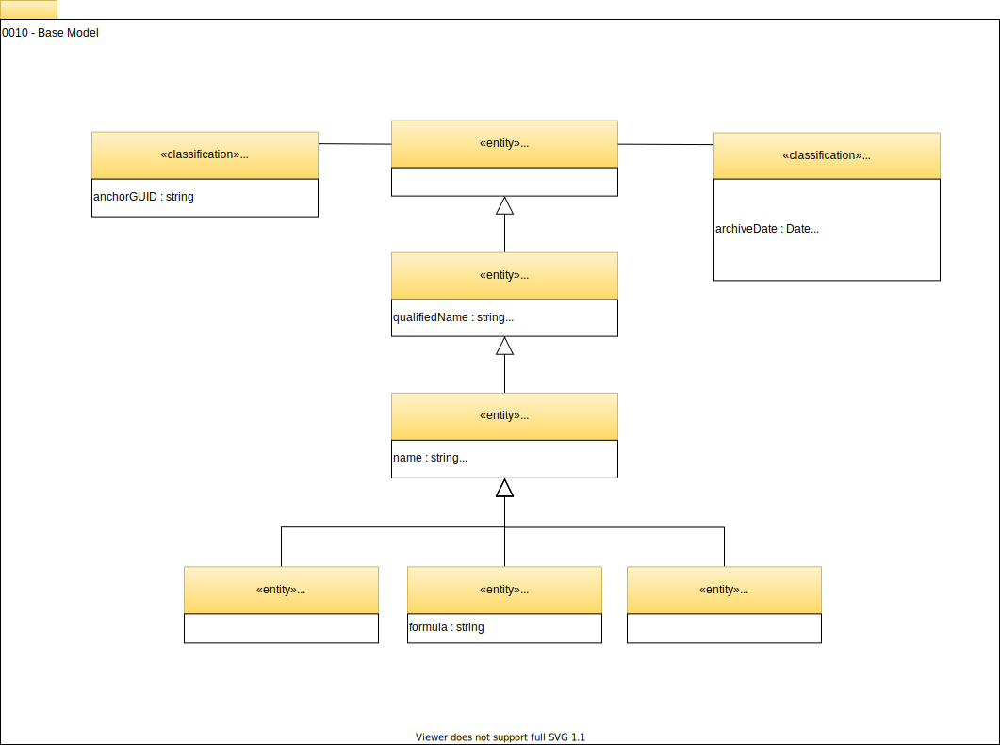

<!-- SPDX-License-Identifier: CC-BY-4.0 -->
<!-- Copyright Contributors to the Egeria project. -->

# 0010 Base model

## OpenMetadataRoot

*OpenMetadataRoot* is the root entity for all open metadata entity types.

## Referenceable

*`Referenceable`* is the super type for many of the open metadata entity types. A `Referenceable` is something that is important enough to be assigned a unique (qualified) name within its type. This unique name is often used outside the open metadata ecosystem as its unique identifier. `Referenceable` also has provision for storing additional properties. This is a set of name-value pairs (i.e. a map) where the values are all strings.

[Further information on the use of Referenceable.](/egeria-docs/concepts/referenceable)

## Asset

*`Asset`* represents the most significant type of `Referenceable`. An `Asset` is something (either physical or digital) that is of value and so needs to be managed and governed.

??? deprecated "Deprecated attributes"
    The `Asset` entity has the following deprecated attributes. Their values have been moved to classifications as shown in the table below. Many `Asset`s are created by their hosting technology and locked read-only to the broader metadata ecosystem (see [external metadata provenance](/egeria-docs/features/metadata-provenance) for more detail). By moving the governance related information to a classification, it can be maintained by a different service to the `Asset` creator.

    | Deprecated attribute | Moved to classification |
    |---|---|
    | `owner` (type `string`) | [Ownership](../../4/0445-Governance-Roles/#ownership) |
    | `ownerType` (type `AssetOwnerType` enum) | [Ownership](../../4/0445-Governance-roles/#ownership) |
    | `zoneMembership` (type `array<string>`) | [AssetZoneMembership](../../4/0424-Governance-Zones/#assetzonemembership) |
    | `latestChange` (type `string`) | [LatestChange](../../0/0011-managing-referenceables/#latestchange) |

`Infrastructure`, `Process` and `DataSet` are examples of `Asset`s.

### Infrastructure

*`Infrastructure`* represents both the physical and digital assets that the organization runs its business on. There is more information on `Infrastructure` in:

- [0030 Hosts and platforms](0030-hosts-and-platforms.md)
- [0035 Complex hosts](0035-complex-hosts.md)
- [0037 Software server platforms](0037-software-server-platforms.md)
- [0040 Software servers](0040-software-servers.md)
- [0042 Software server capabilities](0042-software-server-capabilities.md)

### Process

*`Process`* describes a well-defined set of processing steps and decisions that drive a particular aspect of the organization's business. Most `Process`es are automated with software (see [`DeployedSoftwareComponent`](../../2/0215-software-components/#deployedsoftwarecomponent)) but they may also be a manual procedure. An automated process can be invoked from a remote server through a [`DeployedAPI`](../../2/0212-deployed-apis/#deployedapi).

### DataSet

*`DataSet`* represents a collection of related data. This data does not need to be stored together. See [`DataStore`](../../2/0210-data-stores/#datastore) for the `Asset` that represents a physical store.

More information on assets can be found in [building an Asset Catalog](../cataloging-assets).

## Anchors

The *`Anchors`* classification is used internally by the open metadata ecosystem to optimize the lookup of the entity at the root of a cluster of elements that represents a larger object. Currently, there is support for objects uniquely "owned" by an asset to store the GUID of that asset.

[Further information on the use of Anchors.](/egeria-docs/concepts/anchor)

## Memento

Finally, the *`Memento`* classification identifies that the `Referenceable` refers to a real-world asset/artifact that has either been deleted or archived offline. The metadata element has been retained to show its role in the [lineage of other assets/artifacts](../lineage). The properties in this classification identifies the archive processing and any information that helps to locate the asset/artifact in the archive (if applicable).

--8<-- "snippets/abbr.md"
