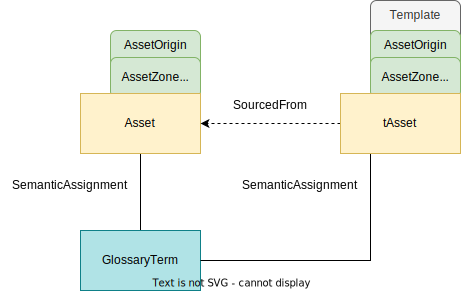
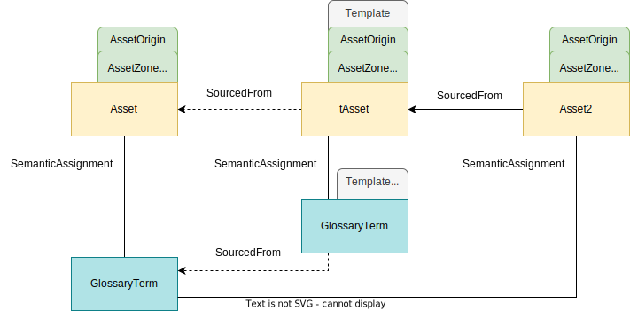

<!-- SPDX-License-Identifier: CC-BY-4.0 -->
<!-- Copyright Contributors to the Egeria project 2020. -->

# 0011 Templates

Open metadata elements can have chains of related feedback and additional information and classifications attached to them. The following types help a metadata manager to process standard patterns of elements more efficiently.

## Template classification

Templates are used when creating new elements that are similar.  For example, consider the case when multiple resources need to be catalogued as assets with the same classifications.  One of the assets can be set up to act as a template.  The other resources can be catalogued using the first asset as a template.

The *Template* classification indicates that a [*Referenceable*](/types/0/0010-Base-Model) entity is a good element be used as a template when creating a new element of the same type. There is no restriction on using entities without this classification as templates. The *Template* classification is simply a useful marker to indicate that the entity does not represent a real resource, since it is only a template.  

The properties for the *Template* classification are:

* *name* - name of the template, designed to help the selection of the correct template.
* *description* - further information on the purpose of the template.
* *versionIdentifier* - allows different versions of a template to be kept in the metadata repository. 
* *additionalProperties* - allows additional information about the template to be supplied

Templates can include relationships.  If the relationship links to an entity that has the same anchor as the starting entity, the entity and the relationship is replicated.  If the linked entity is part of a different anchor, only the relationship is created.  In the example above, the glossary term has a different anchor to the asset.  Therefore any assets created with *tAsset* as a template will be linked to the same glossary term.

## TemplateSubstitute classification

If a query requests all assets linked to the glossary term, *GlossaryTerm*, the *tAsset* entity will be returned with the other assets.  This could be confusing.  Therefore it is possible to create a copy of the glossary term that is linked to *tAsset*.  This copy has the *TemplateSubstitute* classification to show that the real glossary term to link a new asset to is identified by the *SourcedFrom* relationship.

With this set up, when *Asset2* is created with the template *tAsset*, it is linked to the same glossary term as *Asset*.

## SourcedFrom relationship

When one *Referenceable* entity is created by using another *Referencable* entity as a template, the *qualifiedName* must be changed in the new entity to give it a unique name - often the *displayName* value changes, too. This makes it hard to identify the source of an entity's values.

The *SourcedFrom* relationship is used to show the provenance of the information from the template. This is useful to help trace where information has come from and to help understand any potential impact cause by a change to the template if this change also needs to be made to the elements that were copied from it.

The *sourceVersionNumber* identifies the version number of the template used when the new entity was created.

## CatalogTemplate relationship

The *CatalogTemplate* relationship links an *OpenMetadataRoot* entity that describes a class of technology with a [template](/features/templated-cataloguing/overview) for creating a catalog entry for a resource of this class.

???+ info "Further information"

    - [Anchor Management](/features/anchor-management/overview)
    - [Using templates](/features/templated-cataloguing/overview)
    - [Automated Curation API](/services/omvs/automated-curation/overview)
    - [Template Manager API](/services/omvs/template-manager/overview)

--8<-- "snippets/abbr.md"
