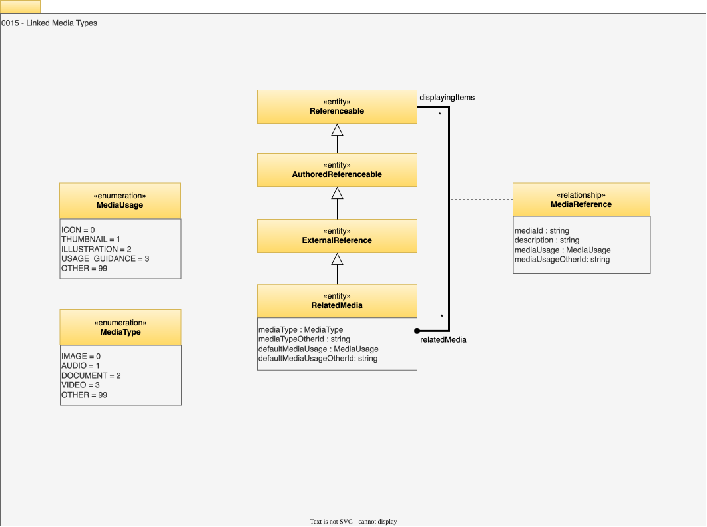

<!-- SPDX-License-Identifier: CC-BY-4.0 -->
<!-- Copyright Contributors to the Egeria project. -->

# 0015 Linked Media Types

Linked media types describe the simple structures that are used repeatedly in open metadata to connect it to media files in other types of repositories.

## RelatedMedia

*`RelatedMedia`* such as images allow an icon, thumbnail and larger images to be associated with a metadata element. They are intended to be displayed with the metadata content. These images enrich the description of the object and may include, for example, design drawings, photographs or illustrations of the component in action.

* *mediaType* - Type of media.
* *mediaTypeOtherId* - Unique identifier of the code (typically a valid value definition) that defines the media type.
* *defaultMediaUsage* - The most common, or expected use of this media resource.
* *defaultMediaUsageOtherId* - Unique identifier of the code (typically a valid value definition) that defines the media use.

## MediaReference relationship

Link to related media such as images, videos, and audio.

* *mediaId* - Local identifier for the media, from the perspective of the referencee. For example. it may be the citation number in the list of references.
* *description* - Description of the element or associated resource in free-text.
* *mediaUsage* - Specific media usage by the consumer that overrides the default media usage documented in the related media.
* *mediaUsageOtherId* - Unique identifier of the code (typically a valid value definition) that defines the media use.

--8<-- "snippets/abbr.md"
