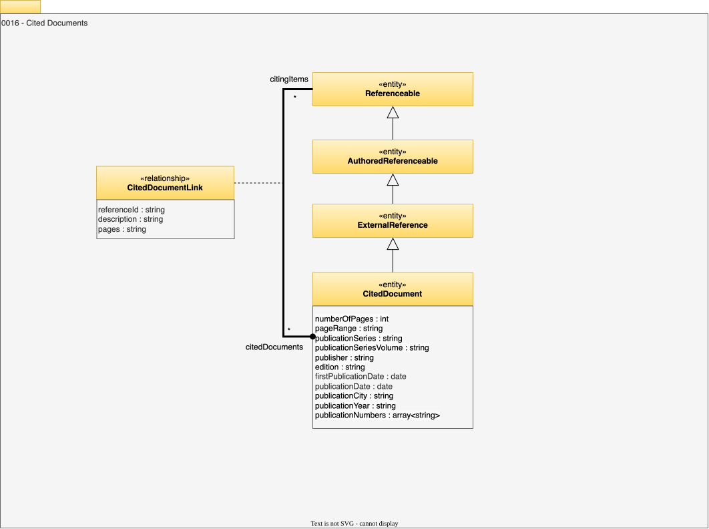

<!-- SPDX-License-Identifier: CC-BY-4.0 -->
<!-- Copyright Contributors to the Egeria project. -->

# 0016 Cited Documents

Cited documents support open metadata elements to link to a precise citation to remote documents in other types of repositories.

## CitedDocument entity

*CitedDocument* entity is an [ExternalReference](/types/0/0014-External-References) that describes a specific document in an external repository.

* *numberOfPages* - Number of pages that this external source has.
* *pageRange* - Range of pages that this reference covers. For example, if it is a journal article, this could be the range of pages for the article in the journal.
* *publicationSeries* - Name of the journal or series of publications that this external source is from.
* *publicationSeriesVolume* - Name of the volume in the publication series that this external source is from.
* *publisher* - Name of the publisher responsible for producing this external source.
* *edition* - Name of the edition for this external source.
* *firstPublicationDate* - Date of the first published version/edition of this external source.
* *publicationDate* - Date when this version/edition of this external source was published.
* *publicationCity* - City where the publishers are based.
* *publicationYear* - Year when the publication of this version/edition of the external source was published.
* *publicationNumbers* - List of unique numbers allocated by the publisher for this external source. For example ISBN, ASIN, UNSPSC code.

## CitedDocumentLink

*CitedDocumentLink* connects a [Referenceable](/types/0/0010-Base-Model) to a CitedDocument entity.  It allows a *referenceId* and a precise page range (*pages* attribute) to be specified along with a short description of the relevance of the citation.  This relationship is a multi-link relationship so the same referenceable can link to the same cited document multiple times, with different referenceIds.

* *referenceId* - Local identifier for the reference.
* *description* - Description of the element or associated resource in free-text.
* *pages* - Range of pages in the external reference that this link refers.

--8<-- "snippets/abbr.md"
