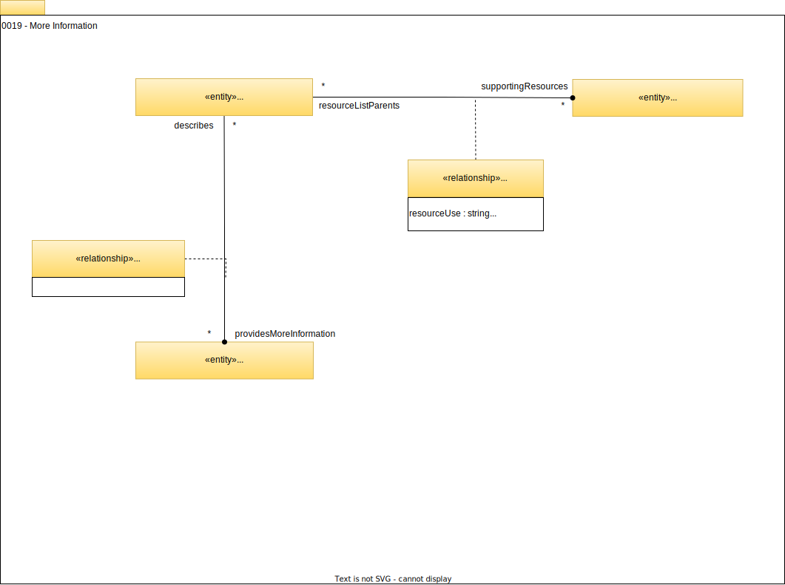

<!-- SPDX-License-Identifier: CC-BY-4.0 -->
<!-- Copyright Contributors to the Egeria project. -->

# 0019 More Information

Entities that inherit from [Referenceable](/types/0/0010-Base-Model) such as [Assets](/types/0/0010-Base-Model), [Governance Definitions](/types/4/0401-Governance-Definitions) and [Actors](/types/1/0110-Actors) are typically the hub of a lot of related information.  The relationships on this page identify resources and information that are relevant to these entities.

## ResourceList relationship

The *ResourceList* relationship links one *Referenceable* entity (parent resource) to another *Referenceable* entity (supporting resource) that is describing resources that are used by the first entity (or what the first entity represents in the real world).

For example, the *ResourceList* relationship may link:

* A governance domain to its associated community.
* An actor to its collection of favourite assets.
* A metadata valid value to the connectors or other resources that are used with it.

The description of what the linked element is used for, and hints on how to use it are provided in the relationship properties.

* *resourceUse* describes the use that the resource is designed to support.  See [Resource Use](/concepts/resource-use) for examples.
* *displayName* provides the short name of the use of the resource for use on menus and buttons.
* *description* provides more description on the use of the resource.
* *additionalProperties* provides the property values needed to use the resource.

## MoreInformation relationship

The *MoreInformation* relationship links [*Referenceable*](/types/0/0010-Base-Model/#referenceable) entities of different types together to indicate that one provides more detail about another.

It is typically used to link descriptive elements such as a [Glossary](/types/3/0310-Glossary),  [GlossaryTerm](/types/3/0330-Terms) or a [ValidValue](/types/5/0545-Reference-Data) to another element that it describes.  For example:

* A glossary (or glossary category) may describe data items that are linked together in a [DesignModel](/types/5/056-Design-Models) or a [SchemaType](/types/5/0501-Schema-Elements) and the *MoreInformation* relationship can show this association.
* A glossary term may describe a particular type of team, project or community and a *MoreInformation* relationship can link it to the [Team](/types/1/0115-Teams) or [Project](/types/1/0130-Projects)  or [Community](/types/1/0140-Communities) element as appropriate,
* A valid value definition for a work location may link to the corresponding [Location](/types/0/0025-Locations) element via a *MoreInformation* relationship.

--8<-- "snippets/abbr.md"
