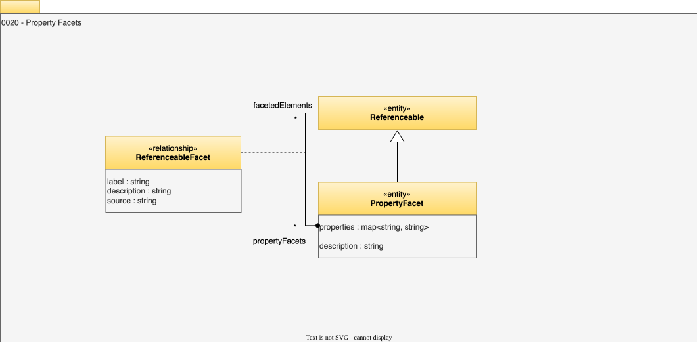

<!-- SPDX-License-Identifier: CC-BY-4.0 -->
<!-- Copyright Contributors to the Egeria project. -->

# 0020 Property Facets

Property facets allow any entity to be extended with additional properties. This is particularly useful for storing metadata that originated in another type of metadata repository or tool, since it allows vendor-/tool-specific values to be stored.

## PropertyFacet

The *PropertyFacet* entity describes the additional properties.

* *description* - Description of the element or associated resource in free-text.
* *properties* - Property name-value pairs.

## ReferenceableFacet

The *ReferenceableFacet* relationship indicates the source of the additional properties.

* *source* - Details of the organization, person or process that created the element, or provided the information used to create the element.

--8<-- "snippets/abbr.md"
