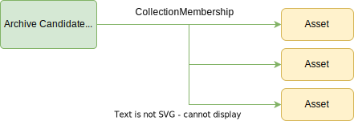

<!-- SPDX-License-Identifier: CC-BY-4.0 -->
<!-- Copyright Contributors to the Egeria project. -->

# 0021 Collections

*Collection*s provide a general mechanism for grouping entities together.  A collection may be maintained manually, or via an automated process (ie a "smart collection").  

The membership of a collection is established via a [*CollectionMembership* relationship](#collectionmembership-relationship), which has attributes that allow the rationale and the confidence of the membership to be established. A [*Referenceable*](/types/0/0010-Base-Model) entity can be a member of none, one or many collections.  

Since a collection is a *Referenceable* entity, collections can be organized into hierarchies - like a directory structure on the filesystem.

## Collection entity

The *Collection* entity describes a parent node for collecting related elements together.  It inherits from [*Referenceable*](/types/0/0010-Base-Model). There are no additional attributes for a collection, beyond the standard attributes for *Referenceable*.

### Collection Subtypes

The collection type is generically useful and there are many subtypes that describe specialist collections, some of which are shown in this model and others are located with the types of elements they contain.

* [Agreement](/types/7/0711-Agreements) described a collection of elements that are part of an agreement.
* [BusinessCapability](/types/7/0715-Digital-Business) described a collection of capabilities needed to operate the business of an organization.
* [CollectionFolder](#collectionfolder-entity) described a collection of elements.
* [ConceptModel](/types/5/0571-Concept-Models) described a collection of modelled concepts.
* [ContextEventCollection](/types/4/0475-Concept-Models) described a collection of [context events](/concepts/context-event).
* [DataDictionary](/types/5/0580-Data-Dictionaries) described a collection of commonly used data field definitions.
* [DataSpec](/types/5/0580-Data-Dictionaries) described a collection of data fields and related definitions that describe the data required.
* [DesignModel](/types/5/0565-Design-Models) described a collection of modelled elements.
* [DigitalProductCatalog](/types/7/0710-Digital-Products) described a collection of digital products that make up a product catalog.
* [DigitalProduct](/types/7/0710-Digital-Products) described a collection of related assets that make up a digital product.
* [DigitalProductFamily](/types/7/0710-Digital-Products) described a collection of digital products that can be subscribed to as if they were a single product.
* [DigitalSubscription](/types/7/0712-Digital-Subscription) is a special type of agreement relating to subscriptions to digital resources.
* [EventSet](/types/5/0535-Event-Schemas) described a collection of event schema definitions.
* [Glossary](/types/3/0310-Glossary) described a collection of [GlossaryTerms](/types/3/0330-Terms).
* [HomeCollection](#homecollection-entity) means the collection is the top-level node in a collection hierarchy anchored to a specific [Referenceable](/types/0/0010-Base-Model).  The members of this collection may or may not be collections.
* [InformationSupplyChain](/types/7/0720-Information-Supply-Chain) described a collection of components performing an important data flow.
* [Namespace](#namespace-entity) means the collection is a set of elements that are organized by namespace (for example, a collection of processes, or schema).
* [NamingStandardsRuleSet](/types/4/0438-Naming-Standards) means the collection is a set of naming standard rules.
* [RecentAccess](#recentaccess-entity) means the collection is a set of elements that have been recently accesses by a user.
* [ResultsSet](#resultsset-entity) means the collection is a set of related results.
* [RootCollection](#rootcollection-entity) described a master collection of collections.
* [SoftwareArchive](/types/0/0030-Hosts-and-Platforms) described a collection of software components.
* [SolutionBlueprint](/types/7/0740-Solution-Blueprints) described a collection of components performing a solution.
* [WorkItemList](#workitemlist-entity) means the collection is a set of elements that have been recently accesses by a user.

## RootCollection entity

The *RootCollection* entity indicates that the collection is used to provide the starting node for an independent hierarchy of collections.  For example, this could be a collection hierarchy that organizes [digital products](/types/7/0710-Digital-Products).

## CollectionFolder entity

The *CollectionFolder* entity is a collection that is used to organize subsets of metadata elements within a larger collection. 
It means the collection can be treated as if it where a folder.

The example below shows part of a collection hierarchy representing a digital product catalog.  The collections are shown in green and the assets that provide the content for the digital product are shown in yellow.

The *RootCollection* collection at the root of the collection hierarchy is called "Product Catalog Collection".  Its membership consists of *CollectionFolder* collections.  The leaf node *DigitalProduct* collections have the data assets as their members.

## HomeCollection entity

The *HomeCollection* classification indicates that the collection is used to provide the starting node for a hierarchy of collections.

## Namespace entity

The *Namespace* entity indicates that the collection is a set of elements that are organized by namespace.

## ResultsSet entity

The *ResultsSet* entity indicates that the collection is a set of elements that are the results from a specific request or query.

## RecentAccess entity

The *RecentAccess* entity indicates that the collection is a set of elements that have been accessed recently.

## WorkItemList entity

The *WorkItemList* entity indicates that the collection is organizing a set of elements (typically [ToDos](/types/1/0135-Actions-For-People), or [Tasks](/types/1/0130-Projects)).

## CollectionMembership relationship

The *CollectionMembership* relationship is used to link a [*Referenceable*](/types/0/0010-Base-Model) entity to a *Collection* entity to indicate that it is a member of the collection.

The *Collection* entity inherits from [*Referenceable*](/types/0/0010-Base-Model) so a collection can be a member of other collections.  For example, it is possible to create a nested set of folders for [assets](/concepts/assets).

The attributes for the *CollectionMembership* relationship establish the level of trust to give to a member's right to be part of the collection:

* The *membershipRationale* attribute describes why the member is part of the collection.
* The *expression* attribute indicates the expression used to decide on the membership.  This is typically set up by automated processes to identify the rule they used to determine the membership.
* The *confidence* attribute indicates how confident that the membership is correct.
* The *createdBy* attribute is the identifier of the process or person that created (curated) the relationship.  This is useful for identifying the instance of a process that created the membership relationship or the curator if they are different from the steward.
* The *source* attribute describes the source of information that identified this membership.
* The *steward* attribute identifies the person that is accountable for the correctness of this membership relationship.
* The *stewardTypeName* attribute identifies the type of element (such as UserIdentity, Person, PersonRole) that is responsible for the correctness of this relationship.
* The *stewardPropertyName* attribute identifies the property (such as guid or qualifiedName) used to identify the steward.
* The *notes* attribute enables the steward to add additional information about this relationship.
* The *membershipStatus* attribute indicates the status of the member in the collection.  It is a [MembershipStatus](#membershipstatus-enumeration) value.
* The *userDefinedStatus* provides a status value when *status=OTHER*.

## MembershipStatus enumeration

The values for the *MembershipStatus* enumeration are:

* *Unknown* - The membership origin is unknown. This is the default value.
* *Discovered* - The membership was discovered by an automated process.
* *Proposed* - The membership was proposed by an expert curator.  The curator uses their expertise to create the membership. They may or may not be the steward who is ultimately accountable for the correctness of the membership.
* *Imported* - The membership was imported from another metadata system.
* *Validated* - The membership created by an automated process has been validated and approved by an expert curator.  Again, the curator may or may not be the steward.
* *Deprecated* - The membership should no longer be used.
* *Obsolete* - The membership must no longer be used.
* *Other* - Another membership status that is set up in the *userDefinedStatus* attribute.

They can be used to support a simple stewardship workflow.  For example, consider an [engine action](/concepts/engine-action) that scans through the [assets](/concepts/asset) examining each one's [Retention](/types/4/0422-Governed-Data-Classifications) classification.  If the values in the classification indicate that the [resource](/concepts/resource) that it represents should be archived, it may link the asset into a collection.

The status value could be *Discovered* in each *CollectionMembership* relationship.  Once the collection is complete, the governance action could trigger a [request to a steward](/types/1/0135-Actions-For-People) to verify the list.  The steward could update the *CollectionMembership* status to either:

* *Validated* - The resource should be archived.
* *Obsolete* - The resource should be retained.

Once the review is complete, another governance action would drive the archive process for all resources indicated by the *CollectionMembership* relationships with *Validated* status.

--8<-- "snippets/abbr.md"
