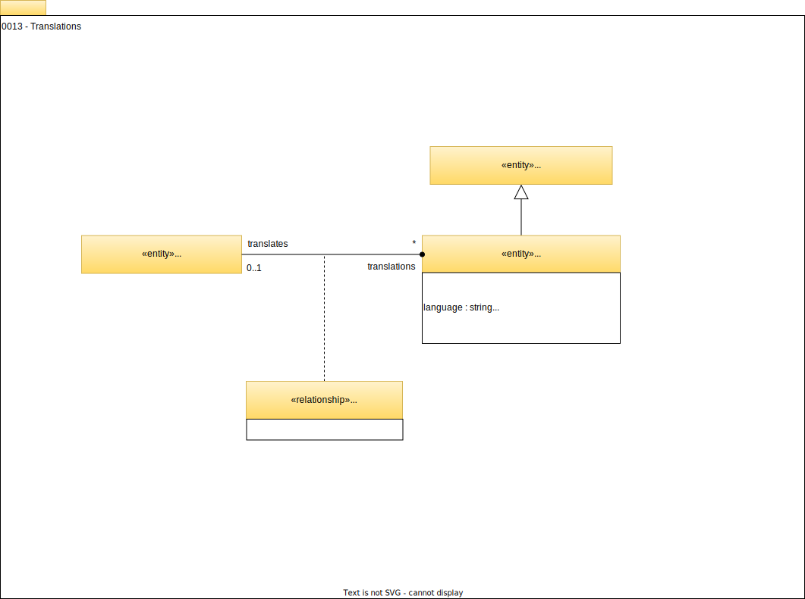

<!-- SPDX-License-Identifier: CC-BY-4.0 -->
<!-- Copyright Contributors to the Egeria project 2020. -->

# 0022 - Translations

Translations provide a means to create alternative text in different languages to support a multilingual deployment of open metadata.

The *TranslationDetails* holds the translation for a single language. It includes the *language* and *locale*.  There are explicit properties of *displayName* and *description* for holding the translation for the *name*/*displayName* and *description* properties respectively.  Any other string properties that need a translation are added to *additionalTranslations*.

The TranslationDetails are linked to the original entity using the *TranslationLink* relationship.

??? info "Further information"
    Translations can be maintained through the [Multi Language API](/services/omvs/multi-language/overview) and are retrieved with the element they are linked to.

--8<-- "snippets/abbr.md"
