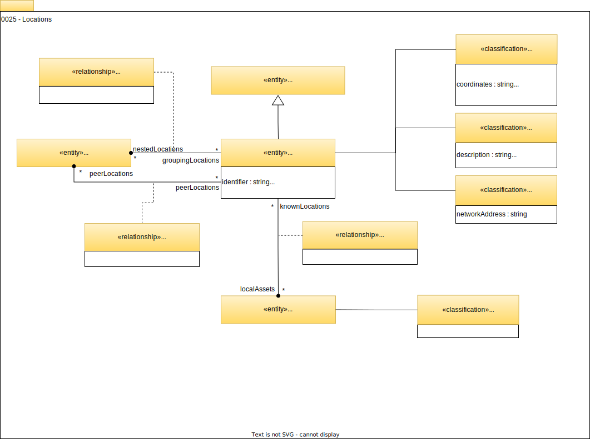

<!-- SPDX-License-Identifier: CC-BY-4.0 -->
<!-- Copyright Contributors to the Egeria project. -->

# 0025 Locations

It is important to understand where assets are located to ensure they are properly protected and comply with data sovereignty laws. The open metadata model allows location information to be captured at many levels of granularity.

## NestedLocation

The *`NestedLocation`* relationship allows hierarchical groupings of locations to be represented. Notice that locations can be organized into multiple hierarchies.

## AdjacentLocation

The *`AdjacentLocation`* relationship links locations that touch one another.

## Classifications

The notion of a location is variable, and the classifications help to clarify the nature of the location.

### FixedLocation

*`FixedLocation`* means that the location represents a physical place where, for example, [`Host`s](/egeria-docs/types/0/0030-Hosts-and-Platforms/#host), [servers](/egeria-docs/types/0/0040-Software-Servers) and hence data may be located. This could be an area of a data center, the building the data center is located in, or even the country where the server/data is located.

The physical location may be defined using a postal address or coordinates. The coordinates should be accompanied by the type of map projection used. For example, Goode's Homolosine Equal Area Projection, Mercator Projection, Gall-Peters Projection, Miller Cylindrical Projection, Mollweide Projection, Sinusoidal EqualArea Projection or Robinson Projection.

### SecureLocation

*`SecureLocation`* indicates that there is restricted access to the location. This can include a description of the type of security.

### CyberLocation

*`CyberLocation`* means that the location describes something in cyberspace. It may include the network address of this location.

--8<-- "snippets/abbr.md"
