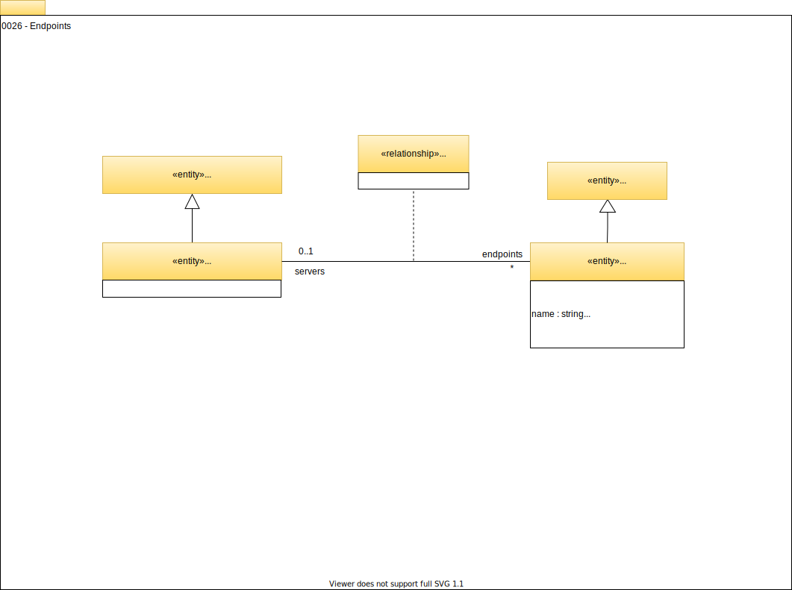
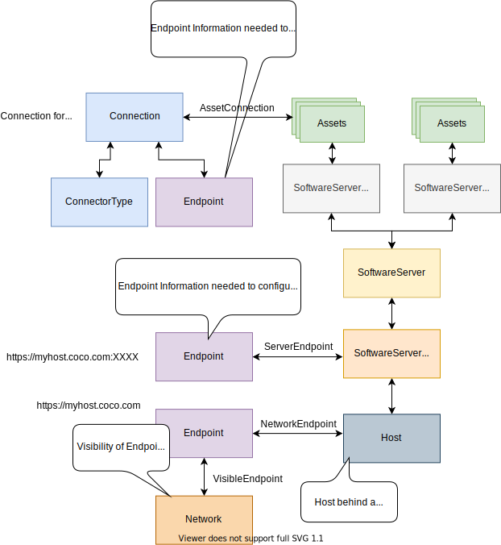

<!-- SPDX-License-Identifier: CC-BY-4.0 -->
<!-- Copyright Contributors to the Egeria project. -->

# 0026 Endpoints

## Endpoint

*`Endpoint`s* capture the network information needed to connect to a service. There is a wide variety of approaches to identifying the endpoint and so its properties will depend on how it is being used.

Endpoints are part of a [`Connection`](/egeria-docs/types/2/0201-connectors-and-connections/#connection). The connection provides the information to create an instance of a connector that is accessing a remote asset. In this situation the `networkAddress` is set up to the URL needed to connect to the specific asset.

## ServerEndpoint

Endpoints can also be linked to infrastructure elements using the *`ServerEndpoint`* relationship to document their network address(s). These are often the values needed in the connection objects configured for [integration connectors](/egeria-docs/connectors/integration-connector) running in an [integration daemon](/egeria-docs/concepts/integration-daemon) and so the endpoint can be looked up either as the integration connector is being configured, or dynamically when the integration connector is running.

!!! example "Endpoint examples"
    The following picture illustrates the different uses of `Endpoint`. The top of the diagram shows the endpoint as part of a connection object used to create a connector to the real resource described by the `Asset`s shown in green.

    In the middle is an `Endpoint` tied to a [`SoftwareServerPlatform`](/egeria-docs/types/0/0037-software-server-platforms/#softwareserverplatform) that is hosting assets. This endpoint can be queried when configuring integration connectors that are to connect to the platform and catalog the resources (assets) it is hosting.

    Finally, the [*`VisibleEndpoint`*](/egeria-docs/types/0/0070-networks-and-gateways/#visibleendpoint) and [*`NetworkEndpoint`*](/egeria-docs/types/0/0070-networks-and-gateways/#networkendpoint) relationships shown at the bottom of the diagram help to document the visibility of an endpoint to a particular network and the host behind it.

    

--8<-- "snippets/abbr.md"
