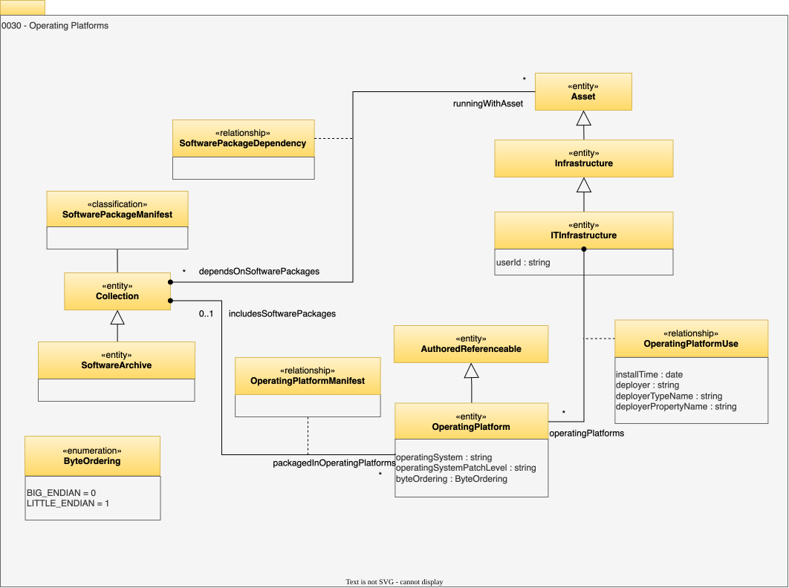

<!-- SPDX-License-Identifier: CC-BY-4.0 -->
<!-- Copyright Contributors to the Egeria project. -->

# 0030 Operating Platforms

The host and platform metadata entities provide a simple model for the IT infrastructure (nodes, computers, etc) that data resources are hosted on.

## OperatingPlatform entity

The *OperatingPlatform* entity is an informational structure to describe the hardware characteristics and software stack (operating system, etc) of the host.

* *operatingSystem* - Name of the operating system running on this operating platform.
* *byteOrdering* - Defines the sequential order in which bytes are arranged into larger numerical values when stored in memory or when transmitted over digital links.
* *operatingSystemPatchLevel* - Level of patches applied to the operating system.

## OperatingPlatformUse relationship

*OperatingPlatformUse* is a relationship showing where an operating platform is located.

* *installTime* - Time that the software was installed on the IT Infrastructure.
* *deployer* - Person, organization, or engine that deployed the IT Infrastructure.
* *deployerTypeName* - Type name of deployer.
* *deployerPropertyName* - Identifying property name of deployer.

## OperatingPlatformManifest relationship

Details of the software stack can be captured in a [Collection](/types/0/0021-Collections/#collection) linked to the operating platform using the *`OperatingPlatformManifest`*. The collection may contain different types of details such as configuration files and software packages that can be organized into nested collections.

## SoftwarePackageManifest classification

Collections that list software packages can be classified with the *SoftwarePackageManifest* classification.

Many hosts could have the same operating platform. This means it can be used to represent standardized software stacks and which hosts they have been deployed to. Pipelines that manage the software stacks on these machines can use these elements to manage the rollout and update of the different software packages.

??? education "Further information"
    - [0035 Complex Hosts](/types/0/0035-Complex-Hosts) describes how hardware is virtualized.
    - [0037 Software Server Platform](/types/0/0037-Software-Server-Platforms) describes the software process that run on a host.

## ITInfrastructure entity

Hardware and base software that supports an IT system.

* *userId* - The user identifier for the person/system executing the request.

## SoftwareArchive entity

A collection of runnable software components.

## SoftwarePackageDependency relationship

Shows the software packages being used within a digital resource.

  
--8<-- "snippets/abbr.md"
