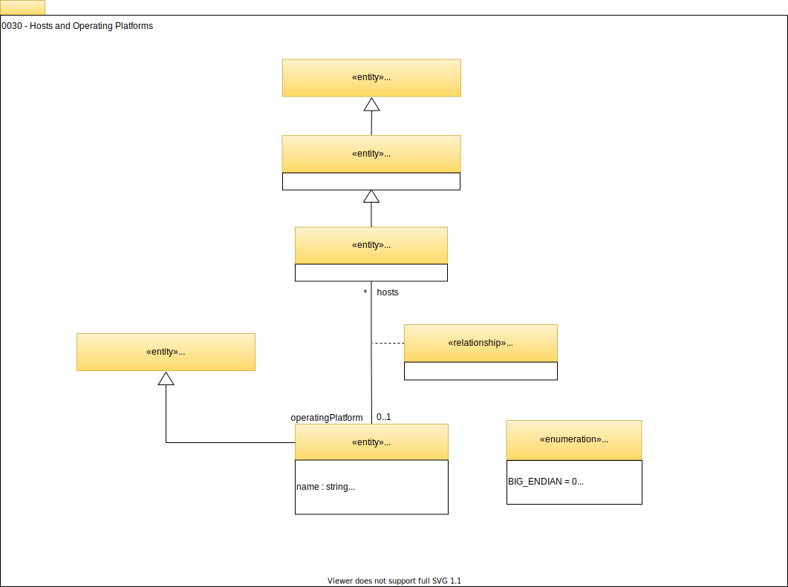

<!-- SPDX-License-Identifier: CC-BY-4.0 -->
<!-- Copyright Contributors to the Egeria project. -->

# 0030 Hosts and Platforms

The host and platform metadata entities provide a simple model for the IT infrastructure (nodes, computers, etc) that data resources are hosted on.

## ITInfrastructure

*`ITInfrastructure`* is a type of [`Asset`](/egeria-docs/types/0/0010-base-model/#asset) that supports the running of software systems.

## Host

In today's systems, hardware is managed to get the maximum use out of it. Therefore, the concept of a *`Host`* is abstracted to describe a deployment environment that has access to hardware and has a basic software stack, typically including the operating systems.

The host can be linked to its location through the [`AssetLocation`](/egeria-docs/types/0/0025-locations/#assetlocation) relationship.

## OperatingPlatform

The *`OperatingPlatform`* is an informational structure to describe the hardware characteristics and software stack (operating system, etc) of the host.

## OperatingPlatformManifest

Details of the software stack can be captured in a [`Collection`](/egeria-docs/types/0/0021-collections/#collection) linked to the operating platform using the *`OperatingPlatformManifest`*. The collection may contain different types of details such as configuration files and software packages that can be organized into nested collections.

## SoftwarePackageManifest

Collections that list software packages can be classified with the `SoftwarePackageManifest`
classification.

Many hosts could have the same operating platform. This means it can be used to represent standardized software stacks and which hosts they have been deployed to. Pipelines that manage the software stacks on these machines can use these elements to manage the rollout and update of the different software packages.

??? education "Further information"
    - [0035 Complex Hosts](/egeria-docs/types/0/0035-complex-hosts) describes how hardware is virtualized.
    - [0037 Software Server Platform](/egeria-docs/types/0/0037-software-server-platforms) describes the software process that run on a host.

--8<-- "snippets/abbr.md"
