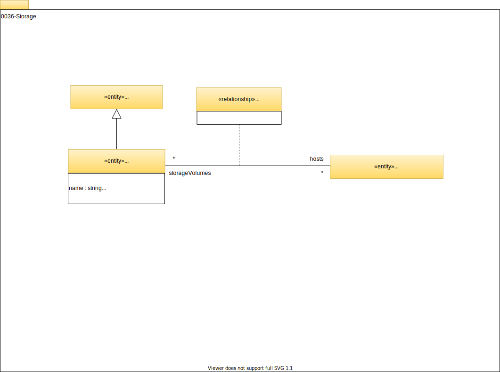

<!-- SPDX-License-Identifier: CC-BY-4.0 -->
<!-- Copyright Contributors to the Egeria project. -->

# 0036 Storage

It is common for the processing running on a [`Host`](/egeria-docs/types/0/0030-hosts-and-platforms/#host) to need to persist data to storage.

## StorageVolume

*`StorageVolume`* describes a persistent storage volume.

## AttachedStorage

*`AttachedStorage`* identifies the host(s) that the `StorageVolume` is connected to.

--8<-- "snippets/abbr.md"
