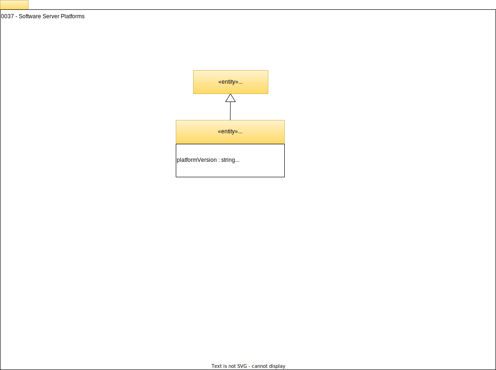

---
hide:
- toc
---

<!-- SPDX-License-Identifier: CC-BY-4.0 -->
<!-- Copyright Contributors to the Egeria project. -->

# 0037 Software Server Platforms

A *SoftwareServerPlatform* entity describes a process running in the operating system on a [*Host*](/types/0/0035-Complex-Hosts).
The different server platform implementations are distinguished using the [deployedImplementationType](/concepts/deployed-implementation-type) property.

The [OMAG Server Platform](/concepts/omag-server-platform) is catalogued using a *SoftwareServerPlatform* entity in the [Leveraging Egeria](/egeria-solutions/leveraging-egeria/overview) solution.

???+ education "Further information"

    * See [0110 Actors](/types/1/0110-Actors) and [0117 IT Profiles](/types/1/0117-IT-Profiles) for capturing the user identity used by a software server platform.  By storing the user identifier for the platform, it is possible to correlate the server with the resourfes that it creates/updates.
    * See [DeployedOn](/types/0/0035-Complex-Hosts) for the relationship between a *SoftwareServerPlatform* entity and a host.

--8<-- "snippets/abbr.md"
