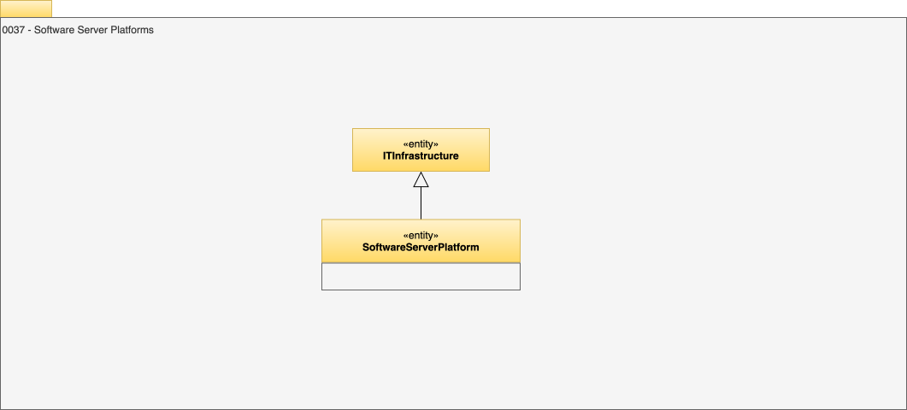

<!-- SPDX-License-Identifier: CC-BY-4.0 -->
<!-- Copyright Contributors to the Egeria project. -->

# 0037 Software Server Platforms

A `SoftwareServerPlatform` describes a process running in the operating system on a [`Host`](/types/0/0035-Complex-Hosts).

The [OMAG Server Platform](/concepts/omag-server-platform) is an example of a software server platform.

??? education "Further information"
    
    See [0041 Server Purposes](/types/0/0041-Server-Purposes) for additional classifications to adorn a software server platform to give more detail as to its purpose in the IT landscape.
    
??? deprecated "Deprecated types"
    - `SoftwareServerPlatformDeployment` is deprecated in favor of [`DeployedOn`](/types/0/0035-Complex-Hosts).

--8<-- "snippets/abbr.md"
