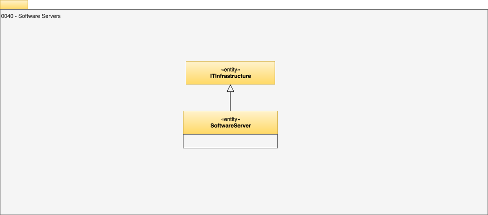

<!-- SPDX-License-Identifier: CC-BY-4.0 -->
<!-- Copyright Contributors to the Egeria project. -->

# 0040 Software Servers

`SoftwareServer`s describe the middleware software servers (such as application servers, data movement engines and database servers) that run on the [`SoftwareServerPlatform`s](/types/0/0037-SoftwareServerPlatform).

The `SoftwareServerDeployment` relationship shows which platforms a server is deployed to.

Within the `SoftwareServer` type it is possible to capture the `userId` that it operates under. By storing the user identifier for the server, it is possible to correlate the server with the calls that it makes.

An [OMAG Server](/concepts/omag-server) is an example of a `SoftwareServer`.

??? education "Further information"
    
    See [0110 Actors](/types/1/0110-Actors) and [0117 IT Profiles](/types/1/0117-IT-Profiles) for al alternative approach to capturing the user identity used by a software server.

    See [0041 Server Purposes](/types/0/0041-Server-Purposes) for additional classifications to adorn a software server to give more detail as to its purpose in the IT landscape.

--8<-- "snippets/abbr.md"
