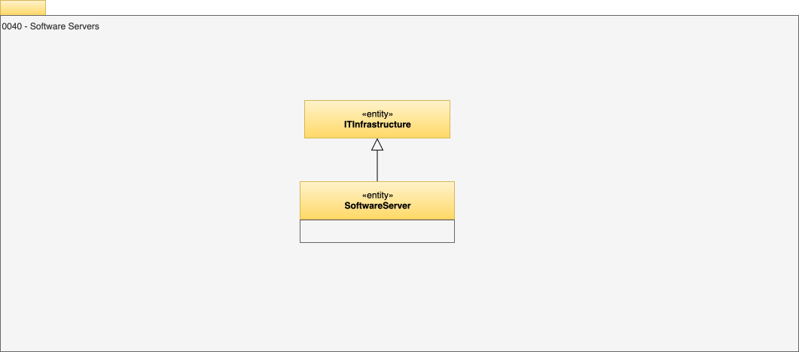

---
hide:
- toc
---

<!-- SPDX-License-Identifier: CC-BY-4.0 -->
<!-- Copyright Contributors to the Egeria project. -->

# 0040 Software Servers

A *SoftwareServer* entity describes the middleware software servers (such as application servers, data movement engines and database servers) that may run on a [Host](/types/0/0035-Complex-Hosts) machine or on a [SoftwareServerPlatform](/types/0/0037-Software-Server-Platforms).

An [OMAG Server](/concepts/omag-server) is catalogued using a *SoftwareServer* entity in the [Leveraging Egeria](/egeria-solutions/leveraging-egeria/overview) solution.
Similarly *SoftwareServer* entities are used to describe the following servers:

* PostgreSQL Database servers in the [Leveraging your PostgreSQL estate](/egeria-solutions/leveraging-postgres/overview) solution.
* Unity Catalog servers in the [Leveraging your Unity Catalog estate](/egeria-solutions/leveraging-unity-catalog/overview) solution.
* Apache Kafka servers in the [Leveraging your Apache Kafka estate](/egeria-solutions/leveraging-apache-kafka/overview) solution.
* Apache Atlas servers in the [Leveraging your Apache Atlas estate](/egeria-solutions/leveraging-apache-atlas/overview) solution.

The different server implementations are distinguished using the [deployedImplementationType](/concepts/deployed-implementation-type) property.

???+ education "Further information"
    
    * See [0110 Actors](/types/1/0110-Actors) and [0117 IT Profiles](/types/1/0117-IT-Profiles) for capturing the user identity used by a software server.  By storing the user identifier for the server, it is possible to correlate the server with the calls that it makes.
    * See [`DeployedOn`](/types/0/0035-Complex-Hosts) for the relationship between a *SoftwareServer* entity and a host/platform.

--8<-- "snippets/abbr.md"
