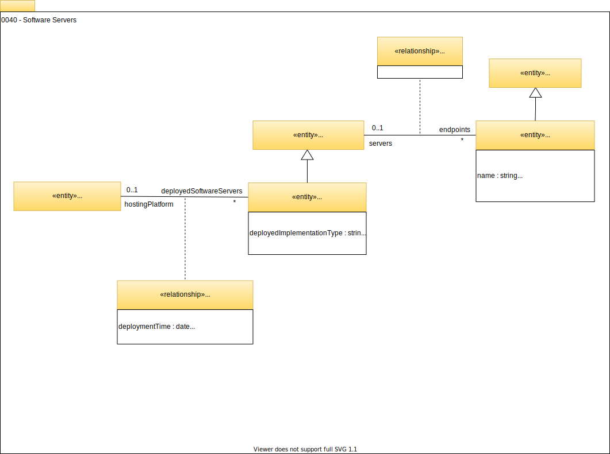

<!-- SPDX-License-Identifier: CC-BY-4.0 -->
<!-- Copyright Contributors to the Egeria project. -->

# 0040 Software Servers

Software servers describe the middleware software servers (such as application servers, data movement engines and database servers) that run on the [`Host`s](/egeria-docs/types/0/0030-hosts-and-platforms/#host).

## SoftwareServer

Within the *`SoftwareServer`* model we capture the `userId` that it operates under. Most metadata repositories are run in a secure mode requiring incoming requests to include the requester's security credentials. Therefore, we have an identifier for each unique logged on security identity (`userId`). This identity is recorded within specific entities and relationships when they are created or updated. By storing the user identifier for the server, it is possible to correlate the server with the changes to the metadata (and related data assets) that it makes.

!!! education "Further information"
    See model [0110 Actors](/egeria-docs/types/0/0110-actors) and [0117 IT Profiles](/egeria-docs/types/1/0117-it-profiles) for details of how user identifiers are correlated with `ActorProfiles` for people and teams. The `ITProfile` makes it possible to define a profile for a server's `userId` so that additional information about the userId can be captured.

An [OMAG server](/egeria-docs/concepts/omag-server) is an example of a `SoftwareServer`.

--8<-- "snippets/abbr.md"
