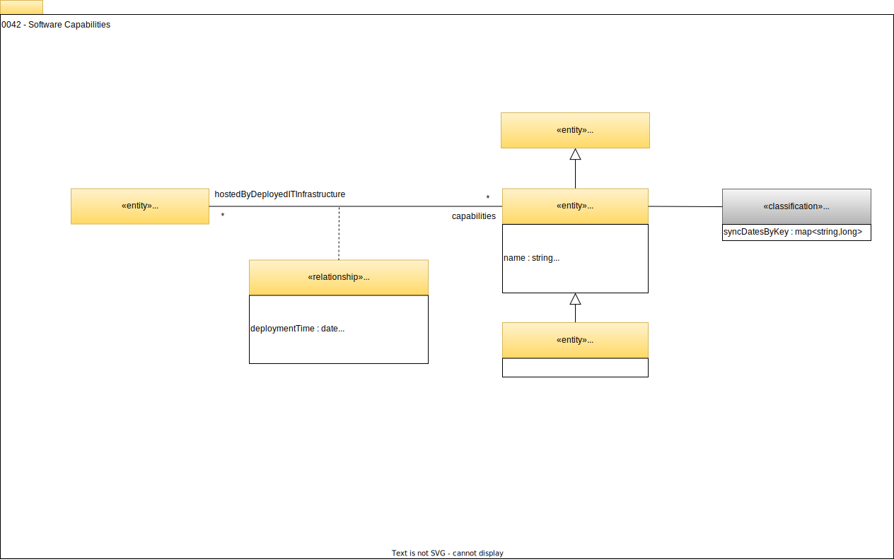

<!-- SPDX-License-Identifier: CC-BY-4.0 -->
<!-- Copyright Contributors to the Egeria project. -->

# 0042 Software Capabilities

Software capabilities are the capabilities implemented in software and supported by [ITInfrastructure](/types/0/0030-Hosts-and-Platforms) such as hosts, software server platforms and software servers.  They are composed of, support and/or consume various [digital resources](/concepts/resources) represented as [Asset entities](/types/0/0010-Base-Model).  They are linked together using the [ServerAssetUse relationship](/types/0045-Servers-and-Assets). 

## SoftwareCapability entity

[*IT Infrastructure*](/types/0/0030-Hosts-and-Platforms) contains many capabilities.  Each capability can be catalogued using the *SoftwareCapability* entity and linked to the hosting *ITInfrastructure* entity using the *SupportedSoftwareCapability* relationship.

*SoftwareCapability* is a [*Referenceable*](/types/0/0010-Base-Model) that adds the following attributes:

* *name* - display name of the capability.
* *description* - description of the capability.
* *capabilityType* - type of the capability - for example the product name.
* *capabilityVersion* - version of the capability.
* *patchLevel* - any patches applied to the version.
* *source* - supplier of the capability.
* *deployedImplementationType* - the class of technology that is used in its implementation. Values for the *deployedImplementationType* attribute can be managed for consistency in a [*deployed implementation type*](/concepts/deployed-implementation-type) valid value set.

Different organizations and tools can choose the granularity in which the capabilities are catalogued in order to provide [appropriate context](/0/0045-Servers-and-Assets) to [assets](/types/0/0010-Base-Model) that are managed by the capabilities and the decisions made around them.

## SoftwareServerCapability entity

The *SoftwareServerCapability* describes a capability that is implemented in a [software server](/types/0/0040-Software-Server).  

These are the subtypes of software server capabilities defined in the open metadata types:

- [*AccessControlManager*](/types/0/0050-Applications-and-Processes/#accesscontrolmanager) - A capability that manages access to specific resources.
- [*APIManager*](/types/0/0050-Applications-and-Processes/#apimanager) - A capability that manages callable APIs that typically delegate onto Software Services.
- [*Application*](/types/0/0050-Applications-and-Processes/#application) - A capability supporting a specific business function.
- [*Catalog*](/types/0/0050-Applications-and-Processes/#catalog) - A capability that manages collections of descriptions about people, places, digital assets, things, ...
- [*DataManager*](/types/0/0050-Applications-and-Processes/#datamanager) - A capability that manages collections of data.
    - [*DatabaseManager*](/types/0/0050-Applications-and-Processes/#databasemanager) - A capability that manages data organized as relational schemas.  Also known as a Database Management System (DBMS).
- [*Engine*](/types/0/0055-Data-Processing-Engines/#engine) - A programmable engine for running automated processes.
    - [*WorkflowEngine*](/types/0/0055-Data-Processing-Engines/#workflowengine) - An engine capable of running a mixture of human and automated tasks as part of a workflow process.
    - [*ReportingEngine*](/types/0/0055-Data-Processing-Engines/#reportingengine) - An engine capable of creating reports by combining information from multiple data sets.
    - [*AnalyticsEngine*](/types/0/0055-Data-Processing-Engines/#analyticsengine) - An engine capable of running analytics models using data from one or more data sets.
    - [*DataMovementEngine*](/types/0/0055-Data-Processing-Engines/#datamovementengine) - An engine capable of copying data from one data store to another.
    - [*DataVirtualizationEngine*](/types/0/0055-Data-Processing-Engines/#datavirtualizationengine) - An engine capable of creating new data sets by dynamically combining data from one or more data stores or data sets.
- [*EventBroker*](/types/0/0050-Applications-and-Processes/#eventbroker) - A capability that supports event-based services, typically around topics.
- [*SoftwareService*](/types/0/0057-Software-Services/#softwareservice) - A capability that provides externally callable functions to other services.
    - [*ApplicationService*](/types/0/0057-Software-Services/#applicationservice) - A software service that supports a reusable business function.
    - [*MetadataIntegrationService*](/types/0/0057-Software-Services/#metadataintegrationservice) - A software service that exchanges metadata between servers.
    - [*MetadataAccessService*](/types/0/0057-Software-Services/#metadataaccessservice) - A software service that provides access to stored metadata.
    - [*EngineHostingService*](/types/0/0057-Software-Services/#enginehostingservice) - A software service that provides services that delegate to a hosted engine.
    - [*UserViewService*](/types/0/0057-Software-Services/#userviewservice) - A software service that provides user interfaces access to digital resources.
- [*NetworkGateway*](/types/0/0070-Networks-and-Gateways/#networkgateway) - A connection point enabling network traffic to pass between two networks.
- [*EnterpriseAccessLayer*](/types/0/0057-Software-Services/#enterpriseaccesslayer) - Repository services for the Open Metadata Access Services (OMAS) supporting federated queries and aggregated events from the connected cohorts.
- [*CohortMember*](/types/0/0057-Software-Services/#cohortmember) - A capability enabling a server to access an open metadata repository cohort.
- [*GovernanceEngine*](/types/4/0461-Governance-Engines/#governanceengine) - A collection of related governance services of the same type.
    - [*GovernanceActionEngine*](/types/4/0461-Governance-Engines) - A collection of related governance services supporting the [Governance Action Framework (GAF)](/frameworks/gaf/overview).
    - [*SurveyActionEngine*](/types/4/0461-Governance-Engines) - A collection of related governance services supporting the [Open Discovery Framework (ODF)](/frameworks/odf/overview).
    - [*RepositoryGovernanceEngine*](/types/4/0461-Governance-Engines) - A collection of related governance services supporting maintenance of [Open Metadata Archives](/concepts/open-metadata-archive).
    - [*ContextEventEngine*](/types/4/0461-Governance-Engines) - A collection of related governance services supporting the [Context Event Framework (CEF)](/frameworks/cef/overview).

In addition, it is possible to augment software server capabilities with the following classifications:

- [*CloudService*](/types/0/0090-Cloud-Platforms-and-Services/#cloudservice) - A capability enabled for a tenant on a cloud platform.
- [*ContentCollectionManager*](/types/0/0056-Resource-Managers/#contentcollectionmanager) - A manager of controlled documents and related media.
- [*FileSystem*](/types/0/0056-Resource-Managers/#filesystem) - A capability that supports a store of files organized into a hierarchy of file folders for general use.
- [*FileManager*](/types/0/0056-Resource-Managers/#filemanager) - A manager of a collection of files and folders.
- [*NotificationManager*](/types/0/0056-Resource-Managers/#notificationmanager) - A software capability that is distributing events from a topic to its subscriber list.

## SupportedSoftwareCapability relationship

Defines the relationship between a *SoftwareCapability* and the *ITInfrastructure* entity that hosts it.  This relationship, plus the attached *SoftwareCapability* entity, help to build out a picture of the capabilities of a particular deployed host, software server platform or software server.  Together they help to describe where and how various IT capabilities are delivered to the owning organization.  This model can form the basis of traceability from business function to IT Infrastructure, particularly when combined with [location information](/types/0/0025-Locations) and [links to the data assets and APIs](/types/0/0045-Servers-and-Assets). 

## ProcessingState classification

Defines a classification for a *SoftwareCapability*. The *ProcessingState* can be used to describe additional runtime processing information used by the component represented by the *SoftwareCapability* entity.

??? deprecated "Deprecated types"
    - *SoftwareServerSupportedCapability* is deprecated in favour of the *SupportedSoftwareCapability* relationship.
    
--8<-- "snippets/abbr.md"
