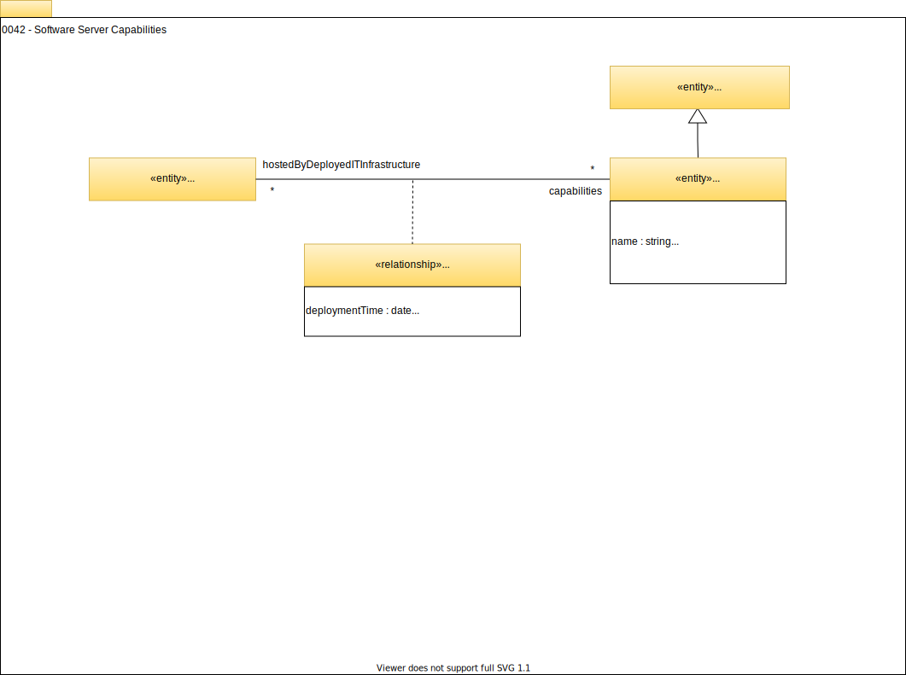

<!-- SPDX-License-Identifier: CC-BY-4.0 -->
<!-- Copyright Contributors to the Egeria project. -->

# 0042 Software Server Capabilities

## SoftwareServerCapability

[*IT Infrastructure*](/egeria-docs/types/0/0030-Hosts-and-Platforms) contains many capabilities.  Each capability can be catalogued using the `SoftwareServerCapability` entity and linked to the hosting `ITInfrastructure` entity using the `SoftwareServerSupportedCapability` relationship. 

Different organizations and tools can choose the granularity in which the capabilities are catalogued in order to provide [appropriate context](/egeria-docs/0/0042-Servers-and-Assets) to [assets](/egeria-docs/types/0/0010-Base-Model) that are managed by the capabilities and the decisions made around them.

These are the sub types of software server capabilities defined in the open metadata types:

- [`AccessControlManager`](/egeria-docs/types/0/0050-Applications-and-Processes/#apimanager) - A capability that manages access to specific resources.
- [`APIManager`](/egeria-docs/types/0/0050-Applications-and-Processes/#apimanager) - A capability that manages callable APIs that typically delegate onto Software Services.
- [`Application`](/egeria-docs/types/0/0050-Applications-and-Processes/#application) - A capability supporting a specific business function.
- [`Catalog`](/egeria-docs/types/0/0050-Applications-and-Processes/#catalog) - A capability that manages collections of descriptions about people, places, digital assets, things, ...
- [`DataManager`](/egeria-docs/types/0/0050-Applications-and-Processes/#datamanager) - A capability that manages collections of data.
- [`Engine`](/egeria-docs/types/0/0055-Data-Processing-Engines/#engine) - A programmable engine for running automated processes.
    - [`WorkflowEngine`](/egeria-docs/types/0/0055-Data-Processing-Engines/#workflowengine) - An engine capable of running a mixture of human and automated tasks as part of a workflow process.
    - [`ReportingEngine`](/egeria-docs/types/0/0055-Data-Processing-Engines/#reportingengine) - An engine capable of creating reports by combining information from multiple data sets.
    - [`AnalyticsEngine`](/egeria-docs/types/0/0055-Data-Processing-Engines/#analyticsengine) - An engine capable of running analytics models using data from one or more data sets.
    - [`DataMovementEngine`](/egeria-docs/types/0/0055-Data-Processing-Engines/#datamovementengine) - An engine capable of copying data from one data store to another.
    - [`DataVirtualizationEngine`](/egeria-docs/types/0/0055-Data-Processing-Engines/#datavirtualizationengine) - An engine capable of creating new data sets by dynamically combining data from one or more data stores or data sets.
- [`EventBroker`](/egeria-docs/types/0/0050-Applications-and-Processes/#eventbroker) - A capability that supports event-based services, typically around topics.
- [`SoftwareService`s](/egeria-docs/types/0/0057-Software-Services/#softwareservice) - A capability that provides externally callable functions to other services.
    - [`ApplicationService`](/egeria-docs/types/0/0057-Software-Services/#applicationservice) - A software service that supports a reusable business function.
    - [`MetadataIntegrationService`](/egeria-docs/types/0/0057-Software-Services/#metadataintegrationservice) - A software service that exchanges metadata between servers.
    - [`MetadataAccessService`](/egeria-docs/types/0/0057-Software-Services/#metadataaccessservice) - A software service that provides access to stored metadata.
    - [`EngineHostingService`](/egeria-docs/types/0/0057-Software-Services/#enginehostingservice) - A software service that provides services that delegate to a hosted engine.
    - [`UserViewService`](/egeria-docs/types/0/0057-Software-Services/#userviewservice) - A software service that provides user interfaces access to digital resources.
- [`NetworkGateway`](/egeria-docs/types/0/0070-Networks-and-Gateways/#networkgateway) - A connection point enabling network traffic to pass between two networks.
- [`DatabaseManager`](/egeria-docs/types/2/0224-Databases/#databasemanager) - A capability that manages data organized as relational schemas.
- [`EnterpriseAccessLayer`](/egeria-docs/types/2/0225-Metadata-Repositories/#enterpriseaccesslayer) - Repository services for the Open Metadata Access Services (OMAS) supporting federated queries and aggregated events from the connected cohorts.
- [`CohortMember`](/egeria-docs/types/2/0225-Metadata-Repositories/#cohortmember) - A capability enabling a server to access an open metadata repository cohort.
- [`GovernanceEngine`](/egeria-docs/types/4/0461-Governance-Engines/#governanceengine) - A collection of related governance services of the same type.
    - [`GovernanceActionEngine`](/egeria-docs/types/4/0461-Governance-Engines/#governanceactionengine) - A collection of related governance services supporting the Governance Action Framework (GAF).
    - [`OpenDiscoveryEngine`](/egeria-docs/types/6/0601-Open-Discovery-Engine/#opendiscoveryengine) - A collection of related governance services supporting the Open Discovery Framework (ODF).

In addition, it is possible to augment software server capabilities with the following classifications:

- [`CloudService`](/egeria-docs/types/0/0090-Cloud-Platforms-and-Services/#cloudservice) - A capability enabled for a tenant on a cloud platform.
- [`ContentCollectionManager`](/egeria-docs/types/2/0221-Document-Stores/#contentcollectionmanager) - A manager of controlled documents and related media.
- [`FileSystem`](/egeria-docs/types/2/0220-Files-and-Folders/#filesystem) - A capability that supports a store of files organized into a hierarchy of file folders for general use.
- [`FileManager`](/egeria-docs/types/2/0220-Files-and-Folders/#filemanager) - A manager of a collection of files and folders.
- [`NotificationManager`](/egeria-docs/types/2/0223-Events-and-Logs/#notificationmanager) - A server capability that is distributing events from a topic to its subscriber list.

--8<-- "snippets/abbr.md"
