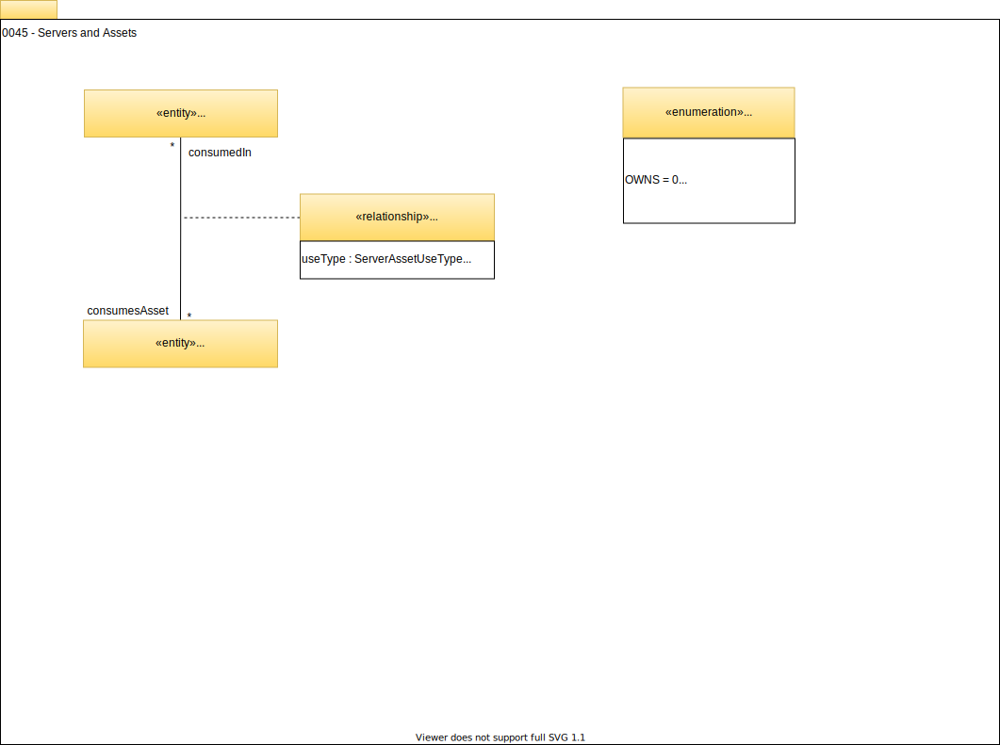

<!-- SPDX-License-Identifier: CC-BY-4.0 -->
<!-- Copyright Contributors to the Egeria project. -->

# 0045 Servers and Assets

## ServerAssetUse

[`Asset`s](/egeria-docs/types/0/0010-base-model/#asset) are managed or consumed by [`SoftwareServerCapabilities`](/egeria-docs/types/0/0042-software-server-capabilities/#softwareservercapability), which is captured by the *`ServerAssetUse`* relationship.

--8<-- "snippets/abbr.md"
