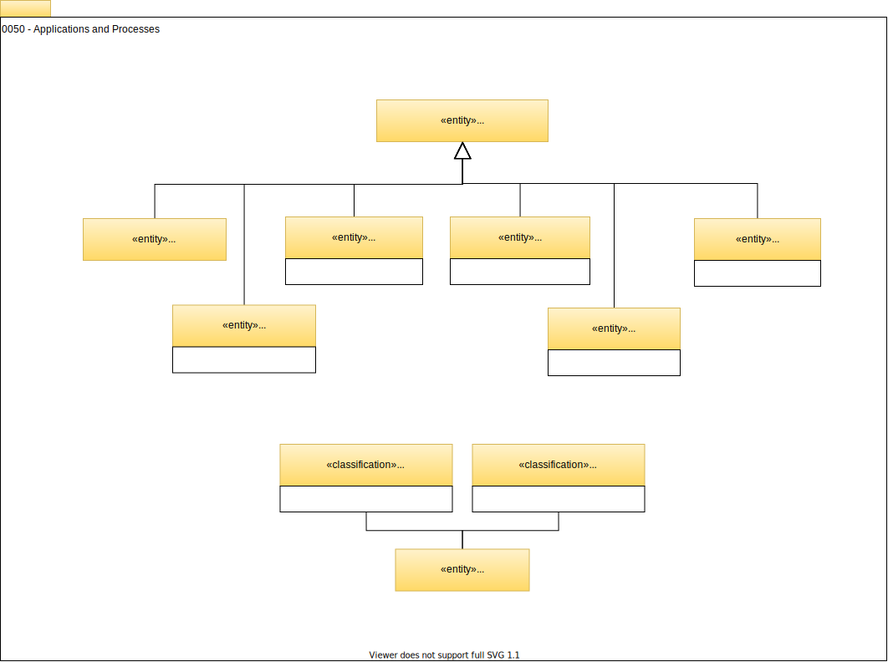

<!-- SPDX-License-Identifier: CC-BY-4.0 -->
<!-- Copyright Contributors to the Egeria project. -->

# 0050 Applications and Processes

## Application

`Application`s provide business or management logic. They are often custom-built but may also be brought as a package. They are deployed onto a server as a [`SoftwareServerCapability`](/egeria-docs/types/0/0042-Software-Server-Capabilities/#softwareservercapability).

??? deprecated "Deprecated types"
    The `RuntimeForProcess` relationship is superfluous: use [`ServerAssetUse`](/egeria-docs/types/0/0045-Servers-and-Assets/#serverassetuse) since `Application` is a `SoftwareServerCapability`.

--8<-- "snippets/abbr.md"
