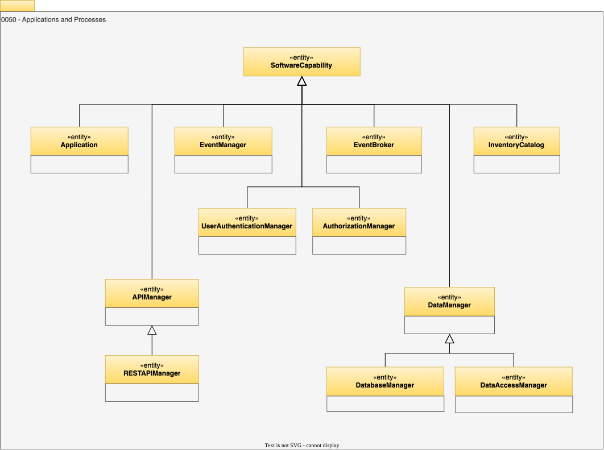

<!-- SPDX-License-Identifier: CC-BY-4.0 -->
<!-- Copyright Contributors to the Egeria project. -->

# 0050 Applications and Processes

## Application

`Application`s provide business or management logic. They are often custom-built but may also be brought as a package. They are deployed onto a server as a [`SoftwareCapability`](/types/0/0042-Software-Capabilities/#softwarecapability).

## APIManager entity

A capability that manages callable APIs.

## AuthorizationManager entity

A capability that supports the authorization of requests.

## DataAccessManager entity

Defines a capability that manages data organized as structured schemas (typically relational tables and columns). It does this by linking the schemas to data sources that are external to its own storage.

## DataManager entity

A capability that manages collections of stored data. It typically maintains a schema to describe how data is formatted and that schema is used in the query and maintenance APIs by the caller to work with the data they desire.

## DatabaseManager entity

Defines a capability that manages data organized as relational schemas. It is also responsible for managing the data including maintaining query indexes, statistics and backups.

## EventBroker entity

A capability that supports event-based services, typically around topics.

## EventManager entity

A capability that ends and/or receives events as part of its software function.

## InventoryCatalog entity

A capability that manages collections of descriptions about people, places, digital assets, things, ...

## RESTAPIManager entity

A capability that supports REST APIs in a server.

## UserAuthenticationManager entity

A capability that supports the identification/authentication of users.

--8<-- "snippets/abbr.md"
