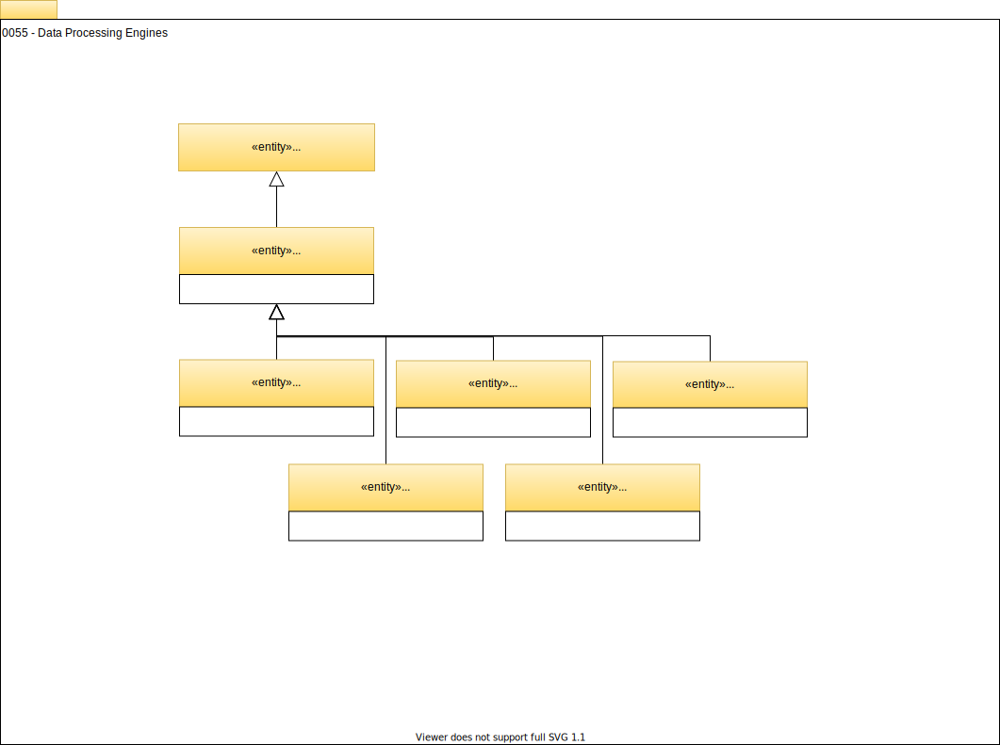

<!-- SPDX-License-Identifier: CC-BY-4.0 -->
<!-- Copyright Contributors to the Egeria project. -->

# 0055 Data Processing Engines

## Engine

The *Engine* entity represents a programmable engine for running automated processes.

## WorkflowEngine

The *WorkflowEngine* entity designates an engine as capable of running a mixture of human and automated tasks as part of a workflow process.

## ReportingEngine

The *ReportingEngine* entity designates an engine as capable of creating reports by combining information from multiple data sets.

## AnalyticsEngine

The *AnalyticsEngine* entity designates an engine as capable of running analytics models and using data from one or more data sets.

## DataMovementEngine

The *DataMovementEngine* entity designates an engine as capable of copying data from one data store to another.

## DataVirtualizationEngine

The *DataVirtualizationEngine* entity designates an engine as capable of creating new data sets by dynamically combining data from one or more data stores or data sets.

--8<-- "snippets/abbr.md"
