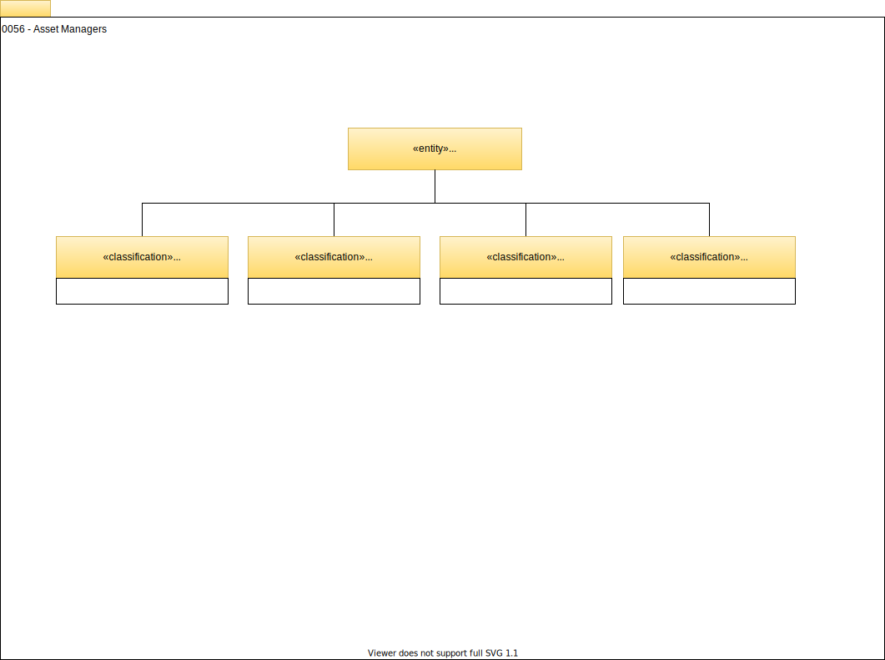

<!-- SPDX-License-Identifier: CC-BY-4.0 -->
<!-- Copyright Contributors to the Egeria project. -->

# 0056 Asset Managers

## AssetManager

The *`AssetManager`* classification represents a technology that manages metadata about assets and may also provide services to manage and/or govern the assets themselves (or at least track such actions). Data catalogs and other types of metadata catalogs are examples of asset managers.

!!! example "Examples of asset managers"
    [Amundsen :material-dock-window:](https://www.amundsen.io/amundsen/){ target=md }, [Marquez :material-dock-window:](https://marquezproject.github.io/marquez/){ target=md } and [Apache Atlas :material-dock-window:](https://atlas.apache.org){ target=md } are examples of data catalogs, and therefore of asset managers.

    An Egeria deployment using a [metadata server](/egeria-docs/concepts/metadata-server) and one or more [integration daemons](/egeria-docs/concepts/integration-daemon) can also be enabled as an asset manager.

The `AssetManager` classification on a [`SoftwareServerCapability`](/egeria-docs/types/0/0042-software-server-capabilities/#softwareservercapability) entity is used by the [Asset Manager OMAS](/egeria-docs/services/omas/asset-manager) to represent the third party asset manager that it is exchanging metadata with.

Identities from this third party asset manager are linked to the `AssetManager` entity using the [`ExternalIdScope`](/egeria-docs/types/0/0017-external-identifiers/#externalidscope) relationship.

## UserProfileManager

The *`UserProfileManager`* classification describes a system that manages user profile information - such as a company directory.

## UserAccessManager

The *`UserAccessManager`* classification describes a user directory such as LDAP.

## MasterDataManager

A *`MasterDataManager`* classification describes a server that manages the rationalization of master data stored in many systems.

--8<-- "snippets/abbr.md"
