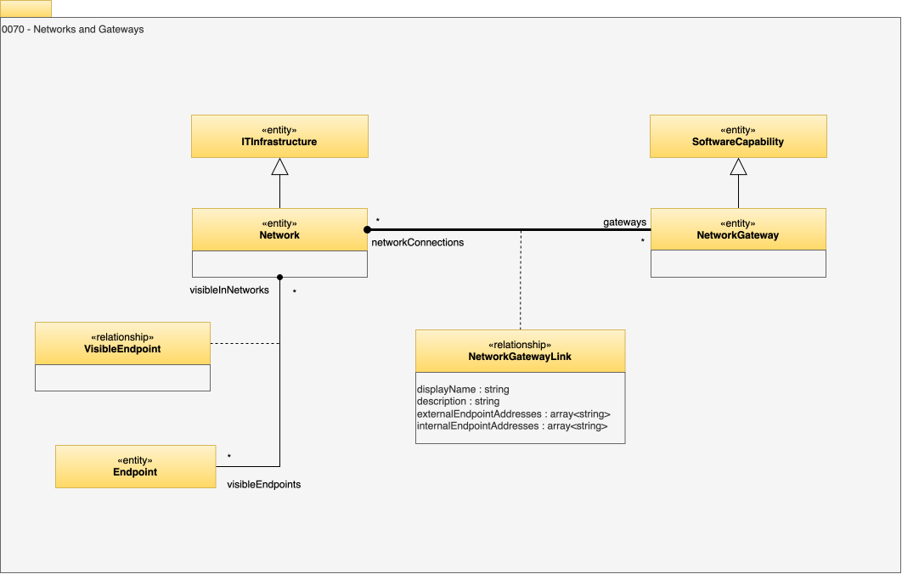

<!-- SPDX-License-Identifier: CC-BY-4.0 -->
<!-- Copyright Contributors to the Egeria project. -->

# 0070 Networks and Gateways

The network model for open metadata is very simple, to allow hosts to be grouped into the networks they are connected to. This can show details such as where hosts are isolated in private networks, and where the gateways onto the Internet are.

## Network entity

Interconnectivity for systems.

## NetworkGateway entity

A connection point enabling network traffic to pass between two networks.

## NetworkGatewayLink relationship

Link from a network to one of its network gateways.

* *displayName* - Display name of the element used for summary tables and titles.
* *description* - Description of the element or associated resource in free-text.
* *externalEndpointAddresses* - Network addresses used by callers to the network gateway.
* *internalEndpointAddresses* - Network addresses that the network gateway maps requests to.

## VisibleEndpoint relationship

Shows that network that an endpoint is visible through.
 

--8<-- "snippets/abbr.md"
